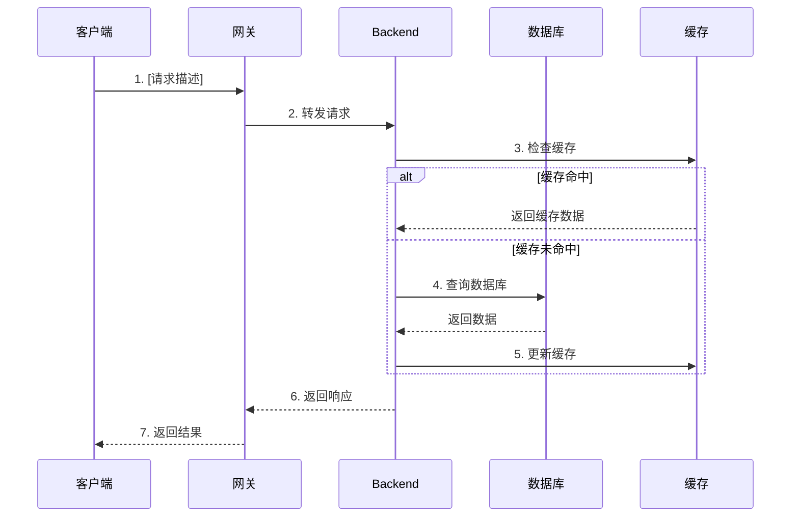

# 技术架构文档模板

> **版本**: v1.0
> **更新日期**: YYYY-MM-DD
> **文档状态**: [草稿/评审中/已发布]
> **作者**: [作者姓名]
> **PRD 来源**: [PRD 文档路径，如无则标注"无"]

---

## 模板使用说明

<!-- 本注释块在生成实际文档时删除 -->

### 章节必填说明

| 标记 | 含义 | 模式要求 |
|------|------|----------|
| `[必填]` | 所有模式必须填写 | 快速/标准/完整 |
| `[标准+]` | 标准和完整模式填写 | 标准/完整 |
| `[完整]` | 仅完整模式填写 | 完整 |

### 填写原则

1. **删除未使用的章节**：根据选择的模式，删除不需要的章节
2. **删除模板注释**：所有 `<!-- -->` 注释在最终文档中删除
3. **替换占位符**：将 `[占位符]` 替换为实际内容
4. **保留结构**：保持标题层级和表格格式

---

## 目录

1. [架构概述](#1-架构概述) `[必填]`
2. [系统分层架构](#2-系统分层架构) `[必填]`
   - 2.1 [分层架构图](#21-分层架构图) `[必填]`
   - 2.2 [各层职责说明](#22-各层职责说明) `[必填]`
   - 2.3 [目录结构](#23-目录结构) `[必填]`
   - 2.4 [依赖关系图](#24-依赖关系图) `[标准+]`
   - 2.5 [业务模块架构](#25-业务模块架构) `[标准+]`
3. [组件部署架构](#3-组件部署架构) `[标准+]`
4. [核心通信流程](#4-核心通信流程) `[标准+]`
5. [数据流向详解](#5-数据流向详解) `[完整]`
6. [关键组件详解](#6-关键组件详解) `[完整]`
7. [技术选型说明](#7-技术选型说明) `[必填]`
8. [安全架构](#8-安全架构) `[标准+]`
9. [扩展与优化建议](#9-扩展与优化建议) `[完整]`
10. [附录](#10-附录) `[必填]`

---

# [项目名称] - 技术架构文档

---

## 1. 架构概述 `[必填]`

### 1.1 架构设计原则

<!-- 至少填写 3 条原则，根据项目实际需求调整 -->

| 原则 | 说明 | 实践方式 |
|------|------|----------|
| **高可用** | [可用性目标，如 99.9%] | [具体措施] |
| **可扩展** | [扩展性要求] | [具体措施] |
| **松耦合** | [解耦策略] | [具体措施] |
| **安全性** | [安全要求] | [具体措施] |
| **可观测** | [可观测性要求] | [具体措施] |

### 1.2 架构风格

| 维度 | 选型 | 决策理由 |
|------|------|----------|
| **整体架构** | [单体/微服务/模块化单体] | [选择理由] |
| **通信模式** | [同步REST/异步消息/混合] | [选择理由] |
| **数据架构** | [集中式/分布式/事件溯源] | [选择理由] |

### 1.3 架构全景图

<!-- 根据实际系统替换各层组件名称 -->

```
┌─────────────────────────────────────────────────────────────────────────┐
│                              用户接入层                                   │
│   ┌───────────────┐   ┌───────────────┐   ┌───────────────┐             │
│   │   Web 前端    │   │  Mobile App   │   │   第三方集成   │             │
│   │  ([框架])     │   │  ([框架])     │   │   (API)       │             │
│   └───────┬───────┘   └───────┬───────┘   └───────┬───────┘             │
└───────────┼───────────────────┼───────────────────┼─────────────────────┘
            │                   │                   │
            └───────────────────┼───────────────────┘
                                │ [协议: HTTP/WebSocket/gRPC]
                                ▼
┌─────────────────────────────────────────────────────────────────────────┐
│                            网关/负载均衡层                                │
│                        [网关技术: Nginx/Kong/...]                        │
└─────────────────────────────────────────────────────────────────────────┘
                                │
                                ▼
┌─────────────────────────────────────────────────────────────────────────┐
│                            业务服务层                                     │
│  ┌───────────────────────────────────────────────────────────────────┐  │
│  │                    [服务名称] ([框架])                              │  │
│  │  ┌──────────┬──────────┬──────────┬──────────┬──────────┐         │  │
│  │  │ [模块1]  │ [模块2]  │ [模块3]  │ [模块4]  │ [模块5]  │         │  │
│  │  └──────────┴──────────┴──────────┴──────────┴──────────┘         │  │
│  └───────────────────────────────────────────────────────────────────┘  │
└─────────────────────────────────────────────────────────────────────────┘
                                │
                                ▼
┌─────────────────────────────────────────────────────────────────────────┐
│                            外部服务层（如有）                             │
│   ┌───────────────┐   ┌───────────────┐   ┌───────────────┐             │
│   │  [服务A]      │   │  [服务B]      │   │  [服务C]      │             │
│   └───────────────┘   └───────────────┘   └───────────────┘             │
└─────────────────────────────────────────────────────────────────────────┘
                                │
                                ▼
┌─────────────────────────────────────────────────────────────────────────┐
│                            数据存储层                                     │
│   ┌─────────────────────────────┐   ┌─────────────────────────────┐     │
│   │       [主数据库]            │   │         [缓存]              │     │
│   │  - [数据类型1]              │   │  - [缓存用途1]              │     │
│   │  - [数据类型2]              │   │  - [缓存用途2]              │     │
│   └─────────────────────────────┘   └─────────────────────────────┘     │
└─────────────────────────────────────────────────────────────────────────┘
```

---

## 2. 系统分层架构 `[必填]`

### 2.1 分层架构图

<!-- 根据选择的架构风格填充：DDD/传统三层/六边形 -->
<!-- 以下为 DDD 分层示例 -->

```
┌─────────────────────────────────────────────────────────────────────┐
│                          API 层 (Presentation)                       │
│  ┌────────────┬────────────┬────────────┬────────────┬────────────┐ │
│  │ /[资源1]   │ /[资源2]   │ /[资源3]   │ /[资源4]   │ /[资源5]   │ │
│  │ ([功能])   │ ([功能])   │ ([功能])   │ ([功能])   │ ([功能])   │ │
│  └────────────┴────────────┴────────────┴────────────┴────────────┘ │
├─────────────────────────────────────────────────────────────────────┤
│                   应用层 (Application)                               │
│  ┌───────────┬───────────┬───────────┬───────────┬───────────┐     │
│  │ [服务1]   │ [服务2]   │ [服务3]   │ [服务4]   │ [服务5]   │     │
│  │ (用例编排) │ (用例编排) │ (用例编排) │ (用例编排) │ (用例编排) │    │
│  └───────────┴───────────┴───────────┴───────────┴───────────┘     │
├─────────────────────────────────────────────────────────────────────┤
│                   领域层 (Domain)                                    │
│  Entity: [实体列表]                                                  │
│  Value Object: [值对象列表]                                          │
│  Domain Service: [领域服务列表]                                      │
│  Repository Interfaces: [仓储接口]                                   │
├─────────────────────────────────────────────────────────────────────┤
│                基础设施层 (Infrastructure)                           │
│  ┌────────────────────────────────────────────────────────────────┐ │
│  │ External Adapters  │  Repository Impl   │  Database & Cache   │ │
│  │  - [适配器1]       │  - [仓储实现1]      │  - [存储1]          │ │
│  │  - [适配器2]       │  - [仓储实现2]      │  - [存储2]          │ │
│  └────────────────────────────────────────────────────────────────┘ │
└─────────────────────────────────────────────────────────────────────┘
```

### 2.2 各层职责说明

| 层级 | 职责 | 包含内容 | 依赖规则 |
|------|------|----------|----------|
| **API 层** | HTTP 请求处理，参数校验，响应格式化 | Routes, Middleware, Schemas | 只调用应用层 |
| **应用层** | 用例编排，事务管理，DTO 转换 | Services, DTOs, Ports | 只调用领域层 |
| **领域层** | 核心业务逻辑，业务规则 | Entities, Value Objects, Domain Services | **不依赖任何层** |
| **基础设施层** | 技术实现，外部服务集成 | Repositories, Adapters, Clients | 实现领域层接口 |

### 2.3 目录结构

<!-- 根据实际项目语言和框架调整 -->

```
[项目根目录]/
├── api/                          # API 层
│   ├── routes/                   # 路由定义
│   │   ├── [资源1].py
│   │   └── [资源2].py
│   ├── middleware/               # 中间件
│   │   ├── auth.py
│   │   ├── logging.py
│   │   └── error_handler.py
│   └── schemas/                  # 请求/响应模型
│       ├── requests/
│       └── responses/
│
├── application/                  # 应用层
│   ├── services/                 # 应用服务
│   │   ├── [服务1]_service.py
│   │   └── [服务2]_service.py
│   ├── dtos/                     # 数据传输对象
│   └── ports/                    # 端口定义（六边形架构）
│
├── domain/                       # 领域层
│   ├── [聚合1]/                  # 聚合根1
│   │   ├── entity.py
│   │   ├── repository.py         # 仓储接口
│   │   └── service.py            # 领域服务
│   └── [聚合2]/                  # 聚合根2
│
├── infrastructure/               # 基础设施层
│   ├── persistence/              # 持久化
│   │   ├── models/               # ORM 模型
│   │   ├── repositories/         # 仓储实现
│   │   └── database.py
│   ├── external/                 # 外部服务
│   │   └── [外部服务]/
│   └── cache/                    # 缓存实现
│
├── core/                         # 核心配置
│   ├── config.py
│   ├── exceptions.py
│   └── logging.py
│
├── tests/                        # 测试
│   ├── unit/
│   ├── integration/
│   └── e2e/
│
└── main.py                       # 应用入口
```

### 2.4 依赖关系图 `[标准+]`

```
┌─────────────────────────────────────────────────────────────────────┐
│                          API 层 (Presentation)                       │
│                              ▼                                     │
│                   应用层 (Application)                               │
│                              ▼                                     │
│                   领域层 (Domain)                                    │
│                              ▲                                     │
│                基础设施层 (Infrastructure)                           │
│                   实现领域层接口                                      │
└─────────────────────────────────────────────────────────────────────┘

依赖规则：
- API 层 → 应用层 → 领域层
- 基础设施层 → 领域层（实现接口）
- 领域层不依赖任何层
```

---

## 2.5 业务模块架构 `[标准+]`

### 2.5.1 模块划分原则

| 原则 | 说明 | 实践方式 |
|------|------|----------|
| **按业务领域划分** | 每个模块对应一个业务领域 | DDD 限界上下文 |
| **高内聚低耦合** | 模块内部紧密相关，模块间松散依赖 | 最小化模块间依赖 |
| **单一职责** | 每个模块有明确的职责边界 | 一个模块只做一件事 |

### 2.5.2 模块清单

| 模块名称 | 职责范围 | 核心实体 | 依赖模块 | 技术分层映射 |
|---------|---------|---------|---------|-------------|
| `[模块A]` | `[职责描述]` | `[实体列表]` | `[依赖]` | `domain/[modulea]/` |
| `[模块B]` | `[职责描述]` | `[实体列表]` | `[依赖]` | `domain/[moduleb]/` |
| `[模块C]` | `[职责描述]` | `[实体列表]` | `[依赖]` | `domain/[modulec]/` |

### 2.5.3 模块交互关系

```
┌─────────────┐    ┌─────────────┐    ┌─────────────┐
│   模块A     │───►│   模块B     │───►│   模块C     │
│ [领域描述]  │    │ [领域描述]  │    │ [领域描述]  │
└─────────────┘    └─────────────┘    └─────────────┘
       │                                    ▲
       └────────────────────────────────────┘
                    [交互描述]
```

### 2.5.4 模块 → 技术分层映射

| 业务模块 | API 层 | 应用层 | 领域层 | 基础设施层 |
|---------|--------|--------|--------|-----------|
| `[模块A]` | `routes/[modulea]/*.py` | `services/[modulea]_*.py` | `domain/[modulea]/` | `repositories/[modulea]_*.py` |
| `[模块B]` | `routes/[moduleb]/*.py` | `services/[moduleb]_*.py` | `domain/[moduleb]/` | `repositories/[moduleb]_*.py` |
| `[模块C]` | `routes/[modulec]/*.py` | `services/[modulec]_*.py` | `domain/[modulec]/` | `repositories/[modulec]_*.py` |

### 2.5.5 模块演进规划

| 阶段 | 模块划分 | 说明 |
|------|----------|------|
| **MVP** | `[核心模块列表]` | 最小可行产品 |
| **V1.0** | `[完整模块列表]` | 正式发布版本 |
| **V2.0** | `[扩展模块列表]` | 规划中的模块 |

---

## 3. 组件部署架构 `[标准+]`

### 3.1 部署架构图

```
                                用户端 (Web/Mobile)
                                     │
                                     │ HTTPS (443)
                                     ▼
                          ┌──────────────────────┐
                          │   负载均衡/CDN        │
                          │   ([技术选型])        │
                          └──────────┬───────────┘
                                     │
                ┌────────────────────┼────────────────────┐
                │                    │                    │
                ▼                    ▼                    ▼
┌───────────────────────┐ ┌───────────────────────┐ ┌───────────────────────┐
│     Backend #1        │ │     Backend #2        │ │     Backend #N        │
│  (Port: [端口])       │ │  (Port: [端口])       │ │  (Port: [端口])       │
└───────────┬───────────┘ └───────────┬───────────┘ └───────────┬───────────┘
            │                         │                         │
            └─────────────────────────┼─────────────────────────┘
                                      │
                 ┌────────────────────┼────────────────────┐
                 │                    │                    │
                 ▼                    ▼                    ▼
      ┌─────────────────┐  ┌──────────────┐  ┌──────────────────┐
      │   [数据库]      │  │   [缓存]     │  │   [其他服务]     │
      │   Port: [端口]  │  │  Port: [端口] │  │   Port: [端口]   │
      └─────────────────┘  └──────────────┘  └──────────────────┘
```

### 3.2 服务清单

#### 必须部署的服务

| 服务名称 | 说明 | 默认端口 | 资源需求 | 扩展策略 |
|----------|------|----------|----------|----------|
| [服务1] | [功能说明] | [端口] | [CPU/Memory] | [水平/垂直] |
| [服务2] | [功能说明] | [端口] | [CPU/Memory] | [水平/垂直] |
| [数据库] | 数据持久化 | [端口] | [CPU/Memory] | [主从/分片] |
| [缓存] | 缓存/会话 | [端口] | [CPU/Memory] | [集群] |

#### 可选部署的服务

| 服务名称 | 说明 | 适用场景 |
|----------|------|----------|
| [服务A] | [说明] | [场景] |
| Prometheus + Grafana | 监控可视化 | 需要详细性能监控 |
| ELK Stack | 日志聚合分析 | 需要日志分析 |

### 3.3 网络架构

```
┌─────────────────────────────────────────────────────────────────┐
│                         公网 (Internet)                          │
└─────────────────────────────────────────────────────────────────┘
                                │
                                │ HTTPS (443)
                                ▼
┌─────────────────────────────────────────────────────────────────┐
│                        DMZ 区域                                  │
│  ┌─────────────────────────────────────────────────────────┐   │
│  │               [网关/反向代理]                            │   │
│  │               (SSL 终止, 路由转发)                       │   │
│  └─────────────────────────────────────────────────────────┘   │
└─────────────────────────────────────────────────────────────────┘
                                │
                                │ HTTP (内网)
                                ▼
┌─────────────────────────────────────────────────────────────────┐
│                        应用区域                                  │
│  ┌──────────────┐  ┌──────────────┐  ┌──────────────┐          │
│  │  Backend     │  │  Worker      │  │  [其他]      │          │
│  │  容器集群    │  │  容器集群    │  │              │          │
│  └──────────────┘  └──────────────┘  └──────────────┘          │
└─────────────────────────────────────────────────────────────────┘
                                │
                                │ TCP (内网)
                                ▼
┌─────────────────────────────────────────────────────────────────┐
│                        数据区域                                  │
│  ┌──────────────┐  ┌──────────────┐  ┌──────────────┐          │
│  │  [数据库]    │  │  [缓存]      │  │  [存储]      │          │
│  └──────────────┘  └──────────────┘  └──────────────┘          │
└─────────────────────────────────────────────────────────────────┘
```

### 3.4 端口规划

| 服务 | 端口 | 协议 | 暴露范围 | 说明 |
|------|------|------|----------|------|
| [网关] | 80, 443 | HTTP/HTTPS | 公网 | 入口网关 |
| Backend API | [端口] | HTTP | 内网 | 业务接口 |
| [数据库] | [端口] | TCP | 数据区 | 数据库 |
| [缓存] | [端口] | TCP | 应用区 | 缓存 |

---

## 4. 核心通信流程 `[标准+]`

### 4.1 [流程1名称] 流程

<!-- 至少描述 1 个核心业务流程 -->

#### 时序图



#### 核心步骤详解

**Request:**

```json
{
  "field1": "value1",
  "field2": "value2"
}
```

**Backend 处理流程：**

```
[Service].method()
  ├─ [步骤1描述]
  ├─ [步骤2描述]
  ├─ [步骤3描述]
  └─ 返回结果
```

**Response:**

```json
{
  "code": 0,
  "message": "success",
  "data": {
    "result": "..."
  }
}
```

### 4.2 异常处理流程

```
正常流程                          异常流程
    │                                │
    ├─ Step 1 ─────────────────────► ├─ Step 1 失败
    │                                │     │
    │                                │     ├─ 重试 (最多 N 次)
    │                                │     │
    │                                │     └─ 记录错误日志
    │                                │         │
    ├─ Step 2 ─────────────────────► ├─ Step 2 失败
    │                                │     │
    │                                │     ├─ 回滚事务
    │                                │     │
    │                                │     └─ 返回错误响应
    │                                │
    └─ 返回成功                      └─ 返回失败 (错误码: [CODE])
```

---

## 5. 数据流向详解 `[完整]`

### 5.1 [数据流名称] 数据流

#### 数据流向图

```
┌─────────┐    ┌─────────┐    ┌─────────┐    ┌─────────┐
│  来源   │───►│  处理1  │───►│  处理2  │───►│  目标   │
│ [描述]  │    │ [描述]  │    │ [描述]  │    │ [描述]  │
└─────────┘    └─────────┘    └─────────┘    └─────────┘
```

#### 详细流程

1. **数据来源**：[描述数据从哪里来]
2. **处理阶段1**：[描述处理逻辑]
3. **处理阶段2**：[描述处理逻辑]
4. **数据目标**：[描述数据最终去向]

### 5.2 配置数据流转

```
前端/API
  │
  │ 创建/更新配置
  │ POST /api/[endpoint]
  │
  ▼
Backend Database ([表名])
  │
  │ 业务逻辑处理时加载
  │ [Service].load()
  │
  ▼
配置对象
  │
  ├─ [配置项1]: { ... }
  ├─ [配置项2]: { ... }
  └─ [配置项3]: { ... }
```

---

## 6. 关键组件详解 `[完整]`

### 6.1 [组件名称]

#### 组件职责

- [职责1]
- [职责2]
- [职责3]

#### 核心接口

```python
class [ComponentName]:
    """[组件描述]"""

    def __init__(self, [params]):
        """初始化组件"""
        pass

    def [method1](self, [params]) -> [ReturnType]:
        """
        [方法描述]

        Args:
            [参数说明]

        Returns:
            [返回值说明]
        """
        pass
```

#### 配置项

| 配置项 | 类型 | 默认值 | 说明 |
|--------|------|--------|------|
| [config1] | [type] | [default] | [说明] |
| [config2] | [type] | [default] | [说明] |

### 6.2 组件间依赖关系

```
┌─────────────┐
│  [组件A]    │
└──────┬──────┘
       │ 依赖
       ▼
┌─────────────┐     ┌─────────────┐
│  [组件B]    │────►│  [组件C]    │
└──────┬──────┘     └─────────────┘
       │ 依赖
       ▼
┌─────────────┐
│  [组件D]    │
└─────────────┘
```

---

## 7. 技术选型说明 `[必填]`

### 7.1 关键设计模式

| 模式 | 实现位置 | 优势 |
|------|----------|------|
| **[模式1]** | [位置] | [优势说明] |
| **[模式2]** | [位置] | [优势说明] |
| **Repository** | 数据访问 | 数据访问抽象，易于测试 |
| **Unit of Work** | 事务管理 | 事务一致性保证 |
| **DI** | 依赖管理 | 解耦，易于测试 |

### 7.2 核心通信协议

| 协议 | 用途 | 端点 |
|------|------|------|
| **[协议1]** | [用途] | [端点] |
| **[协议2]** | [用途] | [端点] |

### 7.3 技术栈选型

| 组件 | 选择方案 | 版本 | 备选方案 | 选择理由 |
|------|----------|------|----------|----------|
| **后端框架** | [选择] | [版本] | [备选] | [理由] |
| **数据库** | [选择] | [版本] | [备选] | [理由] |
| **缓存** | [选择] | [版本] | [备选] | [理由] |
| **消息队列** | [选择] | [版本] | [备选] | [理由] |
| **容器化** | [选择] | [版本] | [备选] | [理由] |

---

## 8. 安全架构 `[标准+]`

### 8.1 认证机制

| 维度 | 方案 | 说明 |
|------|------|------|
| **认证方式** | [JWT/Session/OAuth2.0] | [说明] |
| **Token 存储** | [Cookie/LocalStorage/Memory] | [说明] |
| **Token 有效期** | [时长] | [刷新策略] |

### 8.2 授权模型

| 维度 | 方案 | 说明 |
|------|------|------|
| **授权模型** | [RBAC/ABAC/ACL] | [说明] |
| **权限粒度** | [资源级/操作级/字段级] | [说明] |
| **角色设计** | [角色列表] | [说明] |

### 8.3 数据安全

| 安全措施 | 实现方式 | 覆盖范围 |
|----------|----------|----------|
| **传输加密** | [TLS 1.2+] | 所有外部通信 |
| **存储加密** | [AES-256/透明加密] | [敏感数据范围] |
| **数据脱敏** | [脱敏规则] | [日志/展示/导出] |
| **SQL 注入防护** | [ORM/参数化查询] | 所有数据库操作 |
| **XSS 防护** | [转义/CSP] | 前端输出 |

### 8.4 安全合规

<!-- 根据实际需求填写 -->

| 合规要求 | 状态 | 实现措施 |
|----------|------|----------|
| [等保/GDPR/PCI-DSS/...] | [已满足/规划中] | [措施] |

---

## 9. 扩展与优化建议 `[完整]`

### 9.1 性能优化

| 优化点 | 描述 | 预期收益 | 优先级 |
|--------|------|----------|--------|
| [优化1] | [描述] | [收益] | P1/P2/P3 |
| [优化2] | [描述] | [收益] | P1/P2/P3 |

### 9.2 可靠性设计

| 设计点 | 描述 | 实现方式 |
|--------|------|----------|
| **重试机制** | [描述] | [实现方式] |
| **超时控制** | [描述] | [实现方式] |
| **熔断降级** | [描述] | [实现方式] |
| **错误恢复** | [描述] | [实现方式] |

### 9.3 可观测性

| 类型 | 工具 | 说明 |
|------|------|------|
| **日志** | [工具] | [说明] |
| **指标** | [工具] | [说明] |
| **追踪** | [工具] | [说明] |
| **告警** | [工具] | [说明] |

### 9.4 扩展性设计

```
当前架构                           扩展后架构
┌─────────┐                       ┌─────────┐
│ Backend │                       │ Backend │ x N (水平扩展)
│ (单实例) │         ───────►     │ Cluster │
└─────────┘                       └─────────┘
     │                                 │
     ▼                                 ▼
┌─────────┐                       ┌─────────┐
│   DB    │                       │   DB    │ ([扩展策略])
│ (单实例) │         ───────►     │ Cluster │
└─────────┘                       └─────────┘
```

#### 扩展策略

| 组件 | 扩展方式 | 触发条件 |
|------|----------|----------|
| Backend | 水平扩展 | CPU > [阈值]% 或 QPS > [阈值] |
| 数据库 | [主从/分片] | [触发条件] |
| 缓存 | [集群] | [触发条件] |

---

## 10. 附录 `[必填]`

### A. 部署依赖关系

```
├─ [依赖1] ([角色])
│  └─ [说明]
├─ [依赖2] ([角色])
│  └─ [说明]
├─ Backend (业务逻辑)
│  └─ 依赖上述所有服务
└─ Frontend (用户界面)
   └─ 依赖 Backend API
```

### B. 环境变量清单

| 变量名 | 说明 | 示例值 | 必填 |
|--------|------|--------|------|
| `DATABASE_URL` | 数据库连接串 | `postgres://...` | 是 |
| `REDIS_URL` | Redis 连接串 | `redis://...` | 是 |
| `SECRET_KEY` | 应用密钥 | `[随机字符串]` | 是 |
| `[变量1]` | [说明] | [示例] | 是/否 |
| `[变量2]` | [说明] | [示例] | 是/否 |

### C. 设计决策记录 (ADR)

#### ADR-001: [决策标题]

- **状态**: [已采纳/已废弃/提议中]
- **决策**: [决策内容]
- **背景**: [为什么需要做这个决策]
- **理由**: [选择这个方案的原因]
- **影响**: [这个决策带来的影响]

### D. 参考资料

- [参考文档1](链接)
- [参考文档2](链接)

---

*本文档最后更新：YYYY-MM-DD (v1.0)*
