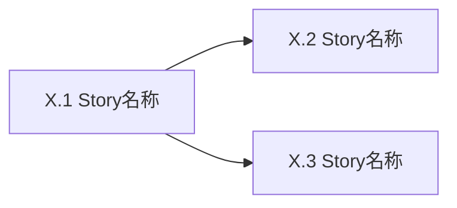

# Epic [序号]: [名称]

## 概述

**背景**: [为什么需要这个功能]
**价值**: [用户获得什么]
**范围**: [包含什么]
**不含**: [明确排除什么]

## Success Criteria

<!-- Epic 级完成判据(不是 Story AC),必须可衡量、可验证、可观测。
     P0/P1 Epic 至少 3 条;P2/P3 至少 1 条。 -->

- [ ] [可衡量的结果 1,含数字或可断言的状态]
- [ ] [可衡量的结果 2]
- [ ] [可衡量的结果 3]

## Risks and Mitigations

<!-- 影响 H/M/L,概率 H/M/L。无重大风险可填一行"无重大风险"。 -->

| 风险 | 影响 | 概率 | 缓解策略 |
|------|------|------|----------|
| [风险描述 1] | H/M/L | H/M/L | [如何处理] |
| [风险描述 2] | H/M/L | H/M/L | [如何处理] |

## Metrics

<!-- 上线后怎么量。P0 Epic 强烈建议有此 section,P2/P3 可省略。
     格式:指标名 | 目标值 | 测量方式 -->

- **[指标 1]**: 目标 [数值],测量方式 [如何采集]
- **[指标 2]**: 目标 [数值],测量方式 [如何采集]

## System-Wide Considerations

<!-- 拆 Story 前必填,用于挖出隐藏 Story(被牵动的其他模块、跨层副作用等)。
     无相关项请填"无",不要删除该 section。
     有相关项时,每条考虑是否需要新增 Story 来覆盖。 -->

- **跨模块影响**: [哪些其他 Epic / 模块 / 服务 / 第三方系统会被此 Epic 牵动]
- **不变量保护**: [哪些现有行为 / 数据约束 / API 行为不能被这个 Epic 破坏]
- **状态生命周期**: [并发访问 / 缓存失效 / 重试幂等 / 资源清理 / 长事务的风险点]
- **API 表面一致性**: [其他端点 / 界面 / 客户端是否需要同步更新]
- **错误传播**: [此 Epic 的错误如何跨层 / 跨服务传递,是否有兜底]
- **权限边界**: [涉及的角色 / 资源所有权 / 越权访问场景,是否在 Story 里覆盖]

## Story 列表

### Story X.1: [标题]

<!-- Feature Bundling 检查:标题禁止用 "和 / & / + / ,"连接两个能力。
     例:"注册和登录" ❌,拆成两个 Story:"手机号注册" + "手机号登录" ✓ -->

**用户故事**: 作为 [角色],我可以 [功能],以便 [价值]

#### 验收标准
<!-- 4 分类组织:Happy Path / Edge Cases / Error Paths / Integration
     每条 AC 必须附带 `验证:` 标注。禁止模糊用语("正确"、"合理"、"正常")
     Happy Path 必须有;其余类别不适用可省略但须在覆盖度自检里注明 N/A 理由
     AC 总数硬上限 ≤7(Happy 1-2 + Edge 1-2 + Error 1-2 + Integration 0-2);超过必须拆 Story -->

**Happy Path**
- [ ] [核心流程条件,含预期结果] `验证: [pytest/API/DB/Browser 具体方式]`

**Edge Cases**
<!-- 检查清单:空输入 / 边界值(最小/最大)/ nil-null / 并发 / 重复请求 / 长度极限 -->
- [ ] [空输入处理] `验证: [具体方式]`
- [ ] [边界值] `验证: [具体方式]`

**Error Paths**
<!-- 检查清单:非法输入 / 下游故障 / 超时 / 权限拒绝 / 速率限制 / 约束冲突 -->
- [ ] [非法输入 → 预期错误码] `验证: [具体方式]`
- [ ] [下游故障 → 预期降级行为] `验证: [具体方式]`

**Integration**(仅当 Story 跨层时填写;纯单层 Story 删除此分组)
<!-- 检查清单:callback / middleware / 多层数据流 / 事件传播 / 副作用 -->
- [ ] [跨层行为:具体场景] `验证: [具体方式]`

#### 前端验收标准
<!-- 如无 UI 交互则删除此 section -->
- [ ] [页面元素存在性,含选择器] `验证: Browser [选择器] 存在`
- [ ] [交互行为:操作 → 预期 DOM/URL 变化] `验证: Browser [操作] → [断言]`
- [ ] [状态展示:空态/加载/错误的具体 DOM 表现] `验证: Browser [条件] → [元素状态]`
- [ ] [设计稿对齐:与 docs/reference/research/designs/{epic-id}/{文件名} 结构一致] `验证: Browser 截图比对`

#### Assumptions
<!-- 假设清单。每条格式:[类别] 描述 — Confidence: H/M/L — 失效影响: 描述
     类别枚举:FEASIBILITY(可行性)/ DEPENDENCY(外部依赖)/ DATA(数据假设)/ SCOPE(范围假设)
     无相关假设填"无",不要删除该 section。 -->

- [DEPENDENCY] [例:短信网关 SLA ≥ 99.5%] — Confidence: M — 失效影响: [例:验证码失败率 >5%,需加重试]
- [DATA] [例:用户手机号唯一] — Confidence: H — 失效影响: [例:需引入合并账户流程]

**覆盖度自检**: Happy ✓ / Edge ✓ / Error ✓ / Integration [✓ 或 N/A — 理由] / FE [✓ 或 N/A] / AC 总数 [N] ≤7 ✓ / Assumptions [N 条 或 "无"]
**参考**: docs/project/api_spec.md §X, docs/project/database_schema.md §Y, docs/reference/research/designs/{epic-id}/{文件名}(如适用)
**依赖**: Story X.Z(必须 Z<当前序号,禁止前向依赖) / 无

---

### Story X.2: [标题]

**用户故事**: 作为 [角色],我可以 [功能],以便 [价值]

#### 验收标准

**Happy Path**
- [ ] [核心流程条件,含预期结果] `验证: [具体方式]`

**Edge Cases**
- [ ] [空输入 / 边界值 / nil-null / 并发] `验证: [具体方式]`

**Error Paths**
- [ ] [非法输入 / 下游故障 / 超时 / 权限拒绝] `验证: [具体方式]`

**Integration**(仅当跨层时)
- [ ] [callback / middleware / 多层数据流] `验证: [具体方式]`

#### 前端验收标准
<!-- 如无 UI 交互则删除此 section -->
- [ ] [页面元素存在性,含选择器] `验证: Browser [断言]`
- [ ] [交互行为 → 预期变化] `验证: Browser [操作] → [断言]`
- [ ] [状态展示:具体 DOM 表现] `验证: Browser [条件] → [元素状态]`

#### Assumptions
- [类别] [假设描述] — Confidence: H/M/L — 失效影响: [描述]
<!-- 或填"无" -->

**覆盖度自检**: Happy ✓ / Edge ✓ / Error ✓ / Integration [✓ 或 N/A — 理由] / FE [✓ 或 N/A] / AC 总数 [N] ≤7 ✓ / Assumptions [N 条 或 "无"]
**参考**: docs/project/api_spec.md §X, docs/project/database_schema.md §Y, docs/reference/research/designs/{epic-id}/{文件名}(如适用)
**依赖**: Story X.Z(必须 Z<当前序号) / 无

---

## 依赖关系

**Epic 依赖**: [依赖 Epic Y: 原因] / 无
**技术依赖**: [需要先完成的基础设施] / 无

## 参考文档

- PRD: [docs/project/requirements.md](../../project/requirements.md) §X
- Architecture: [docs/project/architecture.md](../../project/architecture.md) §Y
- API Design: [docs/project/api_spec.md](../../project/api_spec.md) §Z(如适用)
- Data Model: [docs/project/database_schema.md](../../project/database_schema.md) §W(如适用)
