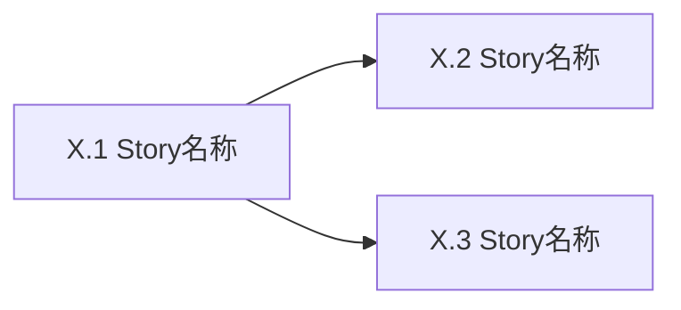

# Epic [序号]: [名称]

## 概述

**背景**: [为什么需要这个功能]
**价值**: [用户获得什么]
**范围**: [包含什么]
**不含**: [明确排除什么]

## Story 列表

### Story X.1: [标题]

**用户故事**: 作为 [角色]，我可以 [功能]，以便 [价值]

#### 验收标准
<!-- 每条 AC 必须附带 `验证:` 标注，说明如何验证。禁止模糊用语（"正确"、"合理"、"正常"） -->
- [ ] [可测试的条件，含预期结果] `验证: [pytest/API/DB/Browser 具体方式]`
- [ ] [可测试的条件，含预期结果] `验证: [pytest/API/DB/Browser 具体方式]`
- [ ] [异常场景，含预期错误码或提示] `验证: [具体方式]`
- [ ] [边界条件，含阈值] `验证: [具体方式]`

#### 前端验收标准
<!-- 如无 UI 交互则删除此 section -->
- [ ] [页面元素存在性，含选择器] `验证: Browser [选择器] 存在`
- [ ] [交互行为：操作 → 预期 DOM/URL 变化] `验证: Browser [操作] → [断言]`
- [ ] [状态展示：空态/加载/错误的具体 DOM 表现] `验证: Browser [条件] → [元素状态]`
- [ ] [设计稿对齐：与 designs/{epic-id}/{文件名} 结构一致] `验证: Browser 截图比对`

**参考**: api-design.md §X, data-model.md §Y, designs/{epic-id}/{文件名}（如适用）
**依赖**: Story X.Z / 无

---

### Story X.2: [标题]

**用户故事**: 作为 [角色]，我可以 [功能]，以便 [价值]

#### 验收标准
- [ ] [可测试的条件，含预期结果] `验证: [具体方式]`
- [ ] [可测试的条件，含预期结果] `验证: [具体方式]`
- [ ] [异常场景，含预期错误码或提示] `验证: [具体方式]`

#### 前端验收标准
<!-- 如无 UI 交互则删除此 section -->
- [ ] [页面元素存在性，含选择器] `验证: Browser [断言]`
- [ ] [交互行为 → 预期变化] `验证: Browser [操作] → [断言]`
- [ ] [状态展示：具体 DOM 表现] `验证: Browser [条件] → [元素状态]`

**参考**: api-design.md §X, data-model.md §Y, designs/{epic-id}/{文件名}（如适用）
**依赖**: Story X.Z / 无

---

## 依赖关系

**Epic 依赖**: [依赖 Epic Y: 原因] / 无
**技术依赖**: [需要先完成的基础设施] / 无

## 参考文档

- PRD: [docs/prd.md](../prd.md) §X
- Architecture: [docs/architecture.md](../architecture.md) §Y
- API Design: [docs/api-design.md](../api-design.md) §Z（如适用）
- Data Model: [docs/data-model.md](../data-model.md) §W（如适用）
