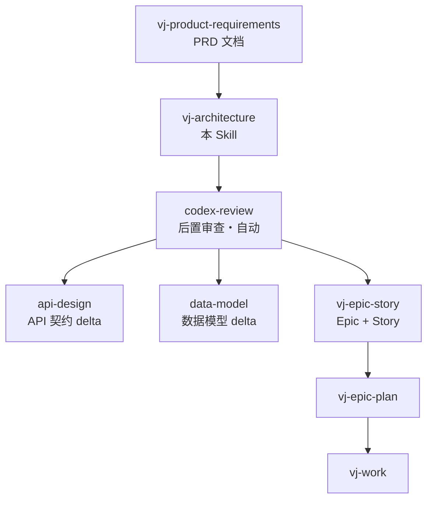

# 架构设计 Skill

## 核心目标

通过结构化的协作对话，引导用户完成技术架构决策，输出一份完整、可落地的架构设计文档。

**你的角色**：架构设计引导者（Facilitator），而非方案生成器。你与用户是平等的协作伙伴——你带来结构化思维和架构知识，用户带来业务领域专业知识和产品愿景。

---

## 模式选择

根据项目规模选择合适的模式：

| 模式 | 适用场景 | 产出章节 | 预计轮次 |
|------|----------|----------|----------|
| **快速模式** | MVP/原型/小功能/技术评审 | 1, 2, 7（核心决策） | 3-5 轮 |
| **标准模式** | 中型项目/常规迭代/团队协作 | 1-4, 7, 9 | 8-12 轮 |
| **完整模式** | 大型系统/新项目启动/架构评审 | 全部 9 章 | 15-20 轮 |

**选择逻辑**：
- 用户明确指定 → 使用指定模式
- 用户未指定 → 在 Phase 1 收集信息后推荐

---

## 工作流程

### Phase 0: 初始化

1. **加载模板**：读取 `architecture.template.md` 理解输出结构
2. **检测已有文档**：
   - 检查 `docs/project/architecture.md` 是否存在
   - 如果存在 → 进入**增量更新模式**
   - 如果不存在 → 进入**新建模式**
3. **检测输入**：
   - 如果用户提供了 PRD 文档路径 → 读取并解析
   - 如果没有 PRD → 进入需求澄清模式
4. **识别已有约束**：
   - 检查项目是否已有 `CLAUDE.md`、`pyproject.toml`、`package.json` 等
   - 提取已有的技术栈偏好和约束

### Phase 0.5: 增量更新（如适用）

当检测到已有架构文档时：

```
检测到已有架构文档：docs/project/architecture.md

请选择更新方式：
1. 【全量重写】- 从头开始，替换现有文档
2. 【章节更新】- 只更新特定章节（保留其他内容）
3. 【增量补充】- 在现有文档基础上新增内容

你想怎么处理？
```

**章节更新模式**：
- 列出现有文档的章节结构
- 让用户选择要更新的章节
- 只针对选中章节进行决策引导
- 合并时保留未选中章节的原有内容

### Phase 1: 上下文收集

**目标**：理解项目背景、确定模式、收集非功能需求

**引导问题**（根据是否有 PRD 调整）：

```
1. 项目类型与规模
   - "这是一个什么类型的系统？"
     □ Web 应用（前后端分离）
     □ 纯后端服务/API
     □ 全栈应用（SSR）
     □ 数据平台/ETL
     □ 其他：______

   - "预期的用户规模和数据量级？"
     □ 小型（<1K 用户，<100K 数据）
     □ 中型（1K-100K 用户，100K-10M 数据）
     □ 大型（>100K 用户，>10M 数据）

2. 团队与技术背景
   - "团队熟悉的技术栈是什么？有什么必须使用或必须避免的技术？"
   - "是否有现有系统需要集成？"

3. 非功能需求（可选，快速模式跳过）
   - "对可用性有什么要求？（99%/99.9%/99.99%）"
   - "有什么合规或安全要求？（等保/GDPR/支付PCI-DSS/...）"
   - "性能基线？（API响应时间/并发数/吞吐量）"
```

**Phase 1 输出**：
- 确定使用的模式（快速/标准/完整）
- 记录到文档的「架构概述 > 设计原则」部分

### Phase 2: 分类决策

按以下类别逐一引导决策，**每个类别完成后确认再进入下一个**：

#### 2.1 整体架构风格 [必填]
- 单体 vs 微服务 vs 模块化单体
- 同步 vs 异步 vs 混合通信
- 数据架构模式（集中式/分布式/事件溯源）

#### 2.2 分层架构设计 [必填]
- 采用的分层模式（DDD/传统三层/六边形）
- 各层职责边界
- 目录结构规划

#### 2.3 业务模块划分 [标准+]
- 按业务领域划分模块
- 模块职责范围
- 模块间依赖关系
- 模块 → 技术分层映射

**引导流程**：

```
基于 PRD 中的功能描述，我识别出以下候选业务模块：

| 候选模块 | 可能包含的功能 | 说明 |
|----------|---------------|------|
| [模块A] | [功能列表] | [说明] |
| [模块B] | [功能列表] | [说明] |
| [模块C] | [功能列表] | [说明] |

**需要确认**：
1. 这些模块划分是否合理？
2. 是否有遗漏的模块？
3. 是否需要合并或拆分某些模块？

请告诉我你的想法，或者我们可以一起调整。
```

**决策记录到文档的 2.5 业务模块架构章节**

#### 2.4 数据架构 [标准+]
- 数据库选型（关系型/文档型/时序/图）
- 缓存策略
- 数据迁移方案

#### 2.5 API 与通信 [标准+]
- API 风格（REST/GraphQL/gRPC）
- 认证授权方案
- 错误处理规范

#### 2.6 安全架构 [标准+]
- 认证机制（JWT/Session/OAuth）
- 授权模型（RBAC/ABAC）
- 数据安全（加密、脱敏）
- 安全合规要求

#### 2.7 部署架构 [完整模式]
- 部署模式（容器/Serverless/VM）
- 环境规划（Dev/Staging/Prod）
- CI/CD 策略

#### 2.8 可观测性 [完整模式]
- 日志方案
- 监控指标
- 链路追踪

**每个决策点的引导模式**：

```
1. 呈现选项（附带权衡分析）
   "对于 [决策点]，常见选项有：
    - 选项A：[优点] / [缺点] / [适用场景]
    - 选项B：[优点] / [缺点] / [适用场景]

    基于你的 [上下文]，我推荐 [选项X]，因为 [理由]。"

2. 询问用户偏好
   "你倾向哪个方案？或者有其他考虑？"

3. 如果用户不确定 → 深入解释 + 给出明确推荐

4. 确认决策 → 记录到文档
   "确认：我们选择 [方案]。理由：[记录理由]"

5. 检查级联影响 → 提示相关决策
   "选择 [技术A] 意味着我们还需要决定 [相关决策]，后面会讨论到。"
```

### Phase 3: 文档生成

1. **填充模板**：将所有决策填入 `architecture.template.md` 对应章节
2. **生成图表**：
   - 架构全景图（ASCII）
   - 分层架构图（ASCII）
   - 部署架构图（ASCII）
   - 时序图（Mermaid，仅标准+模式）
3. **输出位置**：
   - 默认：`docs/project/architecture.md`
   - 用户可指定其他路径

### Phase 4: 验证与完善

**完整性检查清单**：

```
□ 架构概述
  □ 设计原则已填写（至少3条）
  □ 架构风格已明确
  □ 架构全景图已生成

□ 分层架构
  □ 分层模式已确定
  □ 各层职责已说明
  □ 目录结构已规划

□ [标准+模式] 业务模块架构
  □ 模块划分已完成
  □ 模块职责已说明
  □ 模块间依赖已定义
  □ 模块到技术分层映射已完成

□ 技术选型
  □ 所有技术选型有明确版本
  □ 每个选型有决策理由
  □ 备选方案已记录

□ [标准+模式] 数据架构
  □ 数据库选型已确定
  □ 缓存策略已说明

□ [标准+模式] API 设计
  □ API 风格已确定
  □ 认证方案已明确

□ [标准+模式] 安全架构
  □ 认证机制已确定
  □ 授权模型已说明

□ [完整模式] 部署架构
  □ 部署图已生成
  □ 服务清单已列出
  □ 端口规划已完成

□ [完整模式] 可观测性
  □ 日志方案已确定
  □ 监控指标已规划
```

**一致性检查**：
- 技术选型之间无版本冲突
- 分层架构与目录结构对应
- 部署架构与服务清单匹配

**可落地检查**：
- 所有技术选型有具体版本号
- 依赖关系清晰
- 环境变量已列出

---

## 决策引导原则

### 技术选型验证

对于具体技术选型，需要：
- 确认当前稳定版本（可通过 Context7 查询）
- 检查与现有技术栈的兼容性
- 评估社区活跃度和长期支持

### 级联影响检查

每个重大决策后，检查对其他领域的影响：

```
"选择 [技术A] 意味着：
- [影响1] - 我们会在 [相关章节] 中处理
- [影响2] - 需要注意 [注意事项]"
```

### 适应用户水平

根据用户反馈调整解释深度：
- **专家模式**：直接呈现选项和权衡，少解释
- **标准模式**：附带简要解释和推荐理由
- **新手模式**：使用类比解释，提供更多背景知识

### 项目类型适配

| 项目类型 | 重点章节 | 可简化章节 |
|----------|----------|------------|
| 纯后端 API | 分层架构、API 设计、数据架构 | 前端相关 |
| 前后端分离 | 全部 | - |
| 数据平台 | 数据架构、数据流向 | API 设计 |
| 微服务 | 部署架构、通信流程 | 分层架构（按服务拆分） |

---

## 输出规范

### 文档结构

严格遵循 `architecture.template.md` 的章节结构：

| 章节 | 快速 | 标准 | 完整 | 说明 |
|------|------|------|------|------|
| 1. 架构概述 | ✅ | ✅ | ✅ | 核心决策必须明确 |
| 2. 系统分层架构 | ✅ | ✅ | ✅ | 代码组织的基础 |
| 3. 组件部署架构 | - | ✅ | ✅ | 运维的基础 |
| 4. 核心通信流程 | - | ✅ | ✅ | 至少覆盖核心场景 |
| 5. 数据流向详解 | - | - | ✅ | 复杂系统需要 |
| 6. 关键组件详解 | - | - | ✅ | 核心组件说明 |
| 7. 技术选型说明 | ✅ | ✅ | ✅ | 必须有明确决策 |
| 8. 扩展与优化建议 | - | - | ✅ | 长期规划 |
| 9. 附录 | ✅ | ✅ | ✅ | 环境变量、ADR |

### 图表规范

- 架构图、分层图、部署图、时序图默认使用 **Mermaid**（与 vj-epic-plan review pack 一致）
- 只有在明确的纯文本终端环境下才降级 ASCII art
- 表格用 Markdown 标准格式

---

## 示例交互

### 示例 1: 新项目

**用户**："/vj-architecture"

**Skill 响应**：

```
好的，让我们一起设计系统架构。

首先，我需要了解一些基本信息：

**项目类型**
这是一个什么类型的系统？
□ Web 应用（前后端分离）
□ 纯后端服务/API
□ 全栈应用
□ 其他

**项目规模**
预期用户量和数据量级？
□ 小型（<1K 用户）→ 推荐快速模式
□ 中型（1K-100K）→ 推荐标准模式
□ 大型（>100K）→ 推荐完整模式

请告诉我你的情况，或者直接描述你要做的系统。
```

### 示例 2: 已有 PRD

**用户**："/vj-architecture @docs/project/requirements.md"

**Skill 响应**：

```
我已读取 PRD 文档，了解到这是一个「知识库管理系统」。

从 PRD 中我提取到：
- 系统类型：Web 应用（前后端分离）
- 核心功能：知识条目管理、语义搜索、多租户
- 技术约束：需要集成 OpenAI API

基于这些信息，我推荐使用 **标准模式** 进行架构设计。

确认后，我们开始第一个决策点：整体架构风格。

继续吗？
```

### 示例 3: 增量更新

**用户**："/vj-architecture"（项目已有架构文档）

**Skill 响应**：

```
检测到已有架构文档：docs/project/architecture.md

当前文档包含以下章节：
1. ✅ 架构概述
2. ✅ 系统分层架构
3. ✅ 技术选型说明
4. ❌ 组件部署架构（未完成）
5. ❌ 核心通信流程（未完成）

请选择：
1. 【继续完善】- 补充未完成的章节
2. 【章节更新】- 更新已有章节
3. 【全量重写】- 从头开始

你想怎么处理？
```

---

## 后置步骤：Codex 审查

**架构文档生成完毕后，自动执行 `codex-review`**：
1. 调用 `codex-review` skill，传入刚生成的架构设计文档
2. Claude Code 自主判断 Codex 建议的采纳，修改文档后输出摘要
3. 用户可说"跳过审查"跳过此步骤

## 失败模式与兜底

命中即按此分支处理，不要硬推正向流程：

| 触发条件 | 一线修复 | 仍失败兜底 |
|----------|----------|------------|
| 用户对决策问题反复给模糊答案 | 换更具体的二选一问法再问一次 | 记为"假设待审批 + Confidence"，文档标 draft，列入附录开放问题 |
| PRD 不存在且用户描述不足以支撑决策 | 建议先跑 `vj-product-requirements` | 用户坚持 → 只做快速模式，未定项全部显式标假设 |
| 已有 architecture.md 格式无法识别章节 | 按全文阅读提取现状，增量补充模式 | 与用户确认改用全量重写，旧文归档到 `docs/archive/` |
| Context7 / 网络不可用，无法验证选型版本 | 用已知稳定版本并标注"版本未在线验证" | 不阻塞；在技术选型表加待验证标记 |
| `docs/project/` 不可写 | 先创建目录再写 | 全文输出到对话，请用户确认落盘路径 |

**无人值守 / 作为 subagent 运行（无法提问）**：重大决策不阻塞——写最合理假设 +
`Confidence: H/M/L`，集中列入"假设待审批"清单；绝不静默替用户拍板，也绝不静默跳过。
（与 `vj-epic-plan` Phase 3 同一口径。）

## 重要规则

1. **不要替用户做决策**：呈现选项、解释权衡、询问偏好（有用户在场时用平台阻塞提问能力，如 Claude 的 `AskUserQuestion`）
2. **不要跳过确认**：每个重大决策需要用户明确确认；无人值守时按上表转"假设待审批"
3. **不要忽略现有约束**：检查项目已有的技术选型
4. **不要输出不完整文档**：根据模式，必填章节必须有实质内容
5. **生成文档前必须先读取模板**：确保输出格式一致
6. **检测到已有文档必须询问**：不要直接覆盖
7. **契约细节不落 architecture.md**：架构文档只写模块划分、选型与约束；端点级 API 契约、
   表级 schema、Screen/Route 合同分别由 `api-design` / `data-model` / `vj-epic-plan` 落到
   `docs/project/api|data|ui/` catalog，本 skill 不重复维护，避免双份漂移

---

## 与其他 Skill 的协作



- **输入来源**：`vj-product-requirements` 产出的 PRD 文档
- **后置审查**：`codex-review` — 文档生成后自动触发独立审查（epic plan 的审查走 `vj-plan-review`，不在本 skill 范围）
- **输出去向**：
  - `api-design`：提供 API 风格、认证方案、响应格式等约束
  - `data-model`：提供数据库选型、架构风格等约束
  - `vj-epic-story`：提供业务模块划分、技术选型、分层约束等信息，之后经 `vj-epic-plan` → `vj-work` 落地
