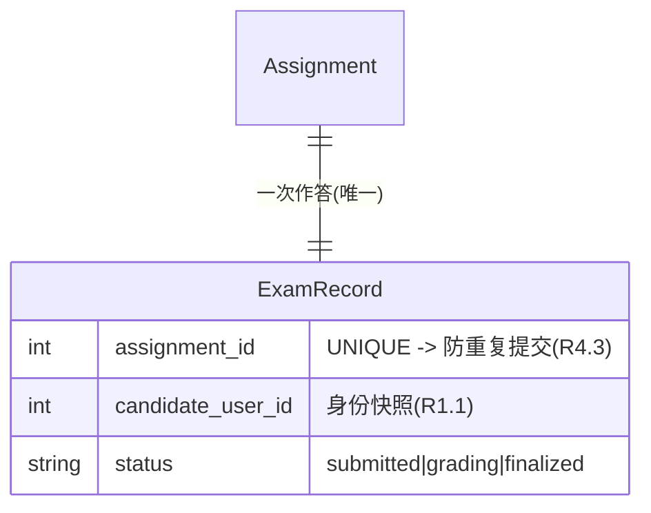
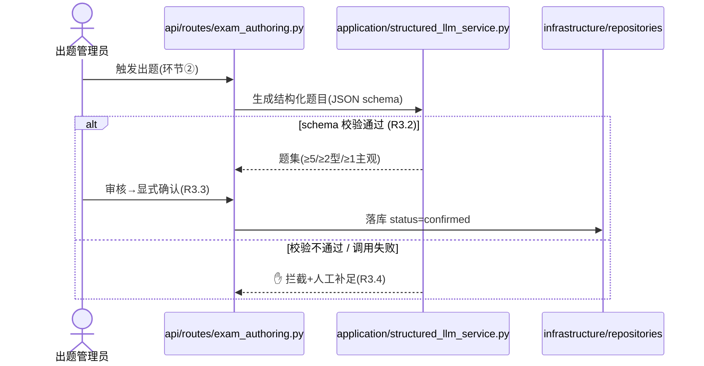
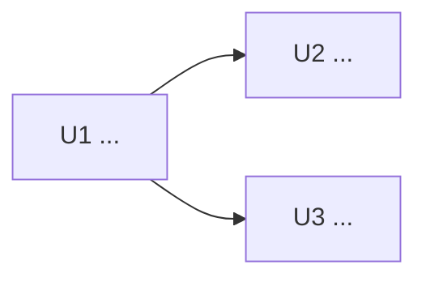

# [Epic N 标题] 实现计划

<!--
生成时删除本注释与所有无关示例。正文优先服务人工 Review；执行细节放 Appendix。
WHAT 来自 epic.md + stories，本 plan 不静默重写 AC。
写作风格：面向人的说明用大白话（像当面口头讲），契约字段（文件路径 / 验证命令 / Delta / 依赖 / D-ID）保持精确；不堆形容词、不写空话套话和学术腔。
-->

## Context Ownership

> 本 plan 是人工 review manifest + 本 Epic delta。稳定跨 Epic 上下文写入 catalog；AI coding 执行上下文写入 task docs / `_execution_context.md`。

| Context | Source of truth | 本 plan 只做什么 |
|---------|-----------------|------------------|
| API 契约 | `docs/project/api/` | §5 记录本 Epic API delta + Catalog Sync |
| Data / persistence 契约 | `docs/project/data/` | §5 记录本 Epic schema delta + Catalog Sync |
| UI Surface / Route 合同 | `docs/project/ui/surfaces.md`, `docs/project/ui/routes.md` | §4/§5 记录本 Epic UI delta + Catalog Sync |
| AI 执行上下文 | `docs/tasks/work/epic-.../T*.md`, `_execution_context.md` | Appendix C/D 给投影原料 |
| 人工决策 / 审计 | 本 plan | §0/§2/Appendix A/E |

## 0. 审批门

> 人工 review 主面是 **§4 共享设计**（ERD / 流程图 / 模块边界 / 术语）——方向对不对、AI 打算怎么搭，看那里。本节只放需要你拍板的决策，且这些决策已内联标注到 §4 的对应图里（扫图即可批准方向）。完整论证在 §2，这里只链 `D-ID`、不复述。

- **目标（一句话）**：
- **设计与方向**：见 §4。
- **需要你拍板**（批准前不得进入实现；无则写“无”）：`D1` …（链 §2，已内联 §4 图注）/ `ACD1` …
- **API / Schema / UI catalog 影响**：API 是/否；Schema 是/否；UI 是/否（详见 §5）。

---

## 1. 目标与范围

### Epic 目标
> 引 epic.md，不重写。

- **背景 / 价值**：（一句话，链 `epic.md`）
- **Success Criteria**：见 `epic.md` 的 Success Criteria（不复制；如有补充口径在此列）
- **Story 列表**：S N.1 …, S N.2 …（链到各 story）

### In Scope
-
- *(底座型 Epic 适用)* 验证脚手架（临时）：为跑通本 Epic AC 引入的最小探针 / 占位端点。显式列出移除时机，避免被当作业务能力。

### Out of Scope / 延后
- **刻意不做**（本 Epic 永不做）：
- **延后到后续 Epic / PR**：
- **不会修改 / 显式排除**（防 Review 时回归误判）：

### 验收边界
> 标出本 Epic 能独立验收的行为，以及必须由下游 Epic 联调完成的行为。

| 验收项 | 本 Epic 是否完成 | 验证方式 | 下游联调 / 备注 |
|--------|-----------------|----------|-----------------|
| | 是 / 部分 / 否 | | |

---

## 2. 决策与 AC 偏离

> 本节是决策真相源。不要在其他章节复制完整论证；其他章节只链接 `D-ID`。

### 待审批决策
> AC 没写、代码推不出、会改变范围或验收口径的事项必须列在此处。有用户在场时逐项询问；无人值守时标为“假设，待审批”。

| ID | 状态 | 决策问题 | 当前建议 / 假设 | 影响 | Rejected / 备选 |
|----|------|----------|-----------------|------|-----------------|
| D1 | 待审批 / 假设待审批 / 已确认 | | | | |

### AC 偏离
> 原则上回改 epic.md / story AC。确需保留偏离时，必须由 reviewer 显式批准；不得用“等价口径”静默覆盖上游 AC。

| ID | 来源 AC | 原始验收口径 | 本 plan 方案 | 是否等价 | 处理方式 |
|----|---------|--------------|-------------|----------|----------|
| ACD1 | | | | 是 / 否 / 部分 | 回改上游 AC / 待审批 / 已批准 |

### 已确认的关键决策
> 仅记录会影响实现方向或后续 Epic 的决策。带 `Rejected:`，供实现与 commit-trailer 复用。

- **[D-ID / 决策]**：[理由] | Rejected: [否决方案 | 为什么]

---

## 3. 跨 Epic 契约（Consumes）

> Flow B/C 填。**单一真相源 = catalog**（`docs/project/api/`、`docs/project/data/`、`docs/project/ui/`）。本节只填 `Consumes`（本 Epic 依赖的上游契约的过滤视图）；**不写 Provides 表**——本 Epic 对下游暴露的稳定契约写进 catalog（见 §5 Catalog Sync 列出的目标文件），不在 plan 内重复列举，避免 plan 与 catalog 双写漂移。

### Consumes
> 本 Epic 依赖的上游契约子集。真相来源 = catalog（`docs/project/api|data|ui/{module-or-file}.md`），**不是上游 plan**。本 Epic 是依赖图的根时填单行：`— | 无上游依赖 | epic.md §依赖`。

| 依赖的契约（接口 / 模型 / 能力 / 不变量） | 在哪用 | 真相来源（catalog 路径） |
|--------------------------------------------|--------|--------------------------|
| | | |

### 本 Epic 对下游的契约（Provides → 写 catalog，不在此列表）
> 不在 plan 重复。本 Epic 新增的稳定契约写进 catalog 模块文档（见 §5 Catalog Sync 的目标文件；catalog 内以「契约状态 / introduced by Epic N」标出处）。**跨切面义务 / 不变量**（如 R1.x：某类记录必须经某机制关联某字段）——读代码 / 读单个模块 catalog 不一定看得出——写进 `docs/project/data/overview.md` 跨模块段、`docs/project/api/conventions.md` 或 `docs/project/ui/surfaces.md`，供下游 epic 规划时直接读。

---

## 4. 共享设计

> **人工 review 主面——用户主要看这一节。** 与 Flow 无关：只要有持久化模型 / 流程 / 状态流转 / 外部调用 / 前端页面，就把设计画清楚（术语、ERD、核心流程 / 状态流转、模块边界、设计上下文），只画本 Epic 拥有或消费的子集。**把 §2 的已定关键决策内联标注到对应图**，让“扫图 = 看见并批准方向”；说人话的预算花在图注和术语上。

### 术语与代码对象
> 本 Epic 引入 5+ 新概念时填。`概念` → 一句话 + 对应代码对象 / 聚合根。

- `Xxx`：一句话解释 → 落点 `domain/xxx/entity.py`

### 数据模型（ERD）
> 有持久化模型时保留 ERD，关键字段内联 `约束 / 枚举 → 需求(R x.y)`，并把已定决策内联到字段注（如 `status "... → D1"`）。本 Epic 不引入表时，删除示例图，用一句话说明数据如何承载。

### 核心流程 / 状态流转
> 涉及权限、状态流转、异步、外部调用或多步骤交接时填。participant 标代码落点；关键步骤内联 R-ID 与已定决策（如 `Note over SVC: token 无 exp（D1）`）；失败路径用 `alt / else`，需要人工兜底时标 `✋`。

### 设计上下文（指针 + 现状冲突 / 契约，不复制 DESIGN.md）
> UI Unit 的设计合同是 `docs/project/DESIGN.md`，vj-work 执行时**直接读**——本 plan **不复制其约束原文**（复制只会和真相源漂移，还诱导执行者把残缺子集当完整 spec）。
> UI Surface / Route 合同的稳定真相源是 `docs/project/ui/surfaces.md` + `docs/project/ui/routes.md`。本节只写本 Epic 的新增/更新 delta；Phase 5 同步到 catalog，后续 Epic 读 catalog，不翻旧 plan。
> 前置检查：`DESIGN.md` 存在 → 继续；缺失 → 暂停 UI-critical 实现先补草案（旧 `design_guidelines.md` 仅 fallback）。设计稿（若有）：`docs/reference/research/designs/{epic-id}/`，无则“暂无”。
> 本节只留 work-time 单 Unit **拿不到、或并行会各判各的** 的东西 ↓

**现状 ↔ DESIGN.md 冲突 / 需跨 UI Unit 统一的设计契约**（无则写“无”）：

| 冲突 / 契约 | 现状 | DESIGN.md / 目标 | 处理（决策 D-ID） | 影响 Unit |
|-------------|------|------------------|-------------------|-----------|
| 主题主色 | `main.tsx` primary `#1565c0` | `#0F3D3E` | 对齐 DESIGN.md（D?） | U2, U4 |

### 页面体验约束（来自 epic.md）
> 每个 UI Unit 至少关联一行。不要把这里扩写成控件脚本；只保留页面职责、主/次操作、关键状态、信息优先级、体验护栏。

| 页面/区域 | 页面职责 | 主操作 | 次操作 | 关键状态 | 信息优先级 | 体验护栏 | 覆盖 Unit |
|-----------|----------|--------|--------|----------|------------|----------|-----------|
| | | | | | | | U1 |

### UI Surface Delta（前端 Epic 必填）
> 本 Epic 新增或更新的 Screen / Route 合同。稳定版本在 Phase 5 写入 `docs/project/ui/surfaces.md` 与 `docs/project/ui/routes.md`；后续 Epic 读取 catalog。
> Story / Unit 负责验收追踪，Screen / Route 负责整体体验。不得让每个 Story 各自发明页面片段；同一 Screen 的 UI 在 frontend composition wave 中整体实现。
> 启动前端实现的条件不是“所有后端全部完成”，而是该 Screen 依赖的 API / 状态 / 数据合同已经稳定。合同不清时列入 §2 待审批决策。

| Action | Screen ID | Route | Primary Job | Role | Covered Units | Regions / IA | Key States | API-for-UI / Data Contract | Screen Done | Catalog target |
|--------|-----------|-------|-------------|------|---------------|--------------|------------|----------------------------|-------------|----------------|
| Add / Update | screen-xxx | `/path` | 用户在此屏完成什么任务 | admin / employee | U1, U3 | 左/中/右区域或上下区域 | empty / loading / error / draft / success / permission | `GET/POST ...` + 关键字段 / 状态枚举 | 可跑通的屏级验收信号 | `docs/project/ui/surfaces.md` |

### Frontend Composition Policy
> 用于 Appendix D 与 vj-work。后端按 capability 落地，前端按 experience 落地。

| Screen ID | Frontend start condition | Composition scope | Must preserve | Browser / Screenshot check |
|-----------|--------------------------|-------------------|---------------|----------------------------|
| screen-xxx | 依赖接口、字段、错误、状态已稳定；mock/real adapter 均可返回合同数据 | 一次性实现该 Route 的壳、区域、主任务、相关 Unit 的 UI AC | 同屏 sibling Unit 的区域与主流程；不得孤立堆卡片 | desktop + mobile / targeted |

### 设计参考
> 前端 Story 且有设计稿时填。默认从 `docs/reference/research/designs/{epic-id}/` 收集；无设计稿时明确写“暂无”。

| 页面 / 状态 | 参考图路径或 URL | 类型 | 说明 |
|-------------|------------------|------|------|
| List / Empty / Loading / Success / Error | `docs/reference/research/designs/{epic-id}/{story-id}-{page}.png` | image / figma / url | |

---

## 5. API / Schema / UI Catalog Delta

> Triage 命中“改 API 契约”或“改 DB schema / persistence contract”时填。本节是当前 Epic 的 delta；稳定项目级视图同步维护在模块化契约目录。

### Project Catalog Sync
> 模块 slug 优先取 architecture 中的业务模块名；无既有 slug 时使用 Epic 业务域 slug（lower-kebab-case）。无对应 delta 时写“无需同步”，不要创建空模块文档。

| Area | Target Docs | Action | Status |
|------|-------------|--------|--------|
| API | `docs/project/api/conventions.md`（仅全局约定变化时修改）+ `docs/project/api/{module}.md` | Create / Update / N/A | |
| Data | `docs/project/data/overview.md`（表索引 / 跨模块关系）+ `docs/project/data/{module}.md` | Create / Update / N/A | |
| UI | `docs/project/ui/surfaces.md` + `docs/project/ui/routes.md` | Create / Update / N/A | |

### API Contract Delta（命中才填）
| Change | Endpoint | Request | Response | Auth / Idempotency / Notes |
|--------|----------|---------|----------|-----------------------------|
| Added / Updated / Removed | `POST /api/v1/...` | | | |

### 错误与向后兼容变化（命中才填）
| Topic | Before | After | Impact |
|-------|--------|-------|--------|
| error code / status / 分页 / 过滤 / 排序 / streaming | | | |

受影响消费者：Web / Mobile / Worker / Third-party
已同步 API 模块文档：`docs/project/api/{module}.md` / 无需同步

### Schema / Migration Delta（命中才填）
| Change | Table / Object | Before | After | Notes |
|--------|----------------|--------|-------|-------|
| Added / Updated / Removed | | | | |

索引 / 约束 / 一致性（unique / FK / 事务 / 幂等）：
Migration 与回滚：
已同步 Data 模块文档：`docs/project/data/overview.md` + `docs/project/data/{module}.md` / 无需同步

### UI Surface / Route Delta（前端 Epic 命中才填）
| Change | Screen / Route | Before | After | Notes |
|--------|----------------|--------|-------|-------|
| Added / Updated / Removed | `screen-xxx` / `/path` | | | |

路由 / 角色 / 导航变化：
API-for-UI 依赖：
Screen 状态（empty/loading/error/success/permission/draft）：
已同步 UI catalog：`docs/project/ui/surfaces.md` + `docs/project/ui/routes.md` / 无需同步

---

## 6. 实现单元与依赖

> 人工 Review 只看 Unit 级目标、依赖、交付和验收。文件级改动与执行细节放 Appendix C。

### Unit 概览
> `Unit = Story`。不要把 Unit 按前端 / 后端 / 数据库拆开；技术层落点放在 Appendix C 的 Files / Approach。Task 文档默认与 Unit 一一对应，只有满足 Appendix D 的拆分门槛才允许 `1 Unit → 多 task`。
> 前端 Epic 例外不是改 Unit 语义，而是改执行编排：后端/API/data 按 Unit capability 交付；UI 由 Appendix D 的 Frontend composition wave 按 Screen/Route 聚合实现。Unit done 仍以 Story AC / Unit Verification / Screen verification 共同成立为准。

| Unit | 对应 Story | 目标 | 主要交付 | Depends | 验收 |
|------|------------|------|----------|---------|------|
| U1 | S N.1 | | | 无 | |
| U2 | S N.2 | | | U1 | |

### 依赖 DAG
> 与 epic.md 的 `**依赖**:` 行保持一致；run-epic 只读取 epic.md，不读取本图。

### 并行结论
- **实现顺序**：
- **可并行 Units**：
- **必须串行 / 协调点**：

---

## Appendix A. Triage 审计

### 影响判定（scope = 本 Epic）
- Story 数 / 用户目标数：
- 涉及模块：
- 涉及层级：[domain / application / infrastructure / api / frontend]
- 是否改 API 契约：是 / 否
- 是否改 DB schema：是 / 否
- 是否改 Domain 规则：是 / 否
- 是否涉及外部系统 / 异步（LLM / Celery / 存储 / 消息）：是 / 否
- 是否涉及权限 / 安全 / 幂等 / 复杂状态流转：是 / 否
- 预估文件数：

### 分级结论
- **Workflow**: Flow A / Flow B / Flow C
- **Confidence**: High / Medium / Low
- **理由**：

### 关键约束来源
> 这里只列 source pointer，不复制 catalog / DESIGN.md / 代码约束原文。执行期由 vj-work 投影进 task docs 与 `_execution_context.md`。

| 类别 | 来源 | 本 Epic 用途 |
|------|------|--------------|
| Story / AC | `docs/tasks/epics/...` | |
| API catalog | `docs/project/api/...` | |
| Data catalog | `docs/project/data/...` | |
| UI catalog / Design | `docs/project/ui/...`, `docs/project/DESIGN.md` | |
| Code patterns | `backend/...`, `frontend/...` | |

### 执行约束投影
- Appendix C：只在对应 Unit 的 Approach / Patterns / Test scenarios 中列该 Unit 需要的约束来源。
- task docs：按 Unit 注入目标文件、验证命令、UI Screen context 与 source pointer。
- `_execution_context.md`：由 vj-work 生成 10-20 条 Epic-level checklist + 每 Unit Context Packet；不从 Appendix A 复制长清单。

### Scope Challenge
- 现有代码 / 上游 Epic 已 Provides 什么，能避免平行实现？
- 达成本 Epic 的最小改动是什么？
- 哪些是 scope creep，应延后？
- 若预计单个 Story 改 >8 文件且超 2 层，是否方案过重？

### 升级触发条件
- 实现中若发现 [改 DB / 改 API 契约 / 跨 BC / 需求歧义]，暂停并升级 Flow。

---

## Appendix B. 上下文与复用

### 当前现状
- 当前流程：
- 当前问题 / 痛点：

### 可复用锚点（现有代码 / 上游契约）
- 已有实现可直接复用：
- 需改造复用：
- 不应重复建设：

### institutional learnings（来自 docs/solutions）
> 由 vj-learnings-researcher 检索。无命中则写“暂无相关沉淀”。
-

---

## Appendix C. Unit 执行详情

> 每个 Story 对应一个 Unit。Test scenarios 链接 Story AC，不重写 AC；发现冲突时登记到 §2“AC 偏离”，不得静默改写。
> 补充用例按来源分两类：**实现涌现型行为用例**（并发/回滚/缓存/幂等等，用户可观测）→ 回流改 Story AC（走 §2），不留此处；**纯实现级用例**（内部分支/私有函数，用户不可观测）→ 留此处。
> 一个 Unit 内有多个技术阶段时，先写进本 Unit 的 Approach / Execution note。默认生成一个 task；只有 Appendix D 的拆分门槛成立时才列多个 task。

### U1. [Story N.1 名称]

**对应 Story**: S N.1（链 `epic.md` / `stories/usNNN-*.md`）
**Goal**: 本单元交付什么
**Requirements**: [R x.y]
**Depends**: 无 / U2 / 上游 Epic 的 Provides 项

**Files**:
- Create: `path`
- Modify: `path`
- Test: `path`

**Approach**: 关键决策 / 数据流 / 分层落点（不写实现代码）
**Execution note**: *(可选：test-first / characterization-first 等执行姿态)*
**Patterns to follow**: 现有可镜像的文件 / 类 / 约定
**Design context（UI Unit）**: `docs/project/DESIGN.md` / fallback `docs/project/design_guidelines.md`；epic.md `## 页面体验地图` 对应页面/区域；设计稿路径（如有）
**UI Surface participation（UI Unit）**: Screen ID / Route；本 Unit 在该 Screen 中负责的区域或状态；同屏 sibling Units；API-for-UI 依赖；Screen done 信号；catalog target `docs/project/ui/surfaces.md` / `routes.md`。
**Task projection**: 默认 T001 覆盖整个 U1；若拆多个 task，列 `T001/T002...`、拆分理由、局部验证与 Unit 级闭环验证。不得只因“前端 / 后端”拆分；只有当 UI Surface Delta / catalog 要求按 Screen 聚合实现时，允许把 UI AC 汇入 Screen composition task，并在此处回指对应 task。

**Test scenarios**:
- 链 S N.1 AC：Happy / Edge / Error / Integration（见 epic.md）
- 补充·纯实现级用例（内部分支 / 私有函数，用户不可观测）：
  <!-- 实现涌现型且用户可观测的行为用例不写这里，回流改 Story AC（见 §2） -->

**Verification**: 本单元完成后应成立的可观察结果

### U2. [Story N.2 名称]
...（同上结构）

---

## Appendix D. 并行与文件协调

> 本 Epic 含 ≥2 个 Story 时填。§6 展示人工 Review 所需结论；本附录保存执行协调细节。**本附录的并行波次表是权威波次计划：下游 vj-work 直接消费、不重算（波次正确性由 vj-plan-review 的"依赖并行"视角负责）。**
> 默认波次按 Unit 拓扑分层。只有通过“task 拆分门槛”时，才增加 task 级 DAG / 波次；task 波次不得越过 Unit 依赖。
> 前端 Epic 必须额外填写 Execution lanes 与 Frontend composition waves。前端不是等所有后端 100% 完成后再做，也不是跟每个 Story 分散做；某个 Screen 的 API / 状态 / 数据合同稳定后，按 Screen 整体实现。

### 真相源对齐
- epic.md 的 Story 依赖：
- 本 plan Unit DAG 与 epic.md 是否一致：

### Unit 并行波次（拓扑分层）
| 波次 | 可并行的 Units | 前置 |
|------|----------------|------|
| Wave 1 | U1 | — |
| Wave 2 | U2, U3 | U1 |

### Execution lanes（前端 Epic 必填）
| Lane | Wave | Scope | Start condition | Done signal |
|------|------|-------|-----------------|-------------|
| UI surface / API contract | Wave 0 | UI Surface Delta + API-for-UI 字段 / 状态 / 错误合同 + UI catalog sync target | plan 定稿 | §4 Screen delta 完整，§5 API/Data/UI Delta 对齐 |
| Backend / API capability | Wave 1..N | 按 Unit 实现后端、API、AI adapter、数据持久化 | 上游 Unit 依赖满足 | API / pytest / service verification 通过 |
| Frontend composition | Wave N+1..M | 按 Screen/Route 整体实现 UI | 对应 Screen 依赖的 API / 状态 / 数据合同稳定，可用 mock 或真实接口返回 | Screen browser check + 关联 UI AC 通过 |
| E2E polish | Final | 演示脚本、截图、异常状态、证据 | backend + screen composition 完成 | 端到端脚本通过 |

### Frontend composition waves（前端 Epic 必填）
| Wave | Screen ID / Route | Covered Units | Required backend/API contracts | Files likely touched | Verification |
|------|-------------------|---------------|--------------------------------|----------------------|--------------|
| FE-1 | screen-xxx / `/path` | U1, U3 | `GET/POST ...`；字段 / 状态枚举 | `frontend/src/routes/...`, `features/...` | Browser route + desktop/mobile screenshot |

### task 拆分门槛（仅当 `1 Unit → 多 task` 时保留）
| Unit | 是否拆分 | 拆分理由 | 文件隔离 / 冲突处理 | 局部验证 | Unit 闭环验收 |
|------|----------|----------|----------------------|----------|---------------|
| U1 | 否 / 是 | 依赖 / 隔离 / 并行收益；不得写“前后端分离”本身 | | | |

### Task 并行波次（仅当启用 task 级拆分时保留）
| 波次 | 可并行的 Tasks | 回指 Unit | 前置 | Unit 依赖是否满足 |
|------|----------------|-----------|------|--------------------|
| Wave 1 | T001 | U1 | — | 是 |

### Unit → Task 映射（仅当启用 task 级拆分时保留）
| Unit | Tasks | Unit done 信号 |
|------|-------|----------------|
| U1 | T001, T002 | 所有 task 完成 + U1 Verification / Story AC 通过 |

### 共享文件冲突点
| 共享文件 | 涉及 Units | 处理建议 |
|----------|------------|----------|
| `backend/infrastructure/unit_of_work.py` | U2, U3 | 串行先后落地，或一次性注册两聚合仓储 |

---

## Appendix E. 风险、回滚与执行步骤

### Risks / Failure Modes
> Flow B/C 填。每条 codepath 对应 §4 时序图中的失败分支，形成“图 ↔ 测试”闭环。

| Codepath / Interaction | 失败方式 | 系统行为 | 用户可见性 | 测试类型 |
|------------------------|----------|----------|------------|----------|
| `service.call()` | timeout / invalid / race / stale | | | unit / integration / api / e2e |

### 回滚 / 撤销策略
> Flow B/C 填。

- feature flag / 开关：
- 部分 Story 已交付时如何回退：
- API 下线 / 前端隐藏：
- DB 回滚见 §5 Schema Delta 的“Migration 与回滚”。

### 关键实现细节（命中才填）
> Triage 命中缓存 / 幂等 / 事务 / 并发时填。无则标 N/A。

- 运行期并发 / 竞态（锁、乐观锁、唯一约束兜底）：
- 运行期幂等（重复请求、重试语义）：
- 事务边界（UoW 跨聚合一致性）：
- 缓存（键、TTL、失效）：

### 执行步骤
> 按 Appendix D 的 lane 顺序执行。后端/API/data 仍按 Unit 分组；前端按 Screen composition wave 分组；可并行 Unit 与协调点见 Appendix D。

- [ ] Wave 0: UI Surface Delta + API-for-UI 合同 + UI catalog target 对齐（如前端 Epic）
- [ ] Backend/API capability: U1 [描述] → 文件 [...] → verification
- [ ] Backend/API capability: U2 [描述] → 文件 [...] → verification
- [ ] Frontend composition: screen-xxx `/path` → 覆盖 U1/U2 的 UI AC → browser/screenshot verification
- [ ] E2E polish: 完整演示脚本 + 全量验证 + review；若改用 run-epic，确认依赖真相源仍来自 epic.md

---

## Appendix F. Sources
- **Epic 源**: [docs/tasks/epics/epic-N-...](path)
- **PRD**: docs/project/requirements.md（R x.y）
- **架构**: docs/project/architecture.md
- **API Catalog**: docs/project/api/conventions.md + docs/project/api/{module}.md（如适用）
- **Data Catalog**: docs/project/data/overview.md + docs/project/data/{module}.md（如适用）
- **UI Catalog**: docs/project/ui/surfaces.md + docs/project/ui/routes.md（如适用）
- **上游契约（Consumes 真相源）**: docs/project/api/、docs/project/data/、docs/project/ui/（catalog；不再从上游 plan 读 Provides）
- **复用锚点**: [path or symbol]
