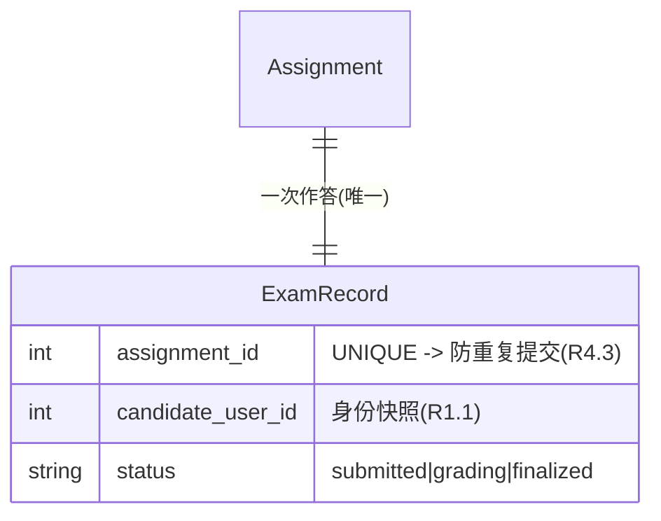
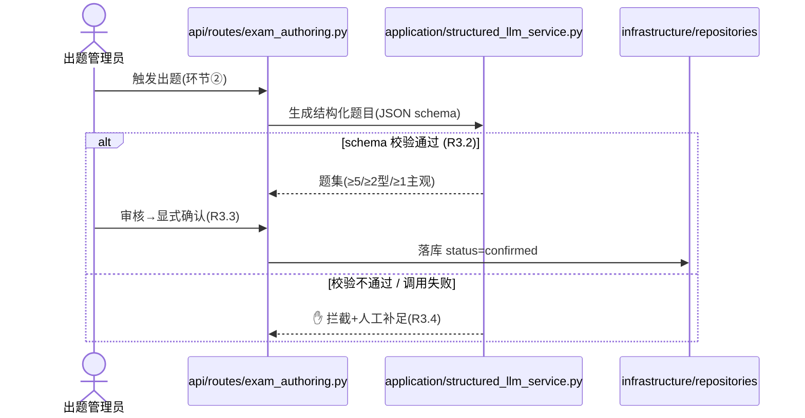
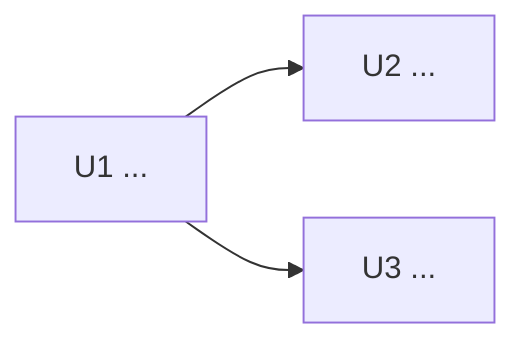

# [Epic N 标题] 实现计划

<!--
生成时删除本注释与所有无关示例。正文优先服务人工 Review；执行细节放 Appendix。
WHAT 来自 epic.md + stories，本 plan 不静默重写 AC。
写作风格：面向人的说明用大白话（像当面口头讲），契约字段（文件路径 / 验证命令 / Delta / 依赖 / D-ID）保持精确；不堆形容词、不写空话套话和学术腔。
-->

## 0. Reviewer Summary

> 人工 Review 入口。控制在一屏左右；只写结论、边界和需要拍板的事项，细节链接到后续章节。

| 项目 | 内容 |
|------|------|
| 目标 | |
| 实现顺序 | `U1 → U2` / 可并行波次见 §6 |
| In Scope | |
| 明确不做 | |
| API / Schema 影响 | API：是/否；Schema：是/否 |
| 项目级契约文档 | API：`docs/project/api/{module}.md` / 无需同步；Data：`docs/project/data/{module}.md` / 无需同步 |
| 设计来源（前端 Epic） | `docs/project/DESIGN.md` / fallback `docs/project/design_guidelines.md` / N/A |
| 下游依赖 | |
| Review Gate | 有 / 无。若有，列出 `D1`、`D2`；批准前不得进入实现 |

### Review Checklist
- [ ] 目标、范围与下游契约可接受
- [ ] §2 中所有 `待审批` 决策已确认
- [ ] §2 中所有 AC 偏离已回改上游 AC 或获得显式批准
- [ ] 如适用，§4 流程图 / ERD 与 §5 API / Schema Delta 可接受
- [ ] 如适用，§4 设计上下文与 epic.md 的页面体验地图可接受
- [ ] §5 Catalog Sync 目标与最终状态可接受；同步在 `vj-plan-review` 采纳修正后完成，或明确无需同步
- [ ] §6 Unit 切分、依赖与实现顺序可接受

---

## 1. 目标与范围

### Epic 目标
> 引 epic.md，不重写。

- **背景 / 价值**：（一句话，链 `epic.md`）
- **Success Criteria**：见 `epic.md` 的 Success Criteria（不复制；如有补充口径在此列）
- **Story 列表**：S N.1 …, S N.2 …（链到各 story）

### In Scope
-
- *(底座型 Epic 适用)* 验证脚手架（临时）：为跑通本 Epic AC 引入的最小探针 / 占位端点。显式列出移除时机，避免被当作业务能力。

### Out of Scope / 延后
- **刻意不做**（本 Epic 永不做）：
- **延后到后续 Epic / PR**：
- **不会修改 / 显式排除**（防 Review 时回归误判）：

### 验收边界
> 标出本 Epic 能独立验收的行为，以及必须由下游 Epic 联调完成的行为。

| 验收项 | 本 Epic 是否完成 | 验证方式 | 下游联调 / 备注 |
|--------|-----------------|----------|-----------------|
| | 是 / 部分 / 否 | | |

---

## 2. 决策与 AC 偏离

> 本节是决策真相源。不要在其他章节复制完整论证；其他章节只链接 `D-ID`。

### 待审批决策
> AC 没写、代码推不出、会改变范围或验收口径的事项必须列在此处。有用户在场时逐项询问；无人值守时标为“假设，待审批”。

| ID | 状态 | 决策问题 | 当前建议 / 假设 | 影响 | Rejected / 备选 |
|----|------|----------|-----------------|------|-----------------|
| D1 | 待审批 / 假设待审批 / 已确认 | | | | |

### AC 偏离
> 原则上回改 epic.md / story AC。确需保留偏离时，必须由 reviewer 显式批准；不得用“等价口径”静默覆盖上游 AC。

| ID | 来源 AC | 原始验收口径 | 本 plan 方案 | 是否等价 | 处理方式 |
|----|---------|--------------|-------------|----------|----------|
| ACD1 | | | | 是 / 否 / 部分 | 回改上游 AC / 待审批 / 已批准 |

### 已确认的关键决策
> 仅记录会影响实现方向或后续 Epic 的决策。带 `Rejected:`，供实现与 commit-trailer 复用。

- **[D-ID / 决策]**：[理由] | Rejected: [否决方案 | 为什么]

---

## 3. 跨 Epic 契约

> Flow B/C 填。`Consumes` 由上游 Epic plan 的“跨 Epic 契约 > Provides”生成；`Provides` 声明本 Epic 对下游的稳定输出，并同步到 `docs/project/api/{module}.md` / `docs/project/data/{module}.md`。

### Consumes
> 本 Epic 是依赖图的根时填单行：`— | 无上游依赖 | — | epic.md §依赖`。

| 来自 Epic | 能力 / 接口 / 模型 | 在哪用 | 真相来源 |
|-----------|--------------------|--------|----------|
| | | | |

### Provides
| 能力 / 接口 / 模型 | 签名 / 端点 / 表（要点） | 下游谁会用 |
|--------------------|--------------------------|------------|
| | | |

---

## 4. 共享设计

> Flow B/C 填。保留对人工 Review 有价值的设计材料：术语、ERD、核心流程 / 状态流转、设计上下文。只画本 Epic 拥有或消费的子集。

### 术语与代码对象
> 本 Epic 引入 5+ 新概念时填。`概念` → 一句话 + 对应代码对象 / 聚合根。

- `Xxx`：一句话解释 → 落点 `domain/xxx/entity.py`

### 数据模型（ERD）
> 有持久化模型时保留 ERD，关键字段内联 `约束 / 枚举 → 需求(R x.y)`。本 Epic 不引入表时，删除示例图，用一句话说明数据如何承载。

### 核心流程 / 状态流转
> 涉及权限、状态流转、异步、外部调用或多步骤交接时填。participant 标代码落点；关键步骤内联 R-ID；失败路径用 `alt / else`，需要人工兜底时标 `✋`。

### 设计上下文
> 前端 Epic 必填。设计合同优先 `docs/project/DESIGN.md`；旧路径 `docs/project/design_guidelines.md` 只作 fallback。页面体验地图来自 epic.md，不在本 plan 重新发明。

| 来源 | 路径 / 位置 | 状态 | 用法 |
|------|-------------|------|------|
| 项目设计合同 | `docs/project/DESIGN.md` | 存在 / 缺失 | UI Unit 必读；颜色、字体、密度、组件和状态规则以此为准 |
| 旧设计说明 fallback | `docs/project/design_guidelines.md` | 使用 / 未使用 / 缺失 | 仅当 DESIGN.md 缺失时使用 |
| 页面体验地图 | `epic.md ## 页面体验地图` | 已覆盖 / 缺失 / N/A | 下沉到对应 UI Unit 的 Technical Approach |
| 设计稿 | `docs/reference/research/designs/{epic-id}/` | 有 / 暂无 | 用于截图比对或结构参考 |

### 页面体验约束（来自 epic.md）
> 每个 UI Unit 至少关联一行。不要把这里扩写成控件脚本；只保留页面职责、主/次操作、关键状态、信息优先级、体验护栏。

| 页面/区域 | 页面职责 | 主操作 | 次操作 | 关键状态 | 信息优先级 | 体验护栏 | 覆盖 Unit |
|-----------|----------|--------|--------|----------|------------|----------|-----------|
| | | | | | | | U1 |

### 设计参考
> 前端 Story 且有设计稿时填。默认从 `docs/reference/research/designs/{epic-id}/` 收集；无设计稿时明确写“暂无”。

| 页面 / 状态 | 参考图路径或 URL | 类型 | 说明 |
|-------------|------------------|------|------|
| List / Empty / Loading / Success / Error | `docs/reference/research/designs/{epic-id}/{story-id}-{page}.png` | image / figma / url | |

---

## 5. API / Schema Delta

> Triage 命中“改 API 契约”或“改 DB schema / persistence contract”时填。本节是当前 Epic 的 delta；稳定项目级视图同步维护在模块化契约目录。

### Project Catalog Sync
> 模块 slug 优先取 architecture 中的业务模块名；无既有 slug 时使用 Epic 业务域 slug（lower-kebab-case）。无对应 delta 时写“无需同步”，不要创建空模块文档。

| Area | Target Docs | Action | Status |
|------|-------------|--------|--------|
| API | `docs/project/api/conventions.md`（仅全局约定变化时修改）+ `docs/project/api/{module}.md` | Create / Update / N/A | |
| Data | `docs/project/data/overview.md`（表索引 / 跨模块关系）+ `docs/project/data/{module}.md` | Create / Update / N/A | |

### API Contract Delta（命中才填）
| Change | Endpoint | Request | Response | Auth / Idempotency / Notes |
|--------|----------|---------|----------|-----------------------------|
| Added / Updated / Removed | `POST /api/v1/...` | | | |

### 错误与向后兼容变化（命中才填）
| Topic | Before | After | Impact |
|-------|--------|-------|--------|
| error code / status / 分页 / 过滤 / 排序 / streaming | | | |

受影响消费者：Web / Mobile / Worker / Third-party
已同步 API 模块文档：`docs/project/api/{module}.md` / 无需同步

### Schema / Migration Delta（命中才填）
| Change | Table / Object | Before | After | Notes |
|--------|----------------|--------|-------|-------|
| Added / Updated / Removed | | | | |

索引 / 约束 / 一致性（unique / FK / 事务 / 幂等）：
Migration 与回滚：
已同步 Data 模块文档：`docs/project/data/overview.md` + `docs/project/data/{module}.md` / 无需同步

---

## 6. 实现单元与依赖

> 人工 Review 只看 Unit 级目标、依赖、交付和验收。文件级改动与执行细节放 Appendix C。

### Unit 概览
| Unit | 对应 Story | 目标 | 主要交付 | Depends | 验收 |
|------|------------|------|----------|---------|------|
| U1 | S N.1 | | | 无 | |
| U2 | S N.2 | | | U1 | |

### 依赖 DAG
> 与 epic.md 的 `**依赖**:` 行保持一致；run-epic 只读取 epic.md，不读取本图。

### 并行结论
- **实现顺序**：
- **可并行 Units**：
- **必须串行 / 协调点**：

---

## Appendix A. Triage 审计

### 影响判定（scope = 本 Epic）
- Story 数 / 用户目标数：
- 涉及模块：
- 涉及层级：[domain / application / infrastructure / api / frontend]
- 是否改 API 契约：是 / 否
- 是否改 DB schema：是 / 否
- 是否改 Domain 规则：是 / 否
- 是否涉及外部系统 / 异步（LLM / Celery / 存储 / 消息）：是 / 否
- 是否涉及权限 / 安全 / 幂等 / 复杂状态流转：是 / 否
- 预估文件数：

### 分级结论
- **Workflow**: Flow A / Flow B / Flow C
- **Confidence**: High / Medium / Low
- **理由**：

### 约束清单
**硬约束**（Story AC / PRD 明确要求，引 R-ID / AC）：
-

**隐含约束**（从现有代码 / 架构推导）：
-

### Scope Challenge
- 现有代码 / 上游 Epic 已 Provides 什么，能避免平行实现？
- 达成本 Epic 的最小改动是什么？
- 哪些是 scope creep，应延后？
- 若预计单个 Story 改 >8 文件且超 2 层，是否方案过重？

### 本次必须产出
- [x] 本 Epic Plan
- [ ] 同步 docs/project/api/conventions.md + docs/project/api/{module}.md（改 API 契约时）
- [ ] 同步 docs/project/data/overview.md + docs/project/data/{module}.md（改 schema / persistence contract 时）
- [ ] 补 ADR（有架构影响时）

### 升级触发条件
- 实现中若发现 [改 DB / 改 API 契约 / 跨 BC / 需求歧义]，暂停并升级 Flow。

---

## Appendix B. 上下文与复用

### 当前现状
- 当前流程：
- 当前问题 / 痛点：

### 可复用锚点（现有代码 / 上游 Provides）
- 已有实现可直接复用：
- 需改造复用：
- 不应重复建设：

### institutional learnings（来自 docs/solutions）
> 由 vj-learnings-researcher 检索。无命中则写“暂无相关沉淀”。
-

---

## Appendix C. Unit 执行详情

> 每个 Story 对应一个 Unit。Test scenarios 链接 Story AC，不重写 AC；发现冲突时登记到 §2“AC 偏离”，不得静默改写。
> 补充用例按来源分两类：**实现涌现型行为用例**（并发/回滚/缓存/幂等等，用户可观测）→ 回流改 Story AC（走 §2），不留此处；**纯实现级用例**（内部分支/私有函数，用户不可观测）→ 留此处。

### U1. [Story N.1 名称]

**对应 Story**: S N.1（链 `epic.md` / `stories/usNNN-*.md`）
**Goal**: 本单元交付什么
**Requirements**: [R x.y]
**Depends**: 无 / U2 / 上游 Epic 的 Provides 项

**Files**:
- Create: `path`
- Modify: `path`
- Test: `path`

**Approach**: 关键决策 / 数据流 / 分层落点（不写实现代码）
**Execution note**: *(可选：test-first / characterization-first 等执行姿态)*
**Patterns to follow**: 现有可镜像的文件 / 类 / 约定
**Design context（UI Unit）**: `docs/project/DESIGN.md` / fallback `docs/project/design_guidelines.md`；epic.md `## 页面体验地图` 对应页面/区域；设计稿路径（如有）

**Test scenarios**:
- 链 S N.1 AC：Happy / Edge / Error / Integration（见 epic.md）
- 补充·纯实现级用例（内部分支 / 私有函数，用户不可观测）：
  <!-- 实现涌现型且用户可观测的行为用例不写这里，回流改 Story AC（见 §2） -->

**Verification**: 本单元完成后应成立的可观察结果

### U2. [Story N.2 名称]
...（同上结构）

---

## Appendix D. 并行与文件协调

> 本 Epic 含 ≥2 个 Story 时填。§6 展示人工 Review 所需结论；本附录保存执行协调细节。**本附录的并行波次表是权威波次计划：下游 vj-work 直接消费、不重算（波次正确性由 vj-plan-review 的"依赖并行"视角负责）。**

### 真相源对齐
- epic.md 的 Story 依赖：
- 本 plan Unit DAG 与 epic.md 是否一致：

### 并行波次（拓扑分层）
| 波次 | 可并行的 Units | 前置 |
|------|----------------|------|
| Wave 1 | U1 | — |
| Wave 2 | U2, U3 | U1 |

### 共享文件冲突点
| 共享文件 | 涉及 Units | 处理建议 |
|----------|------------|----------|
| `backend/infrastructure/unit_of_work.py` | U2, U3 | 串行先后落地，或一次性注册两聚合仓储 |

---

## Appendix E. 风险、回滚与执行步骤

### Risks / Failure Modes
> Flow B/C 填。每条 codepath 对应 §4 时序图中的失败分支，形成“图 ↔ 测试”闭环。

| Codepath / Interaction | 失败方式 | 系统行为 | 用户可见性 | 测试类型 |
|------------------------|----------|----------|------------|----------|
| `service.call()` | timeout / invalid / race / stale | | | unit / integration / api / e2e |

### 回滚 / 撤销策略
> Flow B/C 填。

- feature flag / 开关：
- 部分 Story 已交付时如何回退：
- API 下线 / 前端隐藏：
- DB 回滚见 §5 Schema Delta 的“Migration 与回滚”。

### 关键实现细节（命中才填）
> Triage 命中缓存 / 幂等 / 事务 / 并发时填。无则标 N/A。

- 运行期并发 / 竞态（锁、乐观锁、唯一约束兜底）：
- 运行期幂等（重复请求、重试语义）：
- 事务边界（UoW 跨聚合一致性）：
- 缓存（键、TTL、失效）：

### 执行步骤
> 按 Unit 分组，完成即 commit；可并行 Unit 与协调点见 Appendix D。

- [ ] U1: [描述] → 文件 [...] → commit
- [ ] U2: [描述] → 文件 [...] → commit
- [ ] （全部 Unit 后）vj-work 全量验证 + review；若改用 run-epic，确认依赖真相源仍来自 epic.md

---

## Appendix F. Sources
- **Epic 源**: [docs/tasks/epics/epic-N-...](path)
- **PRD**: docs/project/requirements.md（R x.y）
- **架构**: docs/project/architecture.md
- **API Catalog**: docs/project/api/conventions.md + docs/project/api/{module}.md（如适用）
- **Data Catalog**: docs/project/data/overview.md + docs/project/data/{module}.md（如适用）
- **上游 Epic plans**: [docs/tasks/plans/...](path)（读取其 Provides）
- **复用锚点**: [path or symbol]
