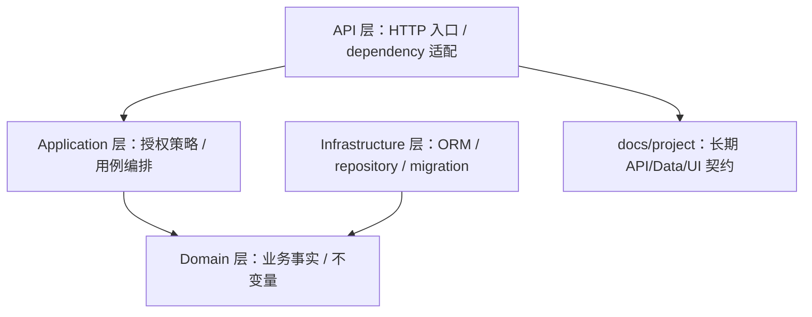
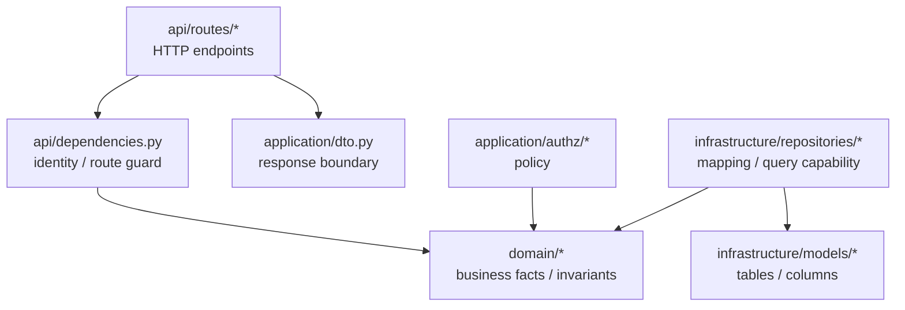

# Epic {N} {name} Technical Design

这份文档给 human reviewer 看。读者懂后端 / DDD / FastAPI，但不熟悉本项目。写作目标是减少理解负担：先讲问题和场景，再讲模块边界，再讲流程、DB/API 和风险。不要复制 task 文件清单，不写逐行实现。

## 1. Problem Model

用场景说明本 Epic 真正在解决什么问题、为什么现在必须做、哪些问题明确不做。避免一句话抽象定义，先让 reviewer 知道用户或系统在什么场景下会踩坑。

## 2. Glossary by Scenario

每个术语都按下面结构写。不要写“X 是 Y”这种平淡定义。

### {Term}

场景：{用具体用户/请求/数据流解释这个词出现在哪里}

它解决的问题：{为什么需要这个概念}

代码归属：{模块 / 类 / catalog}

如果放错层会怎样：{会破坏什么边界、造成什么风险}

Reviewer 重点看：{2-4 条}

## 3. Current Baseline

用短段落说明当前系统怎么工作、已有可复用点、缺口在哪里。只列与本 Epic 直接相关的基线；不要搬运整份架构文档。

## 4. Target Architecture

先用一张 **心智地图图** 给整体分层和责任流向，不放具体文件名。它只回答：请求从哪进来、业务事实在哪层、授权策略在哪层、持久化在哪层、长期契约在哪。不要把文件名、migration、具体方法都塞进这张图。



心智地图之后，再按模块写叙事小节。不要用大表格承载首次解释；表格只适合 quick check。

### {module/path}: {一句话说明这个模块为什么存在}

先用一个真实请求、用户动作或数据流讲清楚 reviewer 为什么会碰到这个模块。不要先下定义，先让人看到场景。

接着解释这段责任为什么应该放在这里，而不是 API / application / domain / infrastructure / 另一个业务模块。重点讲边界背后的理由，不要只说“因为分层”。

然后说明它和相邻模块怎么协作：它从谁那里拿事实，把什么结果交给谁，哪些判断必须留在外面。这里要让 reviewer 能看出模块边界，而不是读到一组抽象名词。

Reviewer 重点看：
- {边界 / 依赖方向}
- {不变量 / 安全约束}
- {最容易放错层或重复实现的点}

## 5. Dependency Graph

画 **模块依赖图**，这张图可以放具体模块 / 文件组，但只画 reviewer 需要检查的依赖边。它回答：这次具体改哪些模块，它们怎么依赖，哪些依赖禁止出现。不要把迁移细节、DTO 字段、方法名全部塞进去；这些放到 Data/API Design 或 task docs。



禁止出现的依赖：

- 

图后用文字点明容易误解的边。例如：DTO 不依赖 repository；DTO 只负责响应边界映射。Repository 负责 ORM 和 domain 之间的映射，不负责授权决策。

## 6. Core Flows

对每个核心流程，用最能降低认知负担的表达：

- 跨模块调用：Mermaid `sequenceDiagram`
- 状态流转：Mermaid `stateDiagram`
- 分支判断：decision table
- 事务 / 失败策略：sequence + failure table
- 核心算法：业务伪代码，不写语言级逐行实现

### {Flow Name}

这个流程解决什么：

```mermaid
sequenceDiagram
```

关键决策 / 不变量：

## 7. Data Design

说明新增或变更的表、字段、迁移、回填、索引、约束、一致性。必须写“为什么不是别的方案”，例如为什么不加索引、为什么用应用层枚举校验、为什么不建新表。

## 8. API Design

说明 endpoint delta、请求/响应形状、错误语义、鉴权变化、兼容影响。统一信封下的字段路径必须写准确。

## 9. Invariants and Risks

### Must Hold

- 

### Risks

| Risk | Consequence | Reviewer should inspect |
|------|-------------|-------------------------|
| | | |

## 10. Reviewer Checklist

写 reviewer 真正该看的点，不写执行步骤。

1. 
