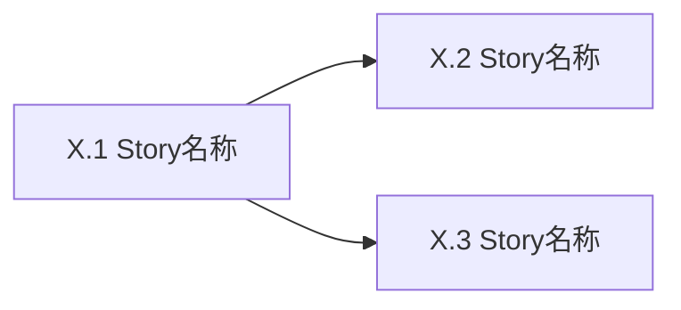

# Epic [序号]: [名称]

## 概述

**背景**: [为什么需要这个功能]
**价值**: [用户获得什么]
**范围**: [包含什么]
**不含**: [明确排除什么]

## 用户旅程

<!-- 从用户视角说明此 Epic 如何被使用。不是实现方案,不是 API 清单,也不是点击脚本。
     主旅程覆盖用户完成目标的正常路径;分支与异常旅程覆盖未登录/无权限/失败/空态/重复操作等场景。
     每一行必须映射到 Story 或具体 AC,否则说明 Story 拆分或验收覆盖有缺口。
     Mermaid 只画客户可理解的业务路径,不要画 API/DB/服务内部调用。 -->

### 主旅程: [角色]完成[目标]

| 步骤 | 页面/入口 | 用户行为 | 系统响应 | 覆盖 Story / AC |
|------|-----------|----------------|----------|-----------------|
| 1 | [页面/入口] | [用户进入/触发动作] | [系统展示/校验/处理] | Story X.Y |
| 2 | [页面/入口] | [用户继续操作] | [系统响应并推进状态] | Story X.Z |

### 分支与异常旅程

| 场景 | 页面/入口 | 用户行为 | 系统响应 | 覆盖 Story / AC |
|------|-----------|----------------|----------|-----------------|
| [未登录/无权限/数据为空/失败] | [页面/入口] | [用户动作] | [系统如何拦截、提示或恢复] | Story X.Y / Error AC |

## 页面体验地图

<!-- 仅前端 Epic 保留。后端/纯能力 Epic 删除本节或填 "N/A - 无用户界面"。
     这是页面组织约束,不是设计稿,也不是控件清单。每行说明一个页面/区域为什么存在、屏型是什么、用户最该做什么、系统必须呈现哪些状态。
     设计合同优先引用 docs/project/DESIGN.md; docs/project/design_guidelines.md 只作旧路径 fallback。 -->

| 页面/区域 | 屏型 | 页面职责 | 主操作 | 次操作 | 关键状态 | 信息优先级 | 品牌/富度要求 | 体验护栏 / 禁止项 |
|-----------|------|----------|--------|--------|----------|------------|---------------|----------------|
| [页面/区域] | [front-of-house / operational / mixed] | [这个页面帮助客户完成什么] | [唯一最重要动作] | [可延后/辅助动作] | [空态/加载/成功/失败/无权限等] | [最先看什么 > 其次看什么] | [品牌区/数据密度/参考骨架] | [不要裸居中表单/不要孤立卡片堆/不要全靠 toast 等] |

<!-- 注意:不写 System-Wide Considerations section。Phase 2.6 的 6 维度扫查是生成期过程,
     结论直接落 Story 的 Integration/Error AC,落不进 AC 的显式路由到 PRD open questions /
     plan decisions.md / repo 基线(见 SKILL.md 重要规则 §23)。 -->

## Story 列表

### Story X.1: [标题]

<!-- Feature Bundling 检查:标题禁止用 "和 / & / + / ,"连接两个能力。
     例:"注册和登录" ❌,拆成两个 Story:"手机号注册" + "手机号登录" ✓
     Story 主体写可交付能力,不要写成"点击左侧菜单/选择下拉框第 N 项"的操作脚本;控件细节只写进前端 AC。 -->

**用户故事**: 作为 [角色],我可以 [功能],以便 [价值]

#### 验收标准
<!-- 4 分类组织:Happy Path / Edge Cases / Error Paths / Integration
     Edge/Error 先按 Story 形态派生(EP/BVA/决策表/状态迁移/单 Story 流程,见 SKILL Phase 4 Step 0),再用下面清单复核
     每条 AC 必须附带 `验证:` 标注。禁止模糊用语("正确"、"合理"、"正常")
     Happy Path 必须有;其余类别不适用可省略但须在覆盖度自检里注明 N/A 理由
     行为 AC 总数硬上限 ≤7(Happy 1-2 + Edge 1-2 + Error 1-2 + Integration 0-2);
     前端验收标准单独计数,建议 ≤4;若 FE AC 承载新增业务行为,回流到行为 AC 或拆 Story。 -->

**Happy Path**
- [ ] [核心流程条件,含预期结果] `验证: [pytest/API/DB/Browser 具体方式]`

**Edge Cases**
<!-- 派生后复核清单:空输入 / 边界值(最小/最大)/ nil-null / 并发 / 重复请求 / 长度极限 -->
- [ ] [空输入处理] `验证: [具体方式]`
- [ ] [边界值] `验证: [具体方式]`

**Error Paths**
<!-- 派生后复核清单:非法输入 / 下游故障 / 超时 / 权限拒绝 / 速率限制 / 约束冲突 -->
- [ ] [非法输入 → 预期错误码] `验证: [具体方式]`
- [ ] [下游故障 → 预期降级行为] `验证: [具体方式]`

**Integration**(仅当 Story 跨层时填写;纯单层 Story 删除此分组)
<!-- 检查清单:callback / middleware / 多层数据流 / 事件传播 / 副作用 -->
- [ ] [跨层行为:具体场景] `验证: [具体方式]`

#### 前端验收标准
<!-- 如无 UI 交互则删除此 section -->
- [ ] [页面元素存在性,含选择器] `验证: Browser [选择器] 存在`
- [ ] [交互行为:操作 → 预期 DOM/URL 变化] `验证: Browser [操作] → [断言]`
- [ ] [状态展示:空态/加载/错误的具体 DOM 表现] `验证: Browser [条件] → [元素状态]`
- [ ] [页面体验地图对齐:主操作清晰,关键状态完整,信息优先级符合本 Epic 页面体验地图] `验证: Browser 截图审查 → 无重叠/无溢出/主操作可见`
- [ ] [设计合同对齐:符合 docs/project/DESIGN.md 的颜色/字体/密度/组件规则] `验证: Browser 截图审查`
- [ ] [设计稿对齐:与 docs/reference/research/designs/{epic-id}/{文件名} 结构一致] `验证: Browser 截图比对`

#### Assumptions
<!-- 假设清单。每条格式:[类别] 描述 — Confidence: H/M/L — 失效影响: 描述
     类别枚举:FEASIBILITY(可行性)/ DEPENDENCY(外部依赖)/ DATA(数据假设)/ SCOPE(范围假设)
     无相关假设填"无",不要删除该 section。 -->

- [DEPENDENCY] [例:短信网关 SLA ≥ 99.5%] — Confidence: M — 失效影响: [例:验证码失败率 >5%,需加重试]
- [DATA] [例:用户手机号唯一] — Confidence: H — 失效影响: [例:需引入合并账户流程]

**覆盖度自检**: 派生 ✓ / Happy ✓ / Edge ✓ / Error ✓ / Integration [✓ 或 N/A — 理由] / FE [✓ 或 N/A] / 行为 AC 总数 [N] ≤7 ✓ / FE AC [M]≤4 ✓ / Assumptions [N 条 或 "无"]
**参考**: docs/project/api/{module}.md §X, docs/project/data/{module}.md §Y, docs/reference/research/designs/{epic-id}/{文件名}(如适用)
**依赖**: Story X.Z(必须 Z<当前序号,禁止前向依赖) / 无

---

### Story X.2: [标题]

**用户故事**: 作为 [角色],我可以 [功能],以便 [价值]

#### 验收标准

**Happy Path**
- [ ] [核心流程条件,含预期结果] `验证: [具体方式]`

**Edge Cases**
- [ ] [空输入 / 边界值 / nil-null / 并发] `验证: [具体方式]`

**Error Paths**
- [ ] [非法输入 / 下游故障 / 超时 / 权限拒绝] `验证: [具体方式]`

**Integration**(仅当跨层时)
- [ ] [callback / middleware / 多层数据流] `验证: [具体方式]`

#### 前端验收标准
<!-- 如无 UI 交互则删除此 section -->
- [ ] [页面元素存在性,含选择器] `验证: Browser [断言]`
- [ ] [交互行为 → 预期变化] `验证: Browser [操作] → [断言]`
- [ ] [状态展示:具体 DOM 表现] `验证: Browser [条件] → [元素状态]`
- [ ] [页面体验地图/设计合同对齐] `验证: Browser 截图审查 → 无重叠/无溢出/主操作清晰`

#### Assumptions
- [类别] [假设描述] — Confidence: H/M/L — 失效影响: [描述]
<!-- 或填"无" -->

**覆盖度自检**: 派生 ✓ / Happy ✓ / Edge ✓ / Error ✓ / Integration [✓ 或 N/A — 理由] / FE [✓ 或 N/A] / 行为 AC 总数 [N] ≤7 ✓ / FE AC [M]≤4 ✓ / Assumptions [N 条 或 "无"]
**参考**: docs/project/api/{module}.md §X, docs/project/data/{module}.md §Y, docs/reference/research/designs/{epic-id}/{文件名}(如适用)
**依赖**: Story X.Z(必须 Z<当前序号) / 无

---

## 依赖关系

**Epic 依赖**: [依赖 Epic Y: 原因] / 无
**技术依赖**: [需要先完成的基础设施] / 无

## 参考文档

- PRD: [docs/project/requirements.md](../../project/requirements.md) §X
- Architecture: [docs/project/architecture.md](../../project/architecture.md) §Y
- API Design: [docs/project/api/{module}.md](../../project/api/{module}.md) §Z(如适用)
- Data Model: [docs/project/data/{module}.md](../../project/data/{module}.md) §W(如适用)
