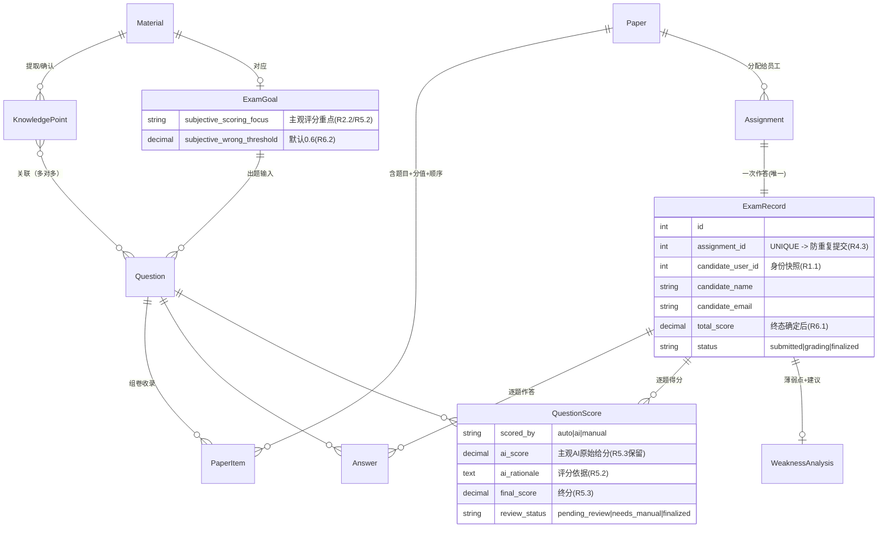

# feat: AI 驱动内部业务考试平台 MVP（6 Epic 闭环）

## Summary

在 `vibejet` 基座库之上构建一个内部业务考试平台 MVP：管理员录入业务资料 → AI 提取知识点（人工确认）→ AI 出题（结构校验 + 人工审核）→ 组卷分配 → 员工作答提交 → 客观题自动判分 + 主观题 AI 评分（人工复核改终分）→ 错题/薄弱点聚合 + AI 学习建议（人工确认）→ 关联员工身份落库。实现策略：**复用** 基座的 `LLMPort`、文件存储、幂等、UoW/仓储与前端 feature/route 骨架；**新增** 一个结构化 LLM 输出层（4 个 AI 环节共用，带 schema 校验 + 重试 + 人工兜底）、Mock-Lark 认证、考试领域聚合，以及前端认证/路由守卫/mutation/表单层。

---

## Problem Frame

公司内部业务知识分散在文档、培训材料、复盘与员工经验中，缺少「可考试、可评估、可反馈、可追踪」的能力验证闭环。出题方人工逐题编写成本高、质量不稳；员工考完只看到分数，得不到错题与针对性学习建议；组织也缺乏可追踪的能力数据。本计划交付一个 8h MVP，用 AI 完成题库生成、自动阅卷、错题分析，并在每个 AI 环节保留人工兜底，证明端到端闭环可一次跑通。（产品背景与角色定义见 origin：`docs/project/requirements.md`）

---

## Requirements

> R-ID 直接对应 origin（`docs/project/requirements.md` §3）的 EARS 需求编号，便于追溯。

- R1.1 每条考试相关记录都关联员工身份（姓名、邮箱、用户 ID）
- R1.2 Mock-Lark 登录建立会话并记录身份
- R1.3 角色权限边界：`出题管理员` vs `员工考生` 可访问范围隔离
- R1.4 未登录访问受保护页面被拦截并引导登录
- R1.5 非预置账号或身份字段缺失时拒绝建立会话
- R2.1 提交业务资料（粘贴文本或 txt/md 上传）并作为出题知识来源
- R2.2 考试目标六字段结构化表单
- R2.3 AI 知识点提取（环节①）→ 可编辑列表 → 人工确认为基准
- R2.4 空资料/提取失败的提示、重试与人工补充兜底；不得空知识点进入出题
- R3.1 AI 生成**结构化**题目（题型/题干/选项/参考答案或评分要点/关联知识点/分值）
- R3.2 题目集 ≥5 题、≥2 题型、≥1 主观题；客观题覆盖单选与判断
- R3.3 AI 题目置「待审核」→ 人工编辑/删除/新增 → 显式确认后才进组卷
- R3.4 出题失败/结构校验不通过的提示、重试与人工兜底；未过校验不得进考试
- R4.1 组卷（题目顺序、各题分值、总分）并分配给员工
- R4.2 员工作答并提交，保存逐题作答并关联身份与试卷
- R4.3 同一员工对同一试卷只能成功提交一次（防重复提交）
- R4.4 提交时未作答项明确提示；确认后仍可提交，未答客观题计 0、未答主观题标记「未作答」
- R5.1 客观题（单选/判断）按参考答案自动判分
- R5.2 主观题 AI 评分（环节③）依据评分重点+评分要点，输出评分依据
- R5.3 主观题三段闭环：AI 给分 → 人工采纳或改分覆盖终分（保留 AI 原始给分与依据）
- R5.4 主观题 AI 评分失败 → 标「待人工评分」直接人工给分；不阻塞客观判分与其余主观复核
- R6.1 全部题目终分确定后计算总成绩
- R6.2 错题清单与判定口径（客观判错；主观得分率 <60% 默认阈值，可配）
- R6.3 按知识点聚合薄弱点 → AI 学习建议（环节④）→ 人工确认后才对员工展示并持久化
- R6.4 薄弱点/建议 AI 失败 → 人工填写/修改兜底；不阻塞成绩与错题展示
- R6.5 持久化每次考试记录并关联员工身份
- R6.6 员工只看本人结果，且仅在总成绩确定 + 分析确认后展示；不得展示他人记录或未确认分析

**Origin actors:** `出题管理员`（A1）、`员工考生`（A2）— origin §2
**Origin flow:** 单一端到端闭环 登录 → 资料/目标/知识点 → AI 出题/审核 → 组卷/作答 → 阅卷/评分/复核 → 分析/建议/落库（origin §9.1，6 Epic 顺序依赖）
**非功能约束（origin §4）:** 常规交互 <2s；AI 出题 P95 <60s、主观评分单题 P95 <30s、客观判分即时；LLM 长调用须有进行中/失败状态；AI 输出必须经 schema 校验，不合法不得进考试/成绩；敏感数据不入日志；secrets 仅经环境配置。

---

## Scope Boundaries

> 本次 MVP 范围之外（origin §7 非目标）。

- `培训负责人` 角色、跨员工/团队能力短板看板、组织级能力评估报表
- 真实 Lark OAuth 与飞书深度集成
- 题库长期沉淀/复用/版本管理；多份资料/多目标批量管理
- 自动补训内容、个性化学习路径、自适应难度、智能组卷算法
- 考试限时、防作弊监考、补考、多轮考试
- 细粒度 RBAC、移动端专门适配
- PDF 等富格式资料解析（MVP 仅 txt/md）

### Deferred to Follow-Up Work

- 超长业务资料分块/摘要/检索策略：MVP 假设单次 LLM 上下文可容纳（origin §5.1、§8.3）；超限后续迭代
- 长 LLM 调用的 Celery 异步化 + 任务状态轮询端点：MVP 采用同步请求内调用（见 Key Technical Decisions），仅当请求超时成为实际问题时再引入

---

## Context & Research

### Relevant Code and Patterns（可复用锚点）

- **LLM 调用抽象**：`backend/application/ports/llm.py`（`LLMPort.generate/stream`，可在 application service 中同步注入调用，无需 conversation 表）；provider `backend/infrastructure/external/llm/openai_provider.py`；DI `backend/api/dependencies.py::get_llm_port`。
- **DDD 模块端到端骨架（参考）**：`conversation` 聚合全链路 —
  `backend/domain/conversation/{entity,repository,exceptions}.py` →
  `backend/infrastructure/models/conversation.py` →
  `backend/infrastructure/repositories/conversation_repository.py` →
  `backend/application/services/conversation_service.py` →
  `backend/api/routes/conversations.py` → 注册于 `backend/main.py`。
- **文件上传**：`POST /api/v1/storage/upload`（server-relay，`backend/api/routes/storage.py`）+ `backend/domain/file_asset/` + `backend/application/ports/storage.py`。
- **幂等**：`backend/application/services/idempotency_service.py` + `backend/api/utils/idempotency.py::idempotency_for(scope)`（header 级、Redis、24h TTL）。
- **UoW/事务**：`backend/infrastructure/unit_of_work.py`、`backend/domain/common/unit_of_work.py`（聚合需在两处注册）；`backend/infrastructure/database.py`、`backend/alembic/`。
- **配置**：`backend/core/config.py`（pydantic-settings，`env_nested_delimiter="__"`，`extra="forbid"`，`SECRET_KEY` 必填，`LLM__API_KEY`）。
- **前端 feature/route 骨架**：`frontend/src/features/health/`（api/hooks/components/types）+ `frontend/src/routes/health/index.tsx`（`createFileRoute` + `lazy` + `<SuspenseLoader>`）。
- **前端基础设施**：`frontend/src/lib/apiClient.ts`（axios，15s timeout，无拦截器）、`frontend/src/hooks/SnackbarProvider.tsx`（context 模板，可镜像做 AuthProvider）、`frontend/src/hooks/useAuth.ts`（占位）、`frontend/src/components/SuspenseLoader/`、`frontend/src/components/layout/AppLayout/`。

### Institutional Learnings

- `docs/solutions/` 不存在；无既有沉淀可引用。
- 架构约束（`docs/project/architecture.md`）：vibejet 为基座库，下游产品代码遵循 `api → application → domain ← infrastructure` 依赖方向；新增模块按「Extension Rules」六步；本计划产物为临时实现计划，不作为基座库常驻基线。

### 必须新增（基座未提供 / 有缺口）

1. **结构化 LLM 输出层**：`LLMPort.generate` 仅返回 free-text，无 JSON mode / schema 校验 / 重试兜底。需在 port + provider 增加 `response_format`（OpenAI SDK 已支持），并新增一个 `StructuredLLMService` 负责「调用 → Pydantic 校验 → 1 次重试 → 失败标记人工兜底」。**4 个 AI 环节共用**。
2. **存储读回**：`StoragePort` 未暴露 `download`（concrete provider 有）。需加 `download(key)->bytes` + adapter 委托 + service `get_asset_text()`，用于把资料文本喂给 LLM。
3. **认证（完全 greenfield）**：后端无任何 auth。需 Mock-Lark 登录路由 + JWT（引入 `pyjwt`）+ 预置账号 + `get_current_user` / `require_role` 依赖；前端无 AuthProvider/守卫/拦截器。
4. **提交幂等的持久不变式**：Redis 幂等是临时层；真正「同卷每人仅一次」靠 DB `UNIQUE`。
5. **首个 Alembic 迁移**：`alembic/versions/` 为空，首次 autogenerate 会覆盖既有全部表 + 新表，需 review。

---

## Key Technical Decisions

- **结构化 LLM 输出 = port 增量 `response_format` + 独立 `StructuredLLMService`**：所有进考试/成绩的 AI 输出（环节①②③④）走「JSON 输出 → Pydantic schema 校验 → 失败重试 1 次 → 仍失败则标记人工兜底」。理由：满足 NFR 4.4（结构校验 + 不合法拦截 + 人工兜底）；对 `LLMPort` 为 keyword 默认 `None` 的非破坏性增量，不影响既有 `chat_service`。
- **MVP 采用同步请求内 LLM 调用，不引入 Celery**：理由：KISS；Celery 在 dev 环境被强制 eager，异步收益为零，仅当评分需脱离请求生命周期才值得。**代价/约束**：前端 axios 默认 15s timeout < 出题 60s P95 → 对触发 AI 的端点在前端按调用提高 `timeout`，并用 mutation 的 `isPending/isError` 驱动进行中/失败/重试 UI。Rejected：Celery 异步 + 任务状态轮询（MVP 不值，列入 Deferred）。
- **提交防重 = DB `UNIQUE(assignment_id)`（或 `(candidate_user_id, paper_id)`）为真不变式 + header 幂等为快速防抖层**：理由：Redis 幂等 24h TTL 且依赖客户端传 key，非持久；唯一约束插入失败翻译为领域「已提交」异常才是 R4.3 的真正保证。
- **Mock-Lark 认证 = JWT + 预置账号（in-code），无 User 聚合表**：登录返回带 `{userId,name,email,role}` 的 JWT；身份以**快照字段**（user_id+name+email）denormalize 到 `ExamRecord` 等需追溯的记录上满足 R1.1/R6.5。理由：MVP 不需要用户管理，自包含、零迁移风险。Rejected：建 User 聚合 + 表（MVP 过度设计）。
- **考试领域按 3 个模块分组聚合**：`domain/material/`（Material、ExamGoal、KnowledgePoint）、`domain/exam/`（Question、Paper、Assignment）、`domain/attempt/`（ExamRecord、Answer、QuestionScore、WeaknessAnalysis）。每个聚合根仓储需在 `AbstractUnitOfWork` + `SQLAlchemyUnitOfWork` + `models/__init__.py` 注册。理由：贴合 origin Epic 边界，控制共享文件改动面。分组可在实现时按 KISS 微调。
- **错题/薄弱点判定为纯领域规则**：客观判错即错题；主观得分率 < `subjective_wrong_threshold`（默认 0.6，存于 ExamGoal 可配）计错题；薄弱点 = 错题关联知识点去重集合，按关联错题数降序。理由：R6.2/R6.3 明确口径，置于 domain service 便于测试且无外部依赖。
- **前端认证 = AuthProvider context（镜像 SnackbarProvider）+ TanStack `beforeLoad` 路由守卫 + apiClient 拦截器注入 token**：理由：复用既有 context 模板与文件路由能力，最小化新增基础设施。

---

## Open Questions

### Resolved During Planning

- 结构化输出怎么做：port 增量 `response_format` + `StructuredLLMService`（见 Key Technical Decisions）。
- 长 LLM 调用同步还是异步：MVP 同步 + 前端提高超时 + 进行中/重试 UI；Celery 延后。
- 提交防重机制：DB 唯一约束为主 + header 幂等为辅。
- 身份如何持久：JWT 声明 + 记录上身份快照，无 User 表。
- AI 评分一致性/可复现（origin §8.3）：保留 AI 原始给分与评分依据（R5.3），人工可覆盖终分。

### Deferred to Implementation

- 4 个 AI 环节各自的 JSON schema 精确字段名与 prompt 措辞（实现时定，置于 `backend/shared/prompts/` 或 service 内）。
- `subjective_wrong_threshold` 配置入口的精确 UI 位置（考试目标表单内）。
- 是否需要 `GET /tasks/{id}` 状态端点：仅当同步调用在 Demo 环境实际超时才补（属 Deferred 异步化的一部分）。
- 首个 Alembic 迁移生成后的人工 review 结果（覆盖既有表 + 新表）。
- `domain` 模块/聚合的最终落地分组（3 模块为建议，实现时按 KISS 确认）。

---

## Output Structure

> 新增文件的预期布局（增量，省略既有未改动文件）。per-unit `**Files:**` 为权威清单；此树仅示意整体形状，实现可微调。

    backend/
      domain/
        material/            # Material, ExamGoal, KnowledgePoint（实体 + 仓储接口 + 异常 + 领域服务）
        exam/                # Question, Paper, Assignment（+ 结构校验领域规则）
        attempt/             # ExamRecord, Answer, QuestionScore, WeaknessAnalysis（+ 判分/错题/薄弱点领域服务）
      application/
        services/
          auth_service.py
          structured_llm_service.py   # 4 个 AI 环节共用
          material_service.py
          exam_authoring_service.py
          grading_service.py
          analysis_service.py
        dto.py               # 增量：考试相关 DTO（既有共享文件）
      infrastructure/
        models/              # material.py, exam.py, attempt.py（+ 在 __init__.py 导出）
        repositories/        # 各聚合仓储实现
      api/
        routes/
          auth.py            # mock-login / me
          material.py        # 资料 + 目标 + 知识点提取/确认
          exam_authoring.py  # 出题/审核/组卷/分配
          attempt.py         # 作答/提交/客观判分触发
          grading.py         # 主观 AI 评分/复核改终分
          results.py         # 成绩/错题/薄弱点/建议
        dependencies.py      # 增量：get_current_user / require_role / 各 service 工厂
      alembic/versions/      # 首个迁移（覆盖既有 + 新表）
      tests/                 # 各单元测试

    frontend/src/
      contexts/              # AuthProvider + authContext
      features/
        auth/                # mock-login api/hooks/components/types
        material/            # 上传 + 目标表单 + 知识点编辑确认
        exam-authoring/      # 题目审核表格 + 组卷分配
        attempt/             # 作答页 + 提交
        results/             # 管理员复核 + 员工结果页
      routes/
        login/index.tsx
        admin/               # 受保护：资料/出题/组卷/复核/结果（含 sidebar 布局路由）
        exam/                # 受保护：$assignmentId 作答 + 结果
      components/ui/          # FileUpload, EditableTable, ConfirmDialog 等共用件
      lib/apiClient.ts        # 增量：请求/响应拦截器 + 长调用超时

---

## High-Level Technical Design

> *以下为方向性设计，供 review 校准，不是实现规范。实现 agent 应将其作为上下文而非待复制代码。*

### 数据模型（ERD）



> KISS 注记：身份用快照字段（无 User 表）；`KnowledgePoint↔Question` 多对多可用关联表或题目侧 JSON id 数组实现，择简。

### 核心闭环时序（人工兜底点用 ✋ 标注）

```mermaid
sequenceDiagram
    actor Admin as 出题管理员
    actor Emp as 员工考生
    participant FE as 前端
    participant API as 后端 API/应用层
    participant LLM as StructuredLLM(schema校验+兜底)
    participant DB as 持久化

    Admin->>FE: 登录(Mock-Lark 预置账号)
    FE->>API: POST /auth/mock-login → JWT(role)
    Admin->>API: 上传资料 + 6字段考试目标
    Admin->>API: 触发知识点提取(环节①)
    API->>LLM: 提取知识点(JSON)
    LLM-->>API: 知识点列表 / ✋失败→重试/人工补充(R2.4)
    Admin->>API: 编辑/确认知识点(基准)
    Admin->>API: 触发出题(环节②)
    API->>LLM: 结构化题目(JSON)
    LLM-->>API: 题目 + 结构校验(≥5/≥2型/≥1主观) / ✋不合法→拦截+人工补足(R3.4)
    Admin->>API: 审核 编辑/删除/新增 → 显式确认(R3.3)
    Admin->>API: 组卷 + 分配给员工(R4.1)
    Emp->>API: 作答 → 提交(UNIQUE 防重 R4.3; 未答提示 R4.4)
    API->>DB: 客观题自动判分(R5.1)
    API->>LLM: 主观题评分(环节③, 含依据)
    LLM-->>API: AI给分+依据 / ✋失败→待人工评分(R5.4)
    Admin->>API: 复核 采纳或改分覆盖终分(R5.3)
    API->>DB: 全部终分定 → 计算总成绩(R6.1)
    API->>API: 错题判定 + 按知识点聚合薄弱点(领域规则 R6.2/R6.3)
    API->>LLM: 生成学习建议(环节④)
    LLM-->>API: 建议 / ✋失败→人工填写(R6.4)
    Admin->>API: 确认分析结果(R6.3)
    Emp->>API: 查看本人结果(确认后才可见, 边界 R6.6)
```

---

## Implementation Units

> 单元按 3 个阶段、依赖顺序排列。U1/U2 为跨切面基座，必须先落地。每个 U-ID 稳定不重编号。

### Phase 1 — 基座（跨切面，使能后续全部 Epic）

### U1. Mock-Lark 认证 + 角色权限边界（Epic 1）

**Goal:** 提供 Mock-Lark 登录、JWT 会话、`get_current_user`/`require_role` 依赖、前端 AuthProvider + 路由守卫 + token 注入；建立两类角色的访问边界与身份关联基础。

**Requirements:** R1.1, R1.2, R1.3, R1.4, R1.5

**Dependencies:** 无（最先落地）

**Files:**
- Create: `backend/api/routes/auth.py`（`POST /auth/mock-login`、`GET /auth/me`）
- Create: `backend/shared/auth/preset_accounts.py`（预置账号：≥1 管理员 + ≥2 员工，含 name/email/userId/role）
- Create: `backend/application/services/auth_service.py`（校验预置账号、签发/解析 JWT、身份快照构造）
- Modify: `backend/api/dependencies.py`（新增 `get_current_user`、`require_role(role)` 依赖）
- Modify: `backend/core/config.py`（如需新增 JWT 相关配置项，遵守 `extra="forbid"`）；`backend/env.example`（声明新配置）
- Modify: `backend/main.py`（注册 auth 路由）；`backend/requirements.txt`（`pyjwt`）
- Create: `frontend/src/contexts/AuthProvider.tsx` + `authContext.ts`（镜像 SnackbarProvider）
- Modify: `frontend/src/hooks/useAuth.ts`（接 AuthProvider，扩展 `role`，localStorage 持久化）
- Create: `frontend/src/features/auth/`（api/hooks/components/types：登录选择预置账号）
- Create: `frontend/src/routes/login/index.tsx`
- Modify: `frontend/src/lib/apiClient.ts`（请求拦截器注入 `Authorization`；响应 401 → 跳登录）
- Test: `backend/tests/test_auth.py`、`frontend/src/features/auth/__tests__/`（如启用前端测试）

**Approach:**
- JWT 用 `settings.SECRET_KEY` 签名，claim 携带 `{userId,name,email,role}`；`get_current_user` 解析 Bearer，`require_role` 在依赖层做角色门禁。
- 身份快照随后由受保护端点写入业务记录（U5/U6/U7），满足 R1.1。
- 前端路由守卫用 TanStack `beforeLoad`：未登录或角色不符 → `redirect({to:'/login'})`。

**Execution note:** 先写「未登录访问受保护端点被拒 / 非预置账号被拒」的失败测试，再实现（test-first）。

**Patterns to follow:** `frontend/src/hooks/SnackbarProvider.tsx`（context 模板）；`backend/api/dependencies.py`（依赖注入风格）。

**Test scenarios:**
- Happy path：用预置管理员账号 mock-login → 返回带 `role=admin` 的 JWT；`GET /auth/me` 回显身份三要素（R1.2）。
- Edge case：用预置员工账号登录 → `role=candidate`；员工 token 访问管理员端点 → 403（R1.3）。
- Error path：非预置账号 / 缺 name|email|userId 任一字段 → 拒绝建立会话并提示（R1.5）。
- Error path：无 token / 失效 token 访问任一受保护端点 → 401，前端引导登录（R1.4）。
- Integration：登录后前端 apiClient 自动带 token；员工被守卫挡在 `/admin/*` 之外（R1.3/R1.4）。

**Verification:** 两类角色各自只能进入允许的页面/端点；未登录被拦截；`/auth/me` 身份正确。

---

### U2. 结构化 LLM 输出层（4 个 AI 环节共用）

**Goal:** 让 `LLMPort` 支持 JSON 输出，并新增 `StructuredLLMService`：调用 → Pydantic schema 校验 → 失败重试 1 次 → 仍失败返回「需人工兜底」结果。为环节①②③④提供统一可靠的结构化能力。

**Requirements:** R2.4, R3.4, R5.4, R6.4（失败兜底）；NFR 4.4（schema 校验）；间接支撑 R2.3/R3.1/R5.2/R6.3

**Dependencies:** 无（可与 U1 并行）

**Files:**
- Modify: `backend/application/ports/llm.py`（`generate` 增加 keyword `response_format=None`，非破坏）
- Modify: `backend/infrastructure/external/llm/openai_provider.py`（透传 `response_format`，如 `{"type":"json_object"}`）
- Create: `backend/application/services/structured_llm_service.py`（泛型「调用+校验+重试+兜底」，输入：messages + Pydantic 模型/JSON schema；输出：`{ok, data|None, raw, error}`）
- Modify: `backend/api/dependencies.py`（`get_structured_llm_service` 工厂）
- Test: `backend/tests/test_structured_llm_service.py`

**Approach:**
- 校验/兜底逻辑集中在此 service，4 个环节只传各自 schema 与 prompt，避免重复。
- 失败返回结构化「需人工兜底」信号，由各业务 service 翻译为对应状态（待补充/待人工评分等）。
- 敏感数据（资料/答题）不写入日志（NFR 4.3）：失败仅记录错误类型与可解析性，不记录原文。

**Execution note:** test-first，用 LLM 测试替身（mock `LLMPort`）构造「合法 JSON / 非法 JSON / 重试后成功 / 重试后仍失败」四类返回。

**Technical design（方向性）:**
```
StructuredLLMService.run(messages, schema):
  resp = llm.generate(messages, response_format=json)
  parsed = try_parse_and_validate(resp.content, schema)
  if parsed.ok: return ok(parsed.data, raw=resp.content)
  resp2 = llm.generate(messages + 纠偏提示, response_format=json)   # 重试 1 次
  parsed2 = try_parse_and_validate(resp2.content, schema)
  if parsed2.ok: return ok(parsed2.data, raw=resp2.content)
  return needs_manual(error=..., raw=resp2.content)                # 人工兜底信号
```

**Patterns to follow:** `backend/application/services/chat_service.py`（如何注入并调用 `LLMPort`）。

**Test scenarios:**
- Happy path：mock 返回合法 JSON 且通过 schema → `ok=True`，data 为校验后对象。
- Edge case：首次非法、重试后合法 → `ok=True`（恰好 2 次调用）。
- Error path：两次均非法/不可解析 → `ok=False, needs_manual`，不抛未捕获异常。
- Integration：既有 `chat_service` 不传 `response_format` 时行为不变（回归保护）。
- Edge case：校验失败时不记录原始 prompt/资料内容到日志（NFR 4.3）。

**Verification:** 合法/重试成功/彻底失败三路径行为正确；既有 chat 路径回归通过。

---

### Phase 2 — 资料与出题（Authoring）

### U3. 资料录入 + 考试目标 + AI 知识点提取与确认（Epic 2，AI 环节①）

**Goal:** 管理员提交资料（粘贴或 txt/md 上传）、填写六字段考试目标、触发 AI 知识点提取、以可编辑列表确认知识点作为基准。

**Requirements:** R2.1, R2.2, R2.3, R2.4

**Dependencies:** U1（管理员鉴权）、U2（结构化提取）

**Files:**
- Create: `backend/domain/material/{entity,repository,exceptions,service}.py`（Material、ExamGoal、KnowledgePoint；领域校验六字段必填、空资料拦截）
- Create: `backend/infrastructure/models/material.py`、`backend/infrastructure/repositories/material_repository.py`
- Modify: `backend/domain/common/unit_of_work.py` + `backend/infrastructure/unit_of_work.py`（注册 material 仓储）；`backend/infrastructure/models/__init__.py`（导出）
- Modify: `backend/application/ports/storage.py` + `backend/infrastructure/adapters/storage_port.py`（新增 `download(key)->bytes`）
- Create: `backend/application/services/material_service.py`（`get_asset_text`、提取知识点编排、确认保存）
- Create: `backend/api/routes/material.py`（资料/目标 CRUD、触发提取、知识点确认）
- Modify: `backend/main.py`（注册路由）；`backend/application/dto.py`（增量 DTO）
- Modify: `backend/alembic/versions/`（生成迁移）
- Create: `frontend/src/features/material/`（上传组件、6 字段 RHF+Zod 表单、知识点可编辑列表）
- Create: `frontend/src/routes/admin/material/index.tsx`（受保护）
- Create: `frontend/src/components/ui/`（FileUpload、EditableList/Table 雏形，按需）
- Test: `backend/tests/test_material_service.py`、`backend/tests/test_material_routes.py`

**Approach:**
- 资料来源二选一：粘贴文本直接存；文件走 `POST /storage/upload` 得 key，再用新增 `download`+`get_asset_text` 读回文本喂 LLM。
- 知识点提取调用 U2 `StructuredLLMService`（知识点 list schema）；失败 → 提示 + 重试 + 允许人工补充，且不得空知识点进入出题（R2.4）。
- 确认后的知识点为后续出题与薄弱点聚合的基准。

**Execution note:** 六字段必填校验、空资料拦截先写失败测试。

**Patterns to follow:** `conversation` 全链路骨架；`backend/api/routes/storage.py`（上传）；`frontend/src/features/health/`（feature 形状）。

**Test scenarios:**
- Happy path：粘贴资料 + 六字段目标 → 保存；触发提取 → 返回结构化知识点列表并可编辑确认（R2.1/R2.2/R2.3）。
- Happy path：上传 txt/md → 读回文本作为知识来源。
- Error path：空资料触发提取 → 拦截并提示，不进入出题（R2.4）。
- Error path：AI 提取失败/不可解析 → 提示失败 + 可重试 + 可人工补充知识点（R2.4，依赖 U2 兜底）。
- Edge case：六字段缺任一 → 表单校验失败，后端二次校验拒绝。

**Verification:** 资料+目标+确认后的知识点正确落库并关联；失败路径有兜底，不产生空知识点出题前置。

---

### U4. AI 出题 + 结构校验 + 人工审核（Epic 3，AI 环节②）

**Goal:** 基于已确认资料/知识点/目标生成结构化题目，做结构校验（≥5 题、≥2 题型含主观、字段齐全），置「待审核」，支持人工编辑/删除/新增，显式确认后才可进组卷。

**Requirements:** R3.1, R3.2, R3.3, R3.4

**Dependencies:** U3（确认知识点为出题输入）、U2（结构化出题）

**Files:**
- Create: `backend/domain/exam/{entity,repository,exceptions,service}.py`（Question；领域服务含结构校验规则：题量≥5、题型≥2、≥1 主观、客观覆盖单选+判断、必需字段齐全）
- Create: `backend/infrastructure/models/exam.py`（Question 表，含 status pending_review|confirmed、source ai|manual、关联知识点）、`backend/infrastructure/repositories/exam_repository.py`
- Modify: UoW 两处 + `models/__init__.py`（注册 exam 仓储）
- Create: `backend/application/services/exam_authoring_service.py`（出题编排、校验、审核状态流转、确认）
- Create: `backend/api/routes/exam_authoring.py`（触发出题、列表、编辑/删除/新增、确认）
- Modify: `backend/main.py`、`backend/application/dto.py`、`backend/alembic/versions/`
- Create: `frontend/src/features/exam-authoring/`（题目审核表格：编辑/删除/新增/确认；触发出题的 mutation + 进行中/失败/重试 UI）
- Create: `frontend/src/routes/admin/questions/index.tsx`
- Test: `backend/tests/test_exam_authoring_service.py`、`backend/tests/test_exam_authoring_routes.py`

**Approach:**
- 出题调用 U2 `StructuredLLMService`（题目 schema：题型/题干/选项/参考答案或评分要点/关联知识点/分值）。
- 结构校验为纯领域规则；不合法 AI 输出被拦截 → 提示具体问题 + 重试 + 人工补足（R3.4）。
- 状态机：AI 生成 → pending_review →（人工编辑/删除/新增）→ 显式 confirm → 可进组卷；未确认不可组卷（R3.3）。
- 前端出题为长 LLM 调用：提高该请求 timeout，用 `mutation.isPending/isError` 驱动 UI。

**Execution note:** 先写结构校验拦截用例（构造 <5 题 / 仅 1 题型 / 无主观 / 缺字段）。

**Patterns to follow:** U3 的领域+服务+路由分层；`frontend/src/features/health/` + 新建 mutation 模式。

**Test scenarios:**
- Happy path：基于已确认知识点触发出题 → 结构化题集（≥5 题、含单选+判断+主观），置待审核（R3.1/R3.2/R3.3）。
- Error path：AI 返回 4 题 / 仅单选 / 无主观题 / 缺必需字段 → 结构校验拦截并提示具体问题，可重试或人工补足（R3.4）。
- Happy path：人工编辑题干/删除一题/新增一题 → 保存修改（R3.3）。
- Edge case：未确认题目尝试进组卷 → 被拒；确认后才允许（R3.3）。
- Integration：出题失败（U2 needs_manual）→ 前端展示失败 + 重试 + 人工新增入口（R3.4）。

**Verification:** 仅结构合法且人工确认的题目可进组卷；不合法 AI 输出被拦截并有兜底。

---

### Phase 3 — 考试 → 阅卷 → 结果

### U5. 组卷 + 分配 + 作答 + 一次提交（Epic 4）

**Goal:** 将已确认题目组卷（顺序/各题分值/总分）并分配给员工；员工作答、提交一次（防重复、未答提示），答卷关联本人身份与试卷。

**Requirements:** R4.1, R4.2, R4.3, R4.4

**Dependencies:** U4（已确认题目）、U1（员工鉴权 + 身份快照）

**Files:**
- Create: `backend/domain/exam/`（追加 Paper、Assignment 实体/仓储；组卷领域规则：顺序、分值、总分）
- Create: `backend/domain/attempt/{entity,repository,exceptions,service}.py`（ExamRecord、Answer；提交领域规则：一次提交、未答标记）
- Create: `backend/infrastructure/models/attempt.py`（ExamRecord 含 `UNIQUE(assignment_id)`、身份快照字段；Answer）、对应仓储；扩展 exam 模型（Paper/Assignment）
- Modify: UoW 两处 + `models/__init__.py`（注册 paper/assignment/attempt 仓储）
- Create: `backend/application/services/exam_authoring_service.py`（追加组卷/分配）或新建 paper 段；`backend/application/services/attempt_service.py`（作答/提交）
- Create: `backend/api/routes/attempt.py`（取本人试卷、提交答卷）；扩展 `exam_authoring.py`（组卷/分配）
- Modify: `backend/main.py`、`backend/application/dto.py`、`backend/alembic/versions/`
- Reuse: `backend/api/utils/idempotency.py::idempotency_for("exam:submit")`（快速防抖层）
- Create: `frontend/src/features/exam-authoring/`（组卷+分配 UI）、`frontend/src/features/attempt/`（作答页 + 提交，未答提示对话框）
- Create: `frontend/src/routes/admin/papers/index.tsx`、`frontend/src/routes/exam/$assignmentId/index.tsx`（受保护）
- Test: `backend/tests/test_paper_assembly.py`、`backend/tests/test_attempt_submit.py`

**Approach:**
- 组卷生成 Paper（题目顺序 + 各题分值 + 总分），可分配给 ≥1 员工（支持多员工各考同一卷、独立记录 — origin §6 中优先级）。
- 提交防重：DB `UNIQUE(assignment_id)`（或 `(candidate_user_id, paper_id)`）为真不变式，插入冲突翻译为领域「已提交」异常（R4.3）；header 幂等为快速重复点击防抖。
- 提交时身份快照（user_id+name+email）写入 ExamRecord（R1.1/R4.2）。
- 未答处理：提交前明确提示未答项，确认后仍可提交；未答客观题计 0、未答主观题标记「未作答」（R4.4）。

**Execution note:** 重复提交拦截、未答计分先写失败测试（origin §6 高优先级假设）。

**Patterns to follow:** `backend/api/routes/storage.py::presign_upload`（幂等使用范式）；U3/U4 分层。

**Test scenarios:**
- Happy path：对已确认题目组卷 → Paper 含顺序/分值/总分；分配给员工（R4.1）。
- Happy path：员工打开本人试卷作答并提交 → 逐题作答保存并关联身份+试卷（R4.2）。
- Error path：同一员工对同一试卷二次提交 → 被拦截（DB 唯一约束，R4.3，高优先级）。
- Edge case：含未答题提交 → 明确提示未答项；确认后提交，未答客观计 0、未答主观标记「未作答」（R4.4）。
- Integration：两个员工各考同一份试卷 → 各自独立 ExamRecord，互不影响（origin §6）。
- Edge case：员工 A 尝试打开/提交分配给员工 B 的试卷 → 被拒（R1.3 边界）。

**Verification:** 组卷分值/总分正确；提交一次且关联身份；重复提交被挡；未答计分符合口径。

---

### U6. 客观自动判分 + 主观 AI 评分 + 人工复核改终分（Epic 5，AI 环节③）

**Goal:** 提交后客观题按参考答案即时判分；主观题 AI 评分（含评分依据）置「待复核」；管理员采纳 AI 分或改分覆盖终分（保留 AI 原始给分与依据）；AI 评分失败转人工给分，不阻塞其余判分。

**Requirements:** R5.1, R5.2, R5.3, R5.4

**Dependencies:** U5（答卷）、U2（结构化评分）

**Files:**
- Create: `backend/domain/attempt/`（追加 QuestionScore 实体/仓储；判分领域规则：客观比对、终分确定逻辑）
- Create: `backend/infrastructure/models/attempt.py`（追加 QuestionScore：scored_by、ai_score、ai_rationale、final_score、review_status）、对应仓储
- Modify: UoW 两处 + `models/__init__.py`
- Create: `backend/application/services/grading_service.py`（客观判分编排、主观 AI 评分编排、复核改终分）
- Create: `backend/api/routes/grading.py`（触发/查询评分、待复核列表、采纳/改分/人工给分）
- Modify: `backend/main.py`、`backend/application/dto.py`、`backend/alembic/versions/`
- Create: `frontend/src/features/results/`（管理员主观题复核：展示 AI 给分+依据，采纳或改分）
- Create: `frontend/src/routes/admin/review/index.tsx`
- Test: `backend/tests/test_grading_objective.py`、`backend/tests/test_grading_subjective_review.py`

**Approach:**
- 客观题（单选/判断）按参考答案即时判分（R5.1，纯领域规则）。
- 主观题调用 U2 `StructuredLLMService`，依据目标「主观题评分重点」+ 题目评分要点输出 `{score, rationale}`（R5.2）；置 review_status=pending_review。
- 三段闭环：采纳 → final_score=ai_score；改分 → final_score=人工分并保留 ai_score+ai_rationale（R5.3）。
- AI 评分失败 → review_status=needs_manual，管理员直接人工给分；不阻塞客观判分与其余主观复核（R5.4）。

**Execution note:** 主观三段闭环 + AI 失败转人工先写测试（origin §9.3 高风险）。

**Patterns to follow:** U2 调用范式；U3/U4 分层；`frontend/src/features/health/` + mutation。

**Test scenarios:**
- Happy path：提交后客观题按参考答案自动判分（单选/判断），即时得分正确（R5.1）。
- Happy path：主观题 AI 评分返回分数 + 依据，置待复核（R5.2）。
- Happy path（三段）：管理员采纳 AI 分 → 终分=AI 分；管理员改分 → 终分=人工分且保留 AI 原始给分与依据（R5.3）。
- Error path：主观 AI 评分失败/不可解析 → 标 needs_manual，可直接人工给分；客观判分与其余主观复核不受阻（R5.4）。
- Integration：一份含 2 主观题的答卷，其中 1 题 AI 失败 → 另一题正常复核，失败题走人工，整卷不卡死（R5.4）。

**Verification:** 客观判分正确即时；主观三段闭环可演示；AI 失败有人工兜底且不阻塞。

---

### U7. 成绩 + 错题 + 薄弱点聚合 + AI 学习建议 + 落库与结果可见性（Epic 6，AI 环节④）

**Goal:** 全部终分确定后计算总成绩；生成错题清单（按口径）；按知识点聚合薄弱点；AI 生成学习建议（失败可人工）；分析经管理员确认后才对员工展示并持久化；员工仅见本人结果。

**Requirements:** R6.1, R6.2, R6.3, R6.4, R6.5, R6.6

**Dependencies:** U6（终分确定）、U3（知识点基准）、U2（建议生成）

**Files:**
- Create: `backend/domain/attempt/`（追加 WeaknessAnalysis 实体/仓储；领域服务：总成绩计算、错题判定口径、薄弱点聚合）
- Create: `backend/infrastructure/models/attempt.py`（追加 WeaknessAnalysis：weak_points JSON、suggestions、status pending_confirm|confirmed）、对应仓储
- Modify: UoW 两处 + `models/__init__.py`
- Create: `backend/application/services/analysis_service.py`（错题/薄弱点/建议编排、确认）
- Create: `backend/api/routes/results.py`（管理员：分析确认/编辑；员工：查看本人结果，强制可见性边界）
- Modify: `backend/main.py`、`backend/application/dto.py`、`backend/alembic/versions/`
- Create: `frontend/src/features/results/`（追加：管理员薄弱点/建议确认编辑；员工结果页：成绩/错题/薄弱点/建议）
- Create: `frontend/src/routes/admin/analysis/index.tsx`、`frontend/src/routes/exam/$assignmentId/result/index.tsx`
- Test: `backend/tests/test_analysis_service.py`、`backend/tests/test_results_visibility.py`

**Approach:**
- 总成绩：所有题目终分确定后计算 得分/总分（R6.1）。
- 错题口径：客观判错即错题；主观得分率 < `subjective_wrong_threshold`（默认 0.6，存 ExamGoal）计错题（R6.2，纯领域规则）。
- 薄弱点聚合：错题关联知识点去重集合，按关联错题数降序（R6.3，纯领域规则）。
- 学习建议调用 U2 `StructuredLLMService`；失败 → 管理员人工填写/修改，不阻塞成绩与错题展示（R6.4）。
- 分析 status=pending_confirm → 管理员确认后才对员工展示并持久化（R6.3/R6.6）。
- 可见性边界：员工只查本人记录，且仅在总成绩定 + 分析确认后可见；不得见他人或未确认分析（R6.6）。

**Execution note:** 错题口径、薄弱点聚合、未确认不展示、可见性边界先写测试（origin §9.3 高风险）。

**Patterns to follow:** U6 领域规则风格；`require_role` + 本人记录过滤（U1）。

**Test scenarios:**
- Happy path：全部终分定后计算总成绩 得分/总分正确（R6.1）。
- Edge case：构造主观题得分率 50% 与 70% → 50% 进错题清单、70% 不进（默认 60% 阈值，R6.2）。
- Happy path：错题按关联知识点去重聚合并按错题数降序（R6.3）。
- Error path：AI 建议生成失败 → 管理员可人工填写薄弱点/建议，成绩与错题仍正常展示（R6.4）。
- Edge case：分析未确认时员工结果页不显示分析；确认后显示（R6.3/R6.6）。
- Error path（可见性）：员工 A 请求员工 B 的结果 → 被拒，不泄露（R6.6）。
- Integration：完整闭环重看 — 记录持久化后管理员/员工再次进入仍可查看（R6.5）。

**Verification:** 成绩/错题/薄弱点口径正确；分析确认后才可见；员工仅见本人；记录持久可重看。

---

## System-Wide Impact

- **共享文件改动面（`AbstractUnitOfWork`）**：U1 不新增聚合根；U3/U4/U5/U6/U7 每新增聚合根仓储都要改 `backend/domain/common/unit_of_work.py` + `backend/infrastructure/unit_of_work.py`。按阶段顺序落地以减少冲突；同一聚合的多实体尽量一次性加。
- **`LLMPort.generate` 签名扩展（U2）**：keyword 默认 `None`，对既有 `chat_service` 非破坏；需回归验证 chat 路径。
- **`StoragePort` 扩展 `download`（U3）**：纯增量委托，既有上传/预签链路不受影响。
- **首个 Alembic 迁移**：`alembic/versions/` 为空，首次 autogenerate 覆盖既有全部表 + 新表，需人工 review 后再 `upgrade head`。
- **前端 apiClient 拦截器（U1）**：影响所有请求（含 health）；需回归 health 页面与 401 行为。
- **错误传播**：各 AI 环节失败必须转化为明确状态（待补充/待人工评分/需人工填写）而非 500；客观判分与其余流程不被单点 AI 失败阻塞（R5.4/R6.4）。
- **状态生命周期风险**：知识点(extracted→confirmed)、题目(pending_review→confirmed)、评分(pending_review/needs_manual→finalized)、分析(pending_confirm→confirmed)、答卷(submitted→grading→finalized) 多状态机；总成绩仅在全部终分定后生成（R6.1）。
- **API 表面一致性**：所有受保护端点统一用 `get_current_user` + `require_role`；员工端点统一做本人记录过滤。
- **不变量（本计划不改）**：既有 `conversation`/`chat`/`file_asset` 行为；`vibejet` 基座的依赖方向与分层；本计划仅新增下游业务模块，不把业务语言写入 shared/core。
- **敏感数据**：业务资料与答题内容不得明文入日志（NFR 4.3），贯穿 U2/U3/U5/U6。

---

## Risks & Dependencies

| Risk | Mitigation |
|------|------------|
| LLM 结构化输出不稳定（4 个环节核心风险） | U2 统一 schema 校验 + 重试 1 次 + 人工兜底；不合法不进考试/成绩（NFR 4.4） |
| 前端 15s axios timeout < 出题 60s P95 | 触发 AI 的请求按调用提高 timeout；mutation `isPending/isError` 驱动进行中/失败/重试 UI；超时仍频发则启用 Deferred 异步化 |
| `AbstractUnitOfWork` 为共享改动点，多单元都改 | 按阶段顺序串行落地；同聚合多实体一次加；改后跑既有 UoW/仓储测试回归 |
| 首个迁移覆盖面大（含既有表） | 生成后人工 review 再 apply；DEBUG 下可先用 `create_tables` 验证 schema 形状 |
| 认证为 greenfield 且所有受保护流程依赖它 | U1 最先落地并以 test-first 锁定边界（401/403）；其后单元复用统一依赖 |
| 提交防重仅靠 Redis 幂等不可靠 | DB `UNIQUE` 为真不变式，幂等仅作快速防抖（R4.3） |
| 多状态机一致性（评分/分析/答卷） | 状态流转置于 domain service 并以测试覆盖；总成绩生成门槛（全部终分）显式校验 |
| 敏感数据入日志（合规） | U2 失败仅记错误类型/可解析性，不记原文；review 时核查日志点 |

---

## Documentation / Operational Notes

- **环境变量**：新增项（`pyjwt` 相关、如有 LLM 额外配置）必须在 `backend/core/config.py` 声明并写入 `backend/env.example`（`extra="forbid"`，否则启动失败）；secrets 仅经 `.env` 注入，不入库不入日志。
- **运行**：后端 `cd backend && uv run python main.py`；迁移 `alembic revision --autogenerate` → review → `alembic upgrade head`；前端 `cd frontend && pnpm dev`（首跑重生成 `routeTree.gen.ts`）。
- **Demo 数据**：预置账号（≥1 管理员 + ≥2 员工）；一份业务资料 + 一份考试目标即可证明闭环（origin §5.1）。
- **成本观测**（NFR 4.3）：可在 U2 统一记录每环节调用次数/token（不含敏感原文），用于成本说明。
- **文件头注释 / README 维护**：按 `.claude/rules/doc-maintenance.md`，新增/修改代码文件需补四行头注释并更新所属目录 README（owner 取 `CLAUDE_FILE_OWNER`，未设则 `unknown`）。

---

## Phased Delivery

### Phase 1 — 基座
- U1 Mock-Lark 认证 + 角色边界；U2 结构化 LLM 输出层。使能后续全部 Epic，先行落地并以 test-first 锁定边界。

### Phase 2 — 资料与出题
- U3 资料/目标/知识点（环节①）；U4 AI 出题 + 结构校验 + 审核（环节②）。产出可进组卷的合法题目。

### Phase 3 — 考试到结果
- U5 组卷/分配/作答/一次提交；U6 客观判分 + 主观 AI 评分 + 复核改终分（环节③）；U7 成绩/错题/薄弱点/建议 + 落库 + 可见性（环节④）。闭环终点。

---

## Sources & References

- **Origin document:** [docs/project/requirements.md](docs/project/requirements.md)（AI 驱动内部业务考试平台 PRD，EARS 格式）
- 架构基线：`docs/project/architecture.md`（vibejet 基座 + 下游产品边界、Extension Rules）
- 后端复用锚点：`backend/application/ports/llm.py`、`backend/domain/conversation/`、`backend/api/routes/storage.py`、`backend/application/services/idempotency_service.py`、`backend/infrastructure/unit_of_work.py`、`backend/core/config.py`
- 前端复用锚点：`frontend/src/features/health/`、`frontend/src/routes/health/index.tsx`、`frontend/src/lib/apiClient.ts`、`frontend/src/hooks/SnackbarProvider.tsx`
