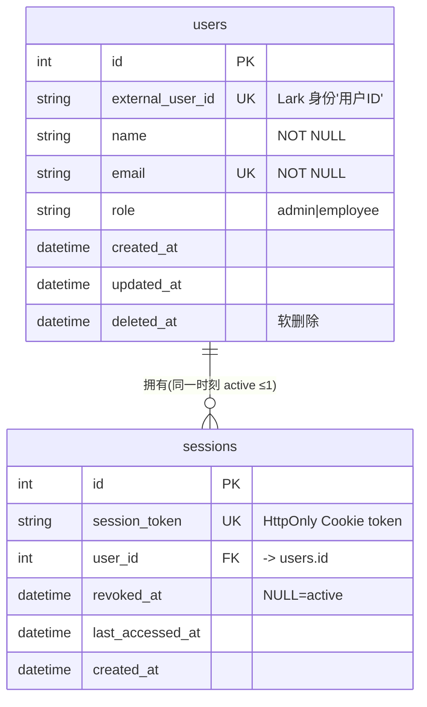

# 数据模型 · identity 模块

> 范围：员工 / 管理员身份与服务端会话（Epic 1）。
> 共享约定见 [overview.md](./overview.md)。API 见 [../api/identity.md](../api/identity.md)。

## ERD

## 表：users

| 字段 | 类型 | 约束 | 说明 / 需求 |
|------|------|------|-------------|
| `id` | int | PK, autoincrement | 关联真相源；Epic 2–6 外键引用（R1.1） |
| `external_user_id` | str | UNIQUE, NOT NULL | Lark 身份「用户 ID」；身份快照字段（R1.2） |
| `name` | str | NOT NULL | 身份完整性（R1.5） |
| `email` | str | UNIQUE, NOT NULL | 身份完整性（R1.5） |
| `role` | str | NOT NULL | `admin`（出题管理员）/ `employee`（员工考生）（R1.3） |
| `created_at`/`updated_at`/`deleted_at` | datetime(tz) | — | `TimestampMixin` |

- 索引：`uq_users_email`(unique)、`uq_users_external_user_id`(unique)。
- 身份完整性不变量（domain）：`name`/`email`/`external_user_id` 均非空才可建会话；否则 `INVALID_ACCOUNT`（R1.5）。

## 表：sessions

| 字段 | 类型 | 约束 | 说明 / 需求 |
|------|------|------|-------------|
| `id` | int | PK | — |
| `session_token` | str | UNIQUE, NOT NULL | 不透明 token（`secrets.token_urlsafe`），存 HttpOnly Cookie |
| `user_id` | int | FK → `users.id`, NOT NULL | 会话归属 |
| `revoked_at` | datetime(tz) | nullable | `NULL` = 活跃；登出 / 旋转时置值 |
| `last_accessed_at` | datetime(tz) | nullable | 登录时写入；MVP 不在每次 `/me` 调用时更新（避免每次鉴权产生 DB 写操作）；后续 Epic 如需 session 审计可开启 |
| `created_at` | datetime(tz) | NOT NULL | — |

- 索引：`ix_sessions_user_id`、`ix_sessions_token`(unique)。
- **Partial unique index** `uq_sessions_active_user`：`user_id` WHERE `revoked_at IS NULL` —— 硬保证同一 user 活跃会话 ≤1（AC：`DB sessions active ≤1`）。
- 单活会话规则（domain + 应用层事务）：登录时撤销该 user 既有活跃会话并建新，同一 `SQLAlchemyUnitOfWork` 事务内提交。

## 一致性

- 登录「撤销旧活跃会话 + 建新会话」原子事务；partial unique index 兜底并发竞态。
- MVP 不设会话硬过期（维持到登出 / 浏览器关闭，session Cookie 无 Max-Age）。

## Migration / 回滚

- 首个 Alembic migration：`alembic/versions/20260602_2130-82622e47ff7a_add_identity_users_and_sessions.py`（包含 partial unique index `uq_sessions_active_user`）。
- 回滚：`alembic downgrade -1` drop `sessions`、`users`（先 drop `sessions` 再 `users`，受 FK 约束顺序）。
- 预置账号：应用启动时幂等 seed（`infrastructure/seed/identity_seed.py`），账号清单在 `infrastructure/seed/preset_accounts.py`，含 1 个缺字段账号供 R1.5 拒绝用例（仅内存，不入 DB）；非数据迁移写入。
- **测试 DB**：使用 SQLite in-memory（aiosqlite）。SQLite 3.8+ 原生支持 partial UNIQUE index，`uq_sessions_active_user` 约束在 SQLite 下真实有效。
