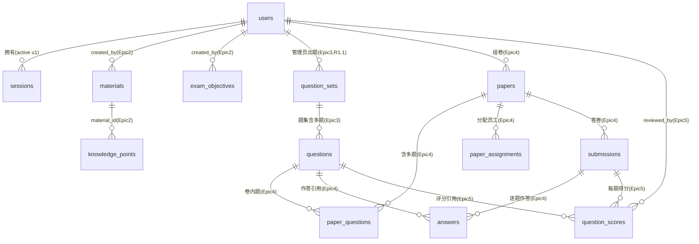

# 数据模型总览

> 模块索引 + 表索引 + 跨模块关系 + 共享持久化约定。
> 各模块实体 / 表 / 索引 / migration 见 `docs/project/data/{module}.md`。

## 共享持久化约定

- ORM 基类：`infrastructure/models/base.py` `Base`（SQLAlchemy 2.0 DeclarativeBase）；`metadata` 用于 Alembic（`target_metadata = Base.metadata`）。
- 时间戳 / 软删除：`infrastructure/models/mixins.py` `TimestampMixin`（`created_at`/`updated_at`/`deleted_at`），查询过滤用 `infrastructure/repositories/mixins.py` `SoftDeleteFilterMixin`。
- 主键：`int` 自增 PK（`id`）。
- 新增模型必须在 `infrastructure/models/__init__.py` 导入，Alembic autogenerate / `create_tables` 才能发现。
- Migration：`cd backend && alembic revision --autogenerate -m "..."` → `alembic upgrade head`；启动迁移策略由 `AUTO_RUN_MIGRATIONS` / `DEBUG` 控制（见 `main.py` lifespan）。

## 模块索引

| 模块 | 文件 | 表 |
|------|------|----|
| identity | [identity.md](./identity.md) | `users`、`sessions`（Epic 1） |
| exam | [exam.md](./exam.md) | `materials`、`material_chunks`、`exam_objectives`、`knowledge_points`（Epic 2） |
| question | [question.md](./question.md) | `question_sets`、`questions`（Epic 3） |
| exam-taking | [exam-taking.md](./exam-taking.md) | `papers`、`paper_questions`、`paper_assignments`、`submissions`、`answers`（Epic 4） |
| grading | [grading.md](./grading.md) | `question_scores`（+ `submissions.total_score` 增列）（Epic 5） |

## 表索引

| 表 | 模块 | 说明 |
|----|------|------|
| `users` | identity | 员工 / 管理员身份聚合；Epic 2–6 外键源 |
| `sessions` | identity | 服务端会话（HttpOnly Cookie token） |
| `materials` | exam | 录入的业务资料文本；提取知识点的来源 |
| `material_chunks` | exam | 资料切块（录入时切分）；提取 map-reduce 与 grounded 出题共用 |
| `exam_objectives` | exam | 考试目标六字段；出题与评分约束 |
| `knowledge_points` | exam | AI 提取的知识点（confirmed=true 才可进入出题） |
| `question_sets` | question | 一次 AI 生成的题集；挂状态机 + 达标 gate（Epic 3） |
| `questions` | question | 单题（题型/题干/选项/答案/评分要点/分值/关联知识点名快照）（Epic 3） |
| `papers` | exam-taking | 一次组卷产物；total_score=各题分值和（Epic 4） |
| `paper_questions` | exam-taking | 卷内题（引用 question + 顺序 + 分值快照）（Epic 4） |
| `paper_assignments` | exam-taking | 试卷分配给员工；UNIQUE(paper,employee) 防重复分配（Epic 4） |
| `submissions` | exam-taking | 答卷；UNIQUE(paper,employee) 防重复提交；grading_status 供 Epic5 接力（Epic 4） |
| `answers` | exam-taking | 逐题作答；answer_text NULL=未作答（Epic 4） |
| `question_scores` | grading | 每题得分 + 复核状态机；保留 AI 原始分/依据（Epic 5） |
| `conversations`/`messages`/`runs`/`agent_configs` | （基座示例） | 基座库 conversation 域示例表 |
| `file_assets` | （基座示例） | 基座库文件资产示例表 |

## 跨模块关系

- `users.id` 是身份关联真相源：**Epic 2–6 的所有考试相关记录**将以 `user_id` 外键引用 `users.id`（R1.1）。
- `sessions.user_id` → `users.id`（一个 user 同一时刻 ≤1 个活跃会话）。
- `materials.created_by` → `users.id`（录入者身份，Epic 2）。
- `exam_objectives.created_by` → `users.id`（创建者身份，Epic 2）。
- `knowledge_points.material_id` → `materials.id`（知识点来源资料，Epic 2）。
- `question_sets.created_by` → `users.id`（哪个管理员出的题，R1.1）。
- `question_sets.objective_id` → `exam_objectives.id`、`question_sets.material_id` → `materials.id`（出题依据，epic-2）。
- 题目「关联知识点」存名称快照在 `questions.knowledge_point_names`（JSON），**不跟 epic-2 知识点表建外键**（epic-2 知识点全量替换、id 不稳定，见 [question.md](./question.md)）。
- `papers.created_by` → `users.id`（组卷管理员，Epic 4）；`paper_assignments.employee_id` / `submissions.employee_id` → `users.id`（作答员工身份，R1.1，Epic 4）。
- `paper_questions.question_id` / `answers.question_id` → `questions.id`（试卷与作答引用题目，Epic 4）；分值在 `paper_questions.score` 快照。
- `submissions` 与 `answers` 是 Epic 5 阅卷的输入：`grading_status='pending'` 标记待阅，`answers.answer_text IS NULL` 标记未作答（见 [exam-taking.md](./exam-taking.md)）。
- `question_scores.submission_id` → `submissions.id`（ON DELETE CASCADE）、`question_scores.question_id` → `questions.id`、`question_scores.reviewed_by` → `users.id`（Epic 5 评分/复核）；`submissions.total_score` 由 Epic 5 在全题终分确定时写入（最简总分 Σ final_score），Epic 6 可 supersede（见 [grading.md](./grading.md)）。

