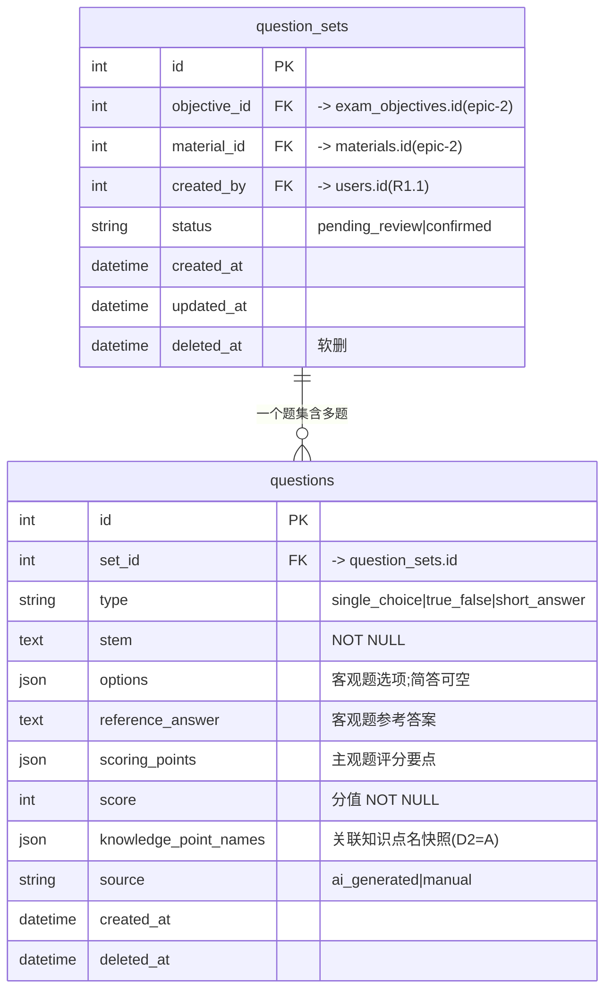

# 数据模型 · question 模块

> 范围：AI 出题与人工审核（Epic 3）。
> 共享约定见 [overview.md](./overview.md)。API 见 [../api/question.md](../api/question.md)。

## ERD

> **关联知识点为什么存名称快照而非外键（D2=A）**：epic-2 的知识点更新是全量替换（`PUT .../knowledge-points` 单事务 delete + bulk insert），`knowledge_points.id` 每次确认/编辑都会变；且 `material` 软删会 cascade 知识点。存外键会指向被删的行，所以这里存知识点名称的快照（JSON 数组），不跟 epic-2 知识点表建外键。出题时仍按 `GET .../knowledge-points?confirmed=true` 取已确认知识点喂 prompt，只是落库存名字。

## 表：question_sets

一次 AI 生成 = 一个题集。它是「确认」和「达标校验」的单位，状态机也挂在这里（R3.3）。

| 字段 | 类型 | 约束 | 说明 / 需求 |
|------|------|------|-------------|
| `id` | int | PK, autoincrement | — |
| `objective_id` | int | FK → `exam_objectives.id`, NOT NULL | 出题依据的考试目标（epic-2，R3.1） |
| `material_id` | int | FK → `materials.id`, NOT NULL | 出题依据的资料（epic-2，R3.1） |
| `created_by` | int | FK → `users.id`, NOT NULL | 触发出题的管理员（身份可追溯，R1.1） |
| `status` | str | NOT NULL, default `pending_review` | `pending_review` → `confirmed`（R3.3） |
| `created_at`/`updated_at`/`deleted_at` | datetime(tz) | — | `TimestampMixin` |

- 状态机（domain）：照 `domain/conversation/entity.py` 的 `Run` 模式，只允许 `pending_review → confirmed`。
- 达标不变量（domain service）：确认前必须满足题数≥5、不同题型≥2、简答（主观）≥1，否则拦截（R3.2）。

## 表：questions

| 字段 | 类型 | 约束 | 说明 / 需求 |
|------|------|------|-------------|
| `id` | int | PK | — |
| `set_id` | int | FK → `question_sets.id`, NOT NULL | 归属题集 |
| `type` | str | NOT NULL | `single_choice`/`true_false`/`short_answer`（R3.2） |
| `stem` | text | NOT NULL | 题干（R3.1） |
| `options` | JSON | nullable | 客观题选项；简答为空（R3.1） |
| `reference_answer` | text | nullable | 客观题参考答案（R3.1） |
| `scoring_points` | JSON | nullable | 主观题评分要点（R3.1） |
| `score` | int | NOT NULL | 分值（R3.1） |
| `knowledge_point_names` | JSON | nullable | 关联知识点名快照（字符串数组，D2=A，R3.1） |
| `source` | str | NOT NULL, default `ai_generated` | `ai_generated`/`manual`（人工新增=manual，R3.3） |
| `source_quote` | text | nullable | grounding 锚点：题目依据的逐字原文片段；忠实闸校验须出自所喂 chunk；name-only 降级或人工题为 null |
| `created_at`/`updated_at`/`deleted_at` | datetime(tz) | — | `TimestampMixin` |

- JSON 列（`options`/`scoring_points`/`knowledge_point_names`）写法照 `infrastructure/models/conversation.py`。

## 一致性

- generate 落库：「建 set（pending_review）+ 建多题」在一个 `SQLAlchemyUnitOfWork` 事务内，任一步失败整体回滚。
- confirm：单事务把 `question_sets.status` 改为 `confirmed`。
- 并发：同一 set 并发确认靠状态判断兜底（已 confirmed 幂等返回），MVP 不加锁。

## Migration / 回滚

- `cd backend && alembic revision --autogenerate -m "add question module tables"` → `alembic upgrade head`。
- 新模型须在 `infrastructure/models/__init__.py` 导入，autogenerate 才能发现。
- 回滚 `alembic downgrade -1`，drop 顺序受 FK 约束：`questions` → `question_sets`。
- **建表顺序约束**：`question_sets` 的 `objective_id`/`material_id` FK 依赖 epic-2 的 `materials`/`exam_objectives` 表先存在（epic-2 已落表，见 [exam.md](./exam.md)）。知识点不建外键（D2=A），无此约束。
