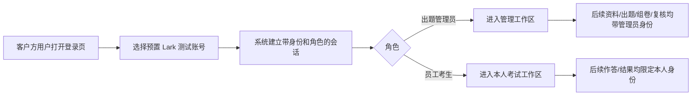
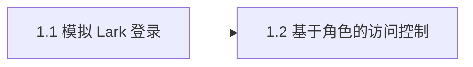

# Epic 1: 员工身份与登录

## 概述

**背景**: 每条考试相关记录（答卷、各题得分、评分依据、薄弱点分析）都必须关联到员工身份；所有受保护功能都要按角色隔离。身份与登录是 Epic 2-6 的数据归属和权限前提。
**价值**: 客户方用户通过模拟 Lark 登录选择预置账号，即可进入与角色匹配的工作区；系统用同一份身份上下文保护后续所有考试流程。
**范围**: 模拟 Lark 登录、当前身份读取、登出、身份四元组持久化、管理员/员工角色门、未登录和越权拦截、非法或缺字段账号拒绝。
**不含**: 真实 Lark OAuth、细粒度 RBAC、会话硬过期策略、组织/部门层级权限。

## 用户旅程

### 主旅程: 客户方用户完成登录并进入对应工作区

| 步骤 | 页面/入口 | 客户方用户行为 | 系统响应 | 覆盖 Story / AC |
|------|-----------|----------------|----------|-----------------|
| 1 | 登录页 `/login` | 选择或输入一个预置 Lark 测试账号 | 校验账号存在且 name/email/user_id/role 齐全 | Story 1.1 / Error AC |
| 2 | 登录页 `/login` | 提交登录 | 建立服务端会话，写入 HttpOnly Cookie，并返回当前身份 | Story 1.1 |
| 3 | 登录后入口 | 根据角色进入管理端或员工端 | admin 进入资料/出题/组卷/复核入口；employee 进入本人试卷与结果入口 | Story 1.2 |
| 4 | 后续受保护页面 | 继续使用业务功能 | API 和页面都复用当前身份，后续记录可追溯到 `users.id` | Story 1.2 / Integration AC |

### 分支与异常旅程

| 场景 | 页面/入口 | 客户方用户行为 | 系统响应 | 覆盖 Story / AC |
|------|-----------|----------------|----------|-----------------|
| 无效账号 | 登录页 `/login` | 选择/输入非预置账号，或选择缺身份字段账号 | 拒绝建立会话，显示账号无效提示 | Story 1.1 / Error AC |
| 重复登录 | 登录页 `/login` | 同一账号再次登录 | 撤销旧活跃会话并建立新会话，同一 user 活跃会话不超过 1 个 | Story 1.1 / Edge AC |
| 未登录访问受保护页面 | `/admin/*` 或 `/my/*` | 直接打开业务页面 | 阻止访问并引导回登录页；API 返回 401 | Story 1.2 / Error AC |
| 角色越权 | `/admin/*` | 员工账号访问管理员页面或端点 | 拦截访问；API 返回 403 | Story 1.2 / Error AC |

## 页面体验地图

| 页面/区域 | 页面职责 | 主操作 | 次操作 | 关键状态 | 信息优先级 | 体验护栏 |
|-----------|----------|--------|--------|----------|------------|----------|
| 登录页 | 让客户方用户快速选择预置账号并理解登录身份 | 登录 | 切换账号、查看账号角色 | 默认、提交中、账号无效、登录成功 | 账号身份 > 角色标签 > 登录按钮 > 错误提示 | 不做营销型大屏；不要让用户手输复杂凭证；错误不能只靠 toast |
| 受保护路由壳 | 根据登录状态和角色控制页面入口 | 进入允许的工作区 | 登出、切换账号 | 未登录、无权限、已登录、登出中 | 当前用户/角色 > 可访问入口 > 退出登录 | 未登录/无权限要有明确去向；不要出现空白页或半加载业务页面 |

## Success Criteria

- [ ] 有效预置账号登录后，系统建立会话并持久化 `external_user_id`、`name`、`email`、`role`，后续模块可引用 `users.id`。
- [ ] 非预置账号或缺少任一身份字段时，登录请求返回 401 `invalid_account`，且不会创建会话。
- [ ] 未登录访问受保护端点返回 401；角色不匹配访问受保护端点返回 403。
- [ ] 同一用户重复登录后活跃会话数不超过 1。
- [ ] 登录页和受保护路由在桌面/移动视口下无文字溢出、无元素重叠，主操作清晰。

## Risks and Mitigations

| 风险 | 影响 | 概率 | 缓解策略 |
|------|------|------|----------|
| 身份字段缺失仍进入系统，污染后续考试记录 | H | L | 登录前校验四元组；缺字段返回 `invalid_account` |
| 角色判断只在前端做，API 被绕过 | H | M | 所有受保护端点统一使用 `get_current_user` / `require_admin` / `require_employee` |
| 重复登录产生多个活跃 session | M | L | 登录事务中撤销旧会话并建新，会话表用 partial unique index 兜底 |

## Metrics

- **登录成功可演示率**: 目标 100%，测量方式为 Demo 中 admin/employee 账号各登录一次。
- **鉴权拦截准确率**: 目标 100%，测量方式为未登录、employee 访问 admin、admin 访问管理端三类用例。

## System-Wide Considerations

- **跨模块影响**: `users.id` 是 Epic 2-6 记录归属真相源；鉴权依赖为后续全部受保护端点提供统一角色门。
- **不变量保护**: 身份四元组非空才可建立会话；同一 user 活跃会话不超过 1。
- **状态生命周期**: 登录时撤旧建新；登出撤销当前会话；MVP 不要求每次 `/me` 更新访问时间。
- **API 表面一致性**: 鉴权错误沿用统一信封和 `UNAUTHORIZED` / `FORBIDDEN` / `INVALID_ACCOUNT`。
- **错误传播**: 登录失败在登录页就地展示；API 401/403 不被前端吞掉。
- **权限边界**: admin 可访问本场资料、知识点、题目、试卷、复核与结果；employee 仅访问本人试卷与本人结果。

## Story 列表

### Story 1.1: 模拟 Lark 登录

**用户故事**: 作为客户方用户，我可以在登录页选择预置 Lark 测试账号，以便系统识别我的身份与角色并进入对应工作区

#### 验收标准

**Happy Path**
- [ ] 选择有效预置账号登录后建立会话并下发 HttpOnly Cookie，响应返回当前身份 `验证: API POST /api/v1/exam/auth/mock-login {account_id} → 200 + Set-Cookie(HttpOnly) + body.data.user.role in {"admin","employee"}`

**Edge Cases**
- [ ] 同一 user 再次登录时撤销既有活跃会话并建立新会话，活跃会话数保持 1 `验证: DB SELECT COUNT(*) FROM sessions WHERE user_id=X AND revoked_at IS NULL → 1`

**Error Paths**
- [ ] 账号不在预置列表时拒绝建立会话 `验证: API POST /api/v1/exam/auth/mock-login {account_id:"nope"} → 401 + body.error.message_key="invalid_account"`
- [ ] 预置账号缺 name/email/external_user_id 任一字段时拒绝建立会话 `验证: API POST /api/v1/exam/auth/mock-login {缺字段账号} → 401 + body.error.message_key="invalid_account"`

**Integration**
- [ ] 登录后凭 Cookie 可读取当前身份，且身份四元组持久化到 users 供下游外键引用 `验证: API GET /api/v1/exam/auth/me (带Cookie) → 200 + body.data.user.id; DB SELECT FROM users WHERE id=X → external_user_id/name/email/role 均非空`

#### 前端验收标准
- [ ] 登录页展示预置账号列表、角色标签和主登录按钮 `验证: Browser 访问 /login → 账号选择控件存在 + role 标签存在 + button[type=submit] 存在`
- [ ] 登录提交中有明确 loading 状态，避免重复点击 `验证: Browser click 登录 → button[disabled] 存在直到请求结束`
- [ ] 登录成功后按角色跳转到对应工作区 `验证: Browser 选 admin 账号 click 登录 → URL 匹配 /admin; 选 employee 账号 click 登录 → URL 匹配 /my`
- [ ] 页面体验地图对齐，桌面/移动视口无重叠、无文字溢出，主操作清晰 `验证: Browser 截图审查 /login desktop+mobile → 无重叠/无溢出/登录按钮首屏可见`

#### Assumptions
- [SCOPE] 预置测试账号足以代表 admin/employee 两类身份，含 1 个缺字段账号供 R1.5 拒绝用例 — Confidence: H — 失效影响: 若改为真实 OAuth，需要重做账号来源与错误口径
- [SCOPE] 本 Epic 不生成项目 DESIGN.md，UI 按现有前端 theme 和页面体验地图执行 — Confidence: M — 失效影响: 后续若补 DESIGN.md，登录页视觉需按新设计合同复核

**覆盖度自检**: 派生 ✓ / Happy ✓ / Edge ✓ / Error ✓ / Integration ✓ / FE ✓ / AC 总数 5 ≤7 ✓ / Assumptions 2 条
**参考**: docs/project/api/identity.md, docs/project/data/identity.md
**依赖**: 无

---

### Story 1.2: 基于角色的访问控制

**用户故事**: 作为客户方用户，我只能进入自己角色允许的页面和数据范围，以便管理员与员工的考试数据边界清晰可靠

#### 验收标准

**Happy Path**
- [ ] admin 会话可访问管理员端点 `验证: API GET /api/v1/exam/materials (admin Cookie) → 200`
- [ ] employee 会话可访问本人试卷与结果端点 `验证: API GET /api/v1/exam/my/papers (employee Cookie) → 200`

**Error Paths**
- [ ] 未登录访问受保护端点时返回 401 并标识未授权 `验证: API GET /api/v1/exam/materials (无Cookie) → 401 + error.message_key 指向 unauthorized`
- [ ] 角色不匹配时返回 403 `验证: API POST /api/v1/exam/materials (employee Cookie) → 403 + error 指向 forbidden`

**Integration**
- [ ] `get_current_user` / `require_admin` / `require_employee` 被 Epic 2-6 受保护端点统一引用，鉴权链一致 `验证: pytest test_role_dependencies_enforced → PASSED`

#### 前端验收标准
- [ ] 未登录访问管理页面时跳转到登录页，并保留可理解的未登录提示 `验证: Browser 未登录访问 /admin → URL 匹配 /login + 未登录提示存在`
- [ ] employee 访问管理员页面时显示无权限状态，不渲染管理员业务内容 `验证: Browser employee Cookie 访问 /admin → 无权限文案存在 + 上传/出题按钮不存在`
- [ ] 登录后的路由壳显示当前用户姓名/角色和登出入口 `验证: Browser 登录后访问 /admin → 用户姓名存在 + role 标签存在 + 登出按钮存在`
- [ ] 页面体验地图对齐，未登录/无权限状态不出现空白页或业务内容闪现 `验证: Browser 截图审查 /admin unauth+forbidden → 状态清晰且无重叠`

#### Assumptions
- [SCOPE] MVP 仅 2 角色（admin/employee），不做细粒度 RBAC — Confidence: H — 失效影响: 新增角色需扩展 `require_role` 与路由导航规则

**覆盖度自检**: 派生 ✓ / Happy ✓ / Edge N/A — 角色枚举无数值边界 / Error ✓ / Integration ✓ / FE ✓ / AC 总数 5 ≤7 ✓ / Assumptions 1 条
**参考**: docs/project/api/identity.md, docs/project/api/conventions.md
**依赖**: Story 1.1

---

## 依赖关系

**Epic 依赖**: 无
**技术依赖**: 会话 Cookie、统一响应信封、SQLAlchemy UoW、partial unique index

## 参考文档

- PRD: [docs/project/requirements.md](../../project/requirements.md) §3 Epic 1, §9.2, §9.3
- Architecture: [docs/project/architecture.md](../../project/architecture.md)
- API Design: [docs/project/api/identity.md](../../project/api/identity.md)
- Data Model: [docs/project/data/identity.md](../../project/data/identity.md)
