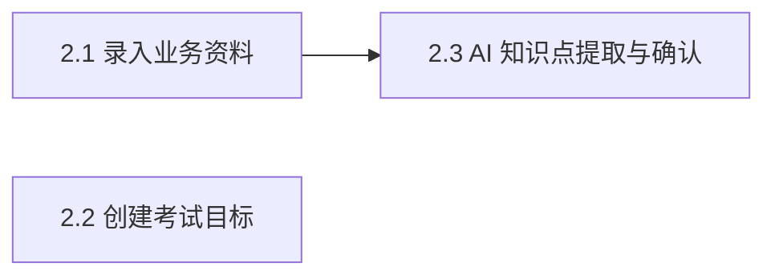

# Epic 2: 业务知识录入与知识点提取（AI 环节 ①）

## 概述

**背景**: 出题前必须先把内部业务资料、考试目标和可确认的知识点沉淀下来，否则后续 AI 出题没有可靠输入基准。
**价值**: 出题管理员可以用业务资料和考试目标快速建立考试上下文，AI 提取知识点后仍由人工编辑确认，保证进入出题环节的是可控知识基准。
**范围**: 业务资料录入（文本粘贴、txt/md/pdf 上传、切块持久化）、考试目标六字段、AI 知识点异步提取、知识点可编辑确认、提取失败重试或人工补充、空知识点拦截。
**不含**: 多资料/多目标批量管理、PDF 扫描件 OCR、题库长期沉淀、真实对象存储、出题生成本身（Epic 3）。

## 用户旅程

### 主旅程: 出题管理员录入资料并确认知识点

| 步骤 | 页面/入口 | 客户方用户行为 | 系统响应 | 覆盖 Story / AC |
|------|-----------|----------------|----------|-----------------|
| 1 | 业务材料页 `/admin/materials` | 粘贴文本或上传 txt/md/pdf 业务资料 | 保存资料，生成列表项，并把全文切块持久化 | Story 2.1 |
| 2 | 考试目标页 `/admin/objectives` | 填写考核对象、目的、覆盖知识点、题型/难度/分值、不考核范围、主观题评分重点 | 校验必填字段并保存考试目标 | Story 2.2 |
| 3 | 业务材料页或材料详情 | 对已录入资料触发知识点提取 | 将资料状态置为 processing，后台调用 AI，前端轮询状态 | Story 2.3 |
| 4 | 知识点确认面板 | 编辑、删除、新增 AI 返回的知识点 | 展示可编辑列表，保留失败/空态兜底入口 | Story 2.3 |
| 5 | 知识点确认面板 | 确认知识点列表 | 保存 `confirmed=true` 的知识点集合，作为 Epic 3 出题输入 | Story 2.3 / Integration AC |

### 分支与异常旅程

| 场景 | 页面/入口 | 客户方用户行为 | 系统响应 | 覆盖 Story / AC |
|------|-----------|----------------|----------|-----------------|
| 空资料 | 业务材料页 | 提交空文本且未上传文件 | 阻止提交，提示必须输入文本或上传文件 | Story 2.1 / Error AC |
| 不支持文件 | 业务材料页 | 上传不支持格式 | 显示格式错误，资料不落库 | Story 2.1 / Error AC |
| 目标缺字段 | 考试目标页 | 遗漏必填字段后提交 | 对应字段标红，API 返回 422 字段错误 | Story 2.2 / Error AC |
| AI 提取失败或超时 | 知识点确认面板 | 等待提取结果 | 显示失败原因、重试入口和人工补充入口 | Story 2.3 / Error AC |
| 知识点为空 | 知识点确认面板 | 尝试进入出题 | 系统阻止进入出题，要求重试或人工补充并确认 | Story 2.3 / Integration AC |

## 页面体验地图

| 页面/区域 | 页面职责 | 主操作 | 次操作 | 关键状态 | 信息优先级 | 体验护栏 |
|-----------|----------|--------|--------|----------|------------|----------|
| 业务材料页 | 管理本次考试的业务资料来源 | 录入/上传资料 | 查看资料详情、触发提取、重试提取 | 空态、上传中、ready、processing、failed | 提取状态 > 资料标题/文件名 > 内容预览 > 创建时间 | 不把全文塞进列表；失败状态必须在列表行可见，不能只靠 toast |
| 考试目标页 | 定义本次考试要考什么和怎么评分 | 创建考试目标 | 查看/选择已有目标 | 空态、编辑中、校验失败、创建成功 | 目标名称/考核对象 > 六字段完成度 > 创建时间 | 六字段表单分组清晰；必填错误就地展示，不让用户提交后猜原因 |
| 知识点确认面板 | 把 AI 提取结果变成可出题的确认知识点 | 确认知识点 | 编辑、删除、新增、重试、人工补充 | processing、completed、failed、空结果、保存中、保存失败 | 知识点名称 > 来源资料状态 > 确认按钮 > 兜底动作 | 长列表可扫描；确认按钮只在有有效知识点时突出；失败/空态必须给下一步 |

## Success Criteria

- [ ] 管理员可以录入文本或上传 txt/md/pdf 资料，资料落库并生成 `material_chunks`。
- [ ] 管理员可以创建包含六字段的考试目标，缺任一必填字段返回 422 且前端字段级提示。
- [ ] 管理员可以触发 AI 知识点提取，并通过轮询看到 processing/completed/failed 状态。
- [ ] 知识点结果可编辑、删除、新增并确认；确认后的知识点以 `confirmed=true` 保存。
- [ ] AI 提取失败、超时、空结果时，页面提供重试或人工补充入口，且空知识点不得进入 Epic 3 出题。
- [ ] 业务材料页、考试目标页、知识点确认面板在桌面/移动视口下无重叠、无文字溢出，主操作清晰。

## Risks and Mitigations

| 风险 | 影响 | 概率 | 缓解策略 |
|------|------|------|----------|
| AI 提取失败导致出题链路卡死 | H | M | 提供 failed 状态、重试、人工补充知识点 |
| 空知识点进入出题导致后续题目质量失控 | H | L | Epic 3 只消费 `confirmed=true` 知识点；0 条时阻止进入出题 |
| 资料切块或 PDF 提取质量差 | M | M | 保留原文和切块；扫描件/OCR 明确延后；允许粘贴文本兜底 |
| 多个 UI 状态堆在同一页造成体验混乱 | M | M | 页面体验地图限定主操作和状态表达，失败/空态必须有就地入口 |

## Metrics

- **知识点确认完成率**: 目标 Demo 100%，测量方式为录入资料后成功保存至少 1 条 confirmed 知识点。
- **AI 提取失败兜底可用性**: 目标 100%，测量方式为 mock 失败时仍可人工补充并确认知识点。
- **目标表单校验准确率**: 目标 100%，测量方式为逐个缺失必填字段均返回字段级错误。

## System-Wide Considerations

- **跨模块影响**: `confirmed=true` 知识点是 Epic 3 出题和 Epic 6 分析的输入；`material_chunks` 供知识点提取和 grounded 出题复用。
- **不变量保护**: 未确认或空知识点不被 Epic 3 消费；`PUT knowledge-points` 以单事务全量替换。
- **状态生命周期**: `extraction_status` 为 null/processing/completed/failed；processing 不重复调度；超过 60s 前端视为失败并允许重试。
- **API 表面一致性**: 全部端点使用 `require_admin`；错误使用统一信封和模块错误码。
- **错误传播**: AI 失败不崩溃为 500 页面，而是 material 状态 failed + 可重试/人工补充。
- **权限边界**: 仅出题管理员可以录入资料、创建目标、提取和确认知识点。

## Story 列表

| Story | 标题 | 文件 |
|-------|------|------|
| 2.1 (US003) | 录入业务资料 | [stories/us003-input-business-material.md](stories/us003-input-business-material.md) |
| 2.2 (US004) | 创建考试目标 | [stories/us004-create-exam-objective.md](stories/us004-create-exam-objective.md) |
| 2.3 (US005) | AI 知识点提取与确认 | [stories/us005-ai-knowledge-point-extraction.md](stories/us005-ai-knowledge-point-extraction.md) |

## 依赖关系

**Epic 依赖**: 依赖 Epic 1（管理员身份与角色门）
**技术依赖**: `LLMPort`、FastAPI BackgroundTasks、`split_into_chunks`、`pypdf`

## 参考文档

- PRD: [docs/project/requirements.md](../../../project/requirements.md) §3 Epic 2, §9.2, §9.3
- Architecture: [docs/project/architecture.md](../../../project/architecture.md)
- API Design: [docs/project/api/exam.md](../../../project/api/exam.md)
- Data Model: [docs/project/data/exam.md](../../../project/data/exam.md)
