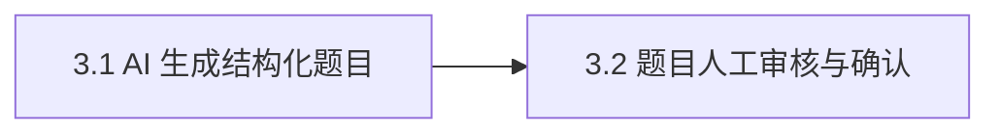

# Epic 3: AI 出题与人工审核

## 概述

**背景**: 出题方不再人工逐题编写，而是「业务资料 + 已确认知识点 + 考试目标 → AI 出结构化题 → 人工审核确认」。这是 AI 环节 ②，题目是组卷与考试的前置物。
**价值**: 出题成本与质量波动下降；不合法 AI 输出被结构校验拦截，人工可编辑/补足后才放行。
**范围**: AI 生成机器可解析题目（R3.1）、题集达标约束（≥5 题/≥2 题型/≥1 主观，R3.2）、结构校验三道闸 + 503 故障分流（R3.4）、人工审核（编辑/删除/新增/确认，R3.3）。
**不含**: 智能组卷算法、题库长期沉淀与复用、多份资料/多目标批量出题。

## 用户旅程

### 主旅程: 出题管理员生成并确认一套合格题目

| 步骤 | 用户行为 | 系统响应 | 覆盖 Story |
|------|----------|----------|------------|
| 1 | 选资料 + 考试目标（可选圈选已确认 KP 子集）触发出题 | grounding 选相关 chunk，调 LLM 生成结构化题，落 `pending_review` 题集，每题带 source_quote | Story 3.1 |
| 2 | 审阅题集，编辑/删除/新增题 | 保存修改（题集仍 pending_review） | Story 3.2 |
| 3 | 确认题集 | 跑达标校验，达标 → `confirmed`，方可进组卷 | Story 3.2 |

### 分支与异常旅程

| 场景 | 用户行为 | 系统响应 | 覆盖 Story / AC |
|------|----------|----------|-----------------|
| AI 输出不合格 | 触发出题 | 三道闸任一不过 → 200 `status=invalid` + reasons[]，提示重试或人工补足 | Story 3.1 / Error AC |
| LLM 基础设施故障 | 触发出题 | timeout/连接/鉴权/限流 → 503 `QUESTION_GENERATION_UNAVAILABLE`（可观测，区分内容问题） | Story 3.1 / Error AC |
| 圈选 KP 全非法 | 传非交集 KP 子集 | 交集为空 → invalid + reasons，不调 LLM、不落库 | Story 3.1 / Edge AC |
| 题集不达标仍想确认 | 点确认 | 题数<5/题型<2/无主观 → 422 `QUESTION_SET_BELOW_MINIMUMS`，拦截确认 | Story 3.2 / Error AC |

## Success Criteria

- [ ] AI 生成机器可解析结构化题（type/stem/options/reference_answer 或 scoring_points/score/knowledge_point_names），非自然语言列表（R3.1）
- [ ] 进入考试的题集 ≥5 题、≥2 题型、≥1 主观（简答），客观覆盖单选与判断（R3.2）
- [ ] 结构校验三道闸（形状/domain/忠实）拦截不合格输出（200 + `status=invalid` + reasons），基础设施异常走 503（R3.4）
- [ ] 题集 `pending_review` → 人工编辑/删除/新增 → confirm 达标才转 `confirmed` 进组卷（R3.3）
- [ ] 出题 LLM 单次调用 P95 < 60s（NFR §4.1）

## Risks and Mitigations

| 风险 | 影响 | 概率 | 缓解策略 |
|------|------|------|----------|
| AI 脱离资料编造（幻觉） | H | M | 忠实闸：每题 source_quote 须逐字出自所喂 chunk，否则 invalid |
| 不合格题混入考试 | H | M | 三道闸 + 确认前强制达标校验，未达标不可 confirmed |
| LLM 超时叠加重试撞 P95<60s | M | M | 出题单独设 timeout<60s 且 max_retries=0或1 |

## System-Wide Considerations

- **跨模块影响**: 上游消费 Epic 2 的 `materials`/`exam_objectives`/已确认 `knowledge_points`（`?confirmed=true`）与 `material_chunks`（grounding）；下游 Epic 4 仅可对 `status=confirmed` 题集的题组卷。
- **不变量保护**: 空知识点不得进入出题（R2.4）；题目「关联知识点」存名称快照（`knowledge_point_names` JSON），不与 Epic 2 知识点表建外键（全量替换、id 不稳定）。
- **状态生命周期**: 题集状态机仅 `pending_review → confirmed`；同 set 并发确认靠状态判断兜底（已 confirmed 幂等），MVP 不加锁。
- **API 表面一致性**: 内容不合格走 `200 + data.status=invalid`（非错误信封）；基础设施异常走 `503`，两者区分以便监控与前端处置。
- **错误传播**: generate 落库「建 set + 建多题」单事务，任一步失败整体回滚。
- **权限边界**: 全部端点 `require_admin`。

## Story 列表

### Story 3.1: AI 生成结构化题目

**用户故事**: 作为出题管理员，我可以基于已确认的资料、知识点与考试目标触发 AI 出题，以便快速得到一套机器可解析、依据资料原文的待审核题目

#### 验收标准

**Happy Path**
- [ ] 触发出题成功返回 `status=generated`，题集落 `pending_review`，每题持久化结构化字段与 source_quote `验证: API POST /api/v1/exam/questions/generate {objective_id,material_id} → 200 + body.data.status="generated"; DB SELECT FROM question_sets WHERE id=set_id → status="pending_review"`

**Edge Cases**
- [ ] 传 `knowledge_point_names` 子集 → 与已确认 KP 取交集收窄出题覆盖面（保序，非交集名忽略）；省略/空数组 → 用全部已确认 KP `验证: API POST .../generate {..., knowledge_point_names:["KP1"]} → 200; DB questions.knowledge_point_names ⊆ {已确认KP}`
- [ ] 圈选 KP 子集与已确认 KP 交集为空 → `status=invalid` + reasons，不调 LLM、不落库 `验证: API POST .../generate {knowledge_point_names:["不存在"]} → 200 + data.status="invalid" + data.reasons 非空; DB question_sets 无新增行`

**Error Paths**
- [ ] AI 输出未过三道闸（非法 JSON / 字段不全 / 题量<5 / 无主观 / source_quote 不在原文）→ 200 `status=invalid` + reasons[]，不落进考试 `验证: API POST .../generate (mock LLM 返回缺主观题) → 200 + data.status="invalid" + data.reasons 含"无主观题"语义`
- [ ] LLM 基础设施异常（timeout/连接/鉴权/限流）→ 503，不混进 invalid `验证: API POST .../generate (mock LLM timeout) → 503 + error.message_key 指向 question_generation_unavailable`

**Integration**
- [ ] grounding 按所选/已确认 KP 名字面匹配选相关 `material_chunks` 作为原文依据，忠实闸校验每题 source_quote 出自所喂片段 `验证: pytest test_generate_source_quote_within_fed_chunks → PASSED`

#### 前端验收标准
- [ ] 出题页可选资料/目标并触发生成，生成中显示进行中状态 `验证: Browser 选资料+目标 click 生成 → 进行中指示出现`
- [ ] invalid 与 503 分别展示「内容需补足（含 reasons）」与「系统故障可重试」 `验证: Browser 生成返回 invalid → reasons 列表渲染; 返回 503 → 重试入口出现`

#### Assumptions
- [DEPENDENCY] LLM 可在 timeout<60s 内返回结构化题（max_retries 0或1） — Confidence: M — 失效影响: P95>60s，需调小题量或拆分调用
- [DATA] 业务资料长度在单次 LLM 上下文窗口可处理范围内 — Confidence: M — 失效影响: 超长资料需分块/摘要策略（PRD §8.3 开放问题）

**覆盖度自检**: 派生 ✓（决策表: KP 子集×交集 + 三道闸）/ Happy ✓ / Edge ✓ / Error ✓ / Integration ✓ / FE ✓ / AC 总数 6 ≤7 ✓ / Assumptions 2 条
**参考**: docs/project/api/question.md（generate / 三道闸 / 503）, docs/project/data/question.md（question_sets/questions/source_quote）
**依赖**: 无（Epic 级依赖 Epic 2，见下方）

---

### Story 3.2: 题目人工审核与确认

**用户故事**: 作为出题管理员，我可以编辑、删除、新增题目并在达标后确认题集，以便只有经我把关且满足题量题型要求的题目才进入组卷

#### 验收标准

**Happy Path**
- [ ] 对 `pending_review` 题集编辑/删除/新增题后保存成功（新增题 source=manual） `验证: API PUT /api/v1/exam/questions/{id} {stem:"改后"} → 200 + data.question.stem="改后"; API POST /api/v1/exam/questions {set_id,...} → 201 + data.question.source="manual"`
- [ ] 确认达标题集 → `status=confirmed` `验证: API POST /api/v1/exam/questions/confirm {set_id} → 200 + data.status="confirmed"`

**Edge Cases**
- [ ] 对已确认题集再次确认 → 幂等返回 confirmed，不报错 `验证: API POST .../questions/confirm {已confirmed set_id} → 200 + data.status="confirmed"`

**Error Paths**
- [ ] 题集不达标（题数<5 / 题型<2 / 无主观）确认被拦截 → 422，error 说明缺什么 `验证: API POST .../questions/confirm {不达标 set_id} → 422 + error.message_key 指向 question_set_below_minimums`
- [ ] 编辑/删除不存在的题 → 404 `验证: API PUT /api/v1/exam/questions/999999 → 404 + error 指向 question_not_found`

**Integration**
- [ ] 只有 `confirmed` 题集的题目可被 Epic 4 组卷引用；`pending_review` 题集的题不可进组卷 `验证: pytest test_unconfirmed_set_questions_rejected_by_paper → PASSED`

#### 前端验收标准
- [ ] 题集列表逐题可编辑/删除/新增，确认按钮可见 `验证: Browser 打开题集 → 每题编辑控件存在 + 确认按钮存在`
- [ ] 确认不达标时展示具体缺项提示 `验证: Browser 对不达标题集 click 确认 → 提示文案含缺项(题量/题型/主观)`

#### Assumptions
- 无

**覆盖度自检**: 派生 ✓（状态迁移: pending_review→confirmed + 非法再确认）/ Happy ✓ / Edge ✓ / Error ✓ / Integration ✓ / FE ✓ / AC 总数 6 ≤7 ✓ / Assumptions "无"
**参考**: docs/project/api/question.md（PUT/DELETE/POST/confirm 达标 gate）, docs/project/data/question.md（达标不变量）
**依赖**: Story 3.1

---

## 依赖关系

**Epic 依赖**: 依赖 Epic 2（资料、考试目标、已确认知识点是出题输入）
**技术依赖**: 基座 `LLMPort.generate_structured`；Epic 2 `material_chunks` 用于 grounding

## 参考文档

- PRD: [docs/project/requirements.md](../../project/requirements.md) §3 Epic 3, §9.2/§9.3
- API Design: [docs/project/api/question.md](../../project/api/question.md)
- Data Model: [docs/project/data/question.md](../../project/data/question.md)
- 上游: [docs/project/api/exam.md](../../project/api/exam.md)（资料/目标/知识点）
