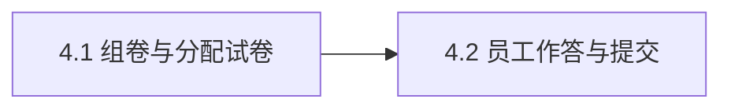

# Epic 4: 组卷与考试作答

## 概述

**背景**: 已确认题目需要组成试卷分配给员工，员工作答并一次性提交，产生可阅卷的答卷。答卷是评分与分析的输入。
**价值**: 管理员一键组卷分配；员工在剥离答案的视图作答；提交关联本人身份与试卷，且防重复提交。
**范围**: 组卷（顺序+分值快照+总分）与分配（R4.1）、员工取卷（剥离答案）与一次性提交（R4.2）、防重复提交（R4.3）、未作答语义（R4.4）。
**不含**: 考试限时、防作弊监考、补考、多轮考试。

## 用户旅程

### 主旅程: 管理员组卷分配，员工作答提交

| 步骤 | 用户行为 | 系统响应 | 覆盖 Story |
|------|----------|----------|------------|
| 1 | 管理员选已确认题目 + 选员工，触发组卷 | 单事务落 paper + 卷内题（顺序/分值快照）+ N 条分配，算 total_score | Story 4.1 |
| 2 | 员工打开分配给本人的试卷 | 返回剥离答案的题目视图（不含参考答案/评分要点/选项正确性标记） | Story 4.2 |
| 3 | 员工提交答卷 | 单事务建答卷+逐题作答，关联本人+试卷，置 grading_status=pending | Story 4.2 |

### 分支与异常旅程

| 场景 | 用户行为 | 系统响应 | 覆盖 Story / AC |
|------|----------|----------|-----------------|
| 组卷含未确认/不存在题 | 触发组卷 | 422 `PAPER_INVALID_QUESTIONS` | Story 4.1 / Error AC |
| 员工重复提交同卷 | 第二次提交 | 409 `DUPLICATE_SUBMISSION`（DB 唯一约束兜底并发） | Story 4.2 / Error AC |
| 员工访问未分配的卷 | 取卷/提交 | 403 FORBIDDEN | Story 4.2 / Error AC |
| 提交时有未作答题 | 提交含空题答卷 | 未作答以 `answer_text=NULL` 落库，返回 `unanswered[]` | Story 4.2 / Edge AC |

## Success Criteria

- [ ] 组卷生成试卷（题目顺序 + 各题分值快照 + `total_score=Σ paper_questions.score`）并分配给员工，`paper_assignments` UNIQUE(paper,employee) 防重复分配（R4.1）
- [ ] 员工取卷视图剥离 `reference_answer`/`scoring_points` 且 `options` 去除 `is_correct`（防答案泄漏）（R4.2）
- [ ] 提交保存逐题作答并关联本人身份与试卷，`submissions.grading_status='pending'` 供 Epic 5 接力（R4.2）
- [ ] 同员工对同卷重复提交被拦截 → 409（`submissions` UNIQUE(paper,employee)，并发兜底）（R4.3）
- [ ] 未作答题以 `answer_text=NULL` 落库（R4.4）

## Risks and Mitigations

| 风险 | 影响 | 概率 | 缓解策略 |
|------|------|------|----------|
| 员工视图泄漏正确答案 | H | M | GET 试卷强制剥离 reference_answer/scoring_points/is_correct |
| 并发重复提交产生双答卷 | H | L | DB UNIQUE(paper,employee) + 先查后插 + 捕获 IntegrityError→409 |
| 答卷未关联正确身份 | H | L | submissions.employee_id 取登录会话 user.id，单事务落库 |

## System-Wide Considerations

- **跨模块影响**: 上游引用 Epic 3 `status=confirmed` 题集的 `questions`；下游 Epic 5 以 `submissions`(`grading_status=pending`)/`answers` 为阅卷输入。
- **不变量保护**: 员工视图不得含 `is_correct`/`reference_answer`/`scoring_points`（安全）；`papers.total_score = Σ paper_questions.score`；分值以组卷时 `paper_questions.score` 快照，抗题目未来变更。
- **状态生命周期**: 组卷（papers+paper_questions+paper_assignments）单事务；提交（submissions+answers）单事务；并发提交靠唯一约束兜底。
- **API 表面一致性**: 提交契约响应体在 Epic 5 接力判分后保持不变（判分异步落库，不改提交响应）。
- **错误传播**: 未分配→403；试卷不存在→404；含非本卷 question_id→422；重复提交→409。
- **权限边界**: 组卷/管理员视图 `require_admin`；取卷/提交/我的试卷 `require_employee` 且仅限被分配本人。

## Story 列表

### Story 4.1: 组卷与分配试卷

**用户故事**: 作为出题管理员，我可以用已确认的题目组成一份试卷并分配给指定员工，以便员工可作答、系统可阅卷

#### 验收标准

**Happy Path**
- [ ] 用已确认题目组卷并分配，返回 paper_id/order/total_score/assignments `验证: API POST /api/v1/exam/papers {question_ids,assignees} → 201 + body.data.total_score == 各题分值和 + data.assignments 长度==assignees 数`

**Edge Cases**
- [ ] 允许跨多个 `confirmed` 题集混合组卷（按 question_ids 顺序定题序） `验证: API POST .../papers {跨两个confirmed题集的question_ids} → 201 + data.order 顺序与入参一致`

**Error Paths**
- [ ] 题目含未确认题集/空题集/不存在 question_id → 422 `验证: API POST .../papers {含pending_review题集的question_id} → 422 + error 指向 paper_invalid_questions`

**Integration**
- [ ] `paper_questions.score` 为组卷时分值快照，`paper_assignments` UNIQUE(paper,employee) 防重复分配 `验证: DB SELECT FROM paper_questions WHERE paper_id=X → score 等于组卷时题目分值; 重复 assignee → 不产生重复 assignment 行`

#### 前端验收标准
- [ ] 组卷页可多选题目与多选员工并提交 `验证: Browser 组卷页 → 题目多选控件 + 员工多选控件 + 提交按钮存在`
- [ ] 组卷成功展示试卷总分与已分配员工 `验证: Browser 提交组卷 → 总分文案 + 已分配员工列表渲染`

#### Assumptions
- 无

**覆盖度自检**: 派生 ✓（EP: question_ids 有效/无效类）/ Happy ✓ / Edge ✓ / Error ✓ / Integration ✓ / FE ✓ / AC 总数 4 ≤7 ✓ / Assumptions "无"
**参考**: docs/project/api/exam-taking.md（POST /papers）, docs/project/data/exam-taking.md（papers/paper_questions/paper_assignments）
**依赖**: 无（Epic 级依赖 Epic 3）

---

### Story 4.2: 员工作答与提交

**用户故事**: 作为员工考生，我可以打开分配给本人的试卷作答并一次性提交，以便我的答卷被关联到本人身份并进入阅卷

#### 验收标准

**Happy Path**
- [ ] 取卷返回剥离答案的题目视图（无 reference_answer/scoring_points，options 仅 key/text） `验证: API GET /api/v1/exam/papers/{id} (employee Cookie) → 200 + data.questions[].reference_answer 不存在 + options[] 无 is_correct`
- [ ] 提交保存逐题作答并关联本人+试卷，置 grading_status=pending `验证: API POST /api/v1/exam/papers/{id}/submit {answers} → 201 + data.submission_id; DB SELECT FROM submissions WHERE id=X → employee_id==当前user, grading_status="pending"`

**Edge Cases**
- [ ] 未作答题（缺失或 answer=null）以 answer_text=NULL 落库，返回 unanswered[] `验证: API POST .../submit {部分题 answer:null} → 201 + data.unanswered 含空题id; DB SELECT FROM answers WHERE submission_id=X AND question_id=空题 → answer_text IS NULL`

**Error Paths**
- [ ] 同员工对同卷重复提交 → 409 `验证: API POST .../submit (第二次) → 409 + error 指向 duplicate_submission`
- [ ] 员工未被分配该卷取卷/提交 → 403 `验证: API GET /api/v1/exam/papers/{未分配id} (employee Cookie) → 403`
- [ ] 试卷不存在 → 404 `验证: API GET /api/v1/exam/papers/999999 → 404 + error 指向 paper_not_found`

**Integration**
- [ ] 员工视图剥离答案防泄漏（安全不变量），提交后 grading_status=pending 接力 Epic 5 `验证: pytest test_employee_paper_view_strips_answers_and_handoff → PASSED`

#### 前端验收标准
- [ ] 试卷展示题目与作答区，提交前对未作答项明确提示后仍可提交 `验证: Browser 留空题提交 → 出现"未作答项"提示 + 确认后可继续提交`
- [ ] 已提交的卷再次进入显示已提交状态，不可重复提交 `验证: Browser 已提交卷 → 提交按钮禁用或显示"已提交"`

#### Assumptions
- [SCOPE] `answers` 含不属本卷的 question_id（→422）为客户端异常路径，非主测用例（前端只提交本卷题） — Confidence: M — 失效影响: 异常入参未拦截会落脏作答行，需补后端校验用例

**覆盖度自检**: 派生 ✓（单 Story 流程: 取卷→提交主备异常）/ Happy ✓ / Edge ✓ / Error ✓ / Integration ✓ / FE ✓ / AC 总数 7 ≤7 ✓ / Assumptions 1 条
**参考**: docs/project/api/exam-taking.md（GET /papers/{id} 剥离答案, POST /submit 幂等）, docs/project/data/exam-taking.md（submissions/answers UNIQUE 约束）
**依赖**: Story 4.1

---

## 依赖关系

**Epic 依赖**: 依赖 Epic 3（confirmed 题目）、Epic 1（身份/角色）
**技术依赖**: 基座提交幂等能力 + DB 唯一约束

## 参考文档

- PRD: [docs/project/requirements.md](../../project/requirements.md) §3 Epic 4, §9.2/§9.3
- API Design: [docs/project/api/exam-taking.md](../../project/api/exam-taking.md)
- Data Model: [docs/project/data/exam-taking.md](../../project/data/exam-taking.md)
