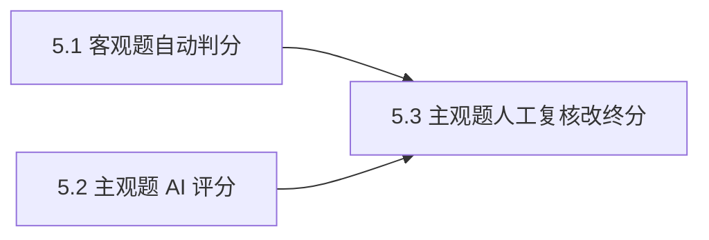

# Epic 5: 自动阅卷与 AI 评分（AI 环节 ③）

## 概述

**背景**: 答卷提交后需产生最终分：客观题按参考答案自动判分，主观题由 AI 评分并经人工复核改终分。这是 AI 环节 ③，产出整卷成绩，是分析的输入。
**价值**: 客观题即时判分；主观题「答案 → AI 评分 → 人工复核改终分」三段闭环，保留 AI 原始给分与依据；AI 失败不阻塞，人工兜底。
**范围**: 客观题同步判分（R5.1）、主观题异步 AI 评分（R5.2）、主观题人工复核 confirm/adjust/manual 定终分（R5.3）、AI 评分失败转人工（R5.4）。
**不含**: 二次评分、评分模型优化、评分一致性复现策略（仅保留原始给分与依据）。

## 用户旅程

### 主旅程: 系统判分 + 管理员复核定终分

| 步骤 | 用户行为 | 系统响应 | 覆盖 Story |
|------|----------|----------|------------|
| 1 | 员工提交答卷（Epic 4 触发） | 同步判客观题→final，预创建全部 question_scores 行，主观题先 pending_manual 占位 | Story 5.1 |
| 2 | — | 后台异步 AI 评主观题：成功→pending_review（含 ai_score+rationale）；空白答案系统给 0 分 | Story 5.2 |
| 3 | 管理员打开复核页查看 AI 给分与依据 | 展示客观分与主观题 AI 分/依据 | Story 5.3 |
| 4 | 管理员 confirm / adjust / manual 定终分 | 写终分（保留 AI 原始），全题 final → 算 total_score 置 graded | Story 5.3 |

### 分支与异常旅程

| 场景 | 用户行为 | 系统响应 | 覆盖 Story / AC |
|------|----------|----------|-----------------|
| 客观题缺参考答案（数据异常） | 提交触发判分 | 该题 needs_manual（不崩溃），复核页可见经 manual 定终分 | Story 5.1 / Error AC |
| 主观题 AI 评分失败/不可解析/越界 | 后台评分 | 该题保持 pending_manual，不阻塞客观判分与其余主观题 | Story 5.2 / Error AC |
| 改分越界 | 复核改分 | 422 SCORE_OUT_OF_RANGE | Story 5.3 / Error AC |

## Success Criteria

- [ ] 客观题（单选/判断）在提交时同步按参考答案判分，落 `question_scores.auto_score`，status=final（R5.1）
- [ ] 主观题异步 AI 评分输出 `ai_score` + `ai_rationale` 并保留原始（R5.2/R5.3）
- [ ] 三段闭环：AI 分 → 管理员 confirm（采纳）/ adjust（改分覆盖，保留 AI 原始）/ manual（人工给分）定终分（R5.3）
- [ ] AI 评分失败 → 该题 `pending_manual`，不阻塞客观判分与其余主观题（R5.4）
- [ ] 全题终分确定 → `total_score = Σ final_score`，`grading_status='graded'`（ACD1）
- [ ] 主观题 AI 评分单题 P95 < 30s（NFR §4.1）

## Risks and Mitigations

| 风险 | 影响 | 概率 | 缓解策略 |
|------|------|------|----------|
| 三段复核断裂（AI 分无法改/无法采纳） | H | M | confirm/adjust/manual 三动作均定终分，保留 ai_score/rationale |
| AI 评分失败阻塞整卷成绩 | H | M | 逐题独立 UPDATE，失败保持 pending_manual，管理员 manual 兜底 |
| 后台失败/进程重启留下"无行"主观题 | M | M | 提交时预创建全部 question_scores 行，bg 做 UPDATE 而非 INSERT |
| 并发触发总分重复计算 | M | L | graded 条件更新（WHERE grading_status!='graded'），只翻转一次 |

## System-Wide Considerations

- **跨模块影响**: 上游消费 Epic 4 `submissions`(`grading_status=pending`)/`answers`、Epic 3 `questions`、Epic 2 `exam_objectives.subjective_scoring_focus`；下游 Epic 6 消费 `submissions.total_score`（graded）与 `question_scores` 判错题。
- **不变量保护**: `adjust`/`manual` 写 `manual_score`/`final_score`，不修改 `ai_score`/`ai_rationale`（R5.3 保留原始）；`max_score` 取 `paper_questions.score` 快照为改分上界（D5）；UNIQUE(submission,question) 防重复落库。
- **状态生命周期**: question_scores: 提交预创建（客观→final / 缺答案→needs_manual，主观→pending_manual）→ bg UPDATE（pending_review 或保持 pending_manual）→ 人工 final；submissions.grading_status: pending→grading→review_pending→graded。
- **API 表面一致性**: 判分由提交端点接力触发，提交契约响应体不变；读分/复核走 `GET .../scores`、`PUT .../question-scores/{id}/review`。
- **错误传播**: AI 失败/不可解析/越界 → 单题 pending_manual（软失败隔离），不抛错阻塞；submission 不存在→404，越界→422，非法 action→422。
- **权限边界**: 读分与复核 `require_admin`。

## Story 列表

| Story | 标题 | 文件 |
|-------|------|------|
| 5.1 (US010) | 客观题自动判分 | [stories/us010-objective-auto-grading.md](stories/us010-objective-auto-grading.md) |
| 5.2 (US011) | 主观题 AI 评分 | [stories/us011-subjective-ai-scoring.md](stories/us011-subjective-ai-scoring.md) |
| 5.3 (US012) | 主观题人工复核改终分 | [stories/us012-subjective-manual-review.md](stories/us012-subjective-manual-review.md) |

## 依赖关系

**Epic 依赖**: 依赖 Epic 4（submissions/answers）、Epic 3（questions）、Epic 2（评分重点）
**技术依赖**: 基座 `LLMPort.generate_structured`、FastAPI BackgroundTasks、UoW 事务

## 参考文档

- PRD: [docs/project/requirements.md](../../../project/requirements.md) §3 Epic 5, §9.2/§9.3
- API Design: [docs/project/api/grading.md](../../../project/api/grading.md)
- Data Model: [docs/project/data/grading.md](../../../project/data/grading.md)
