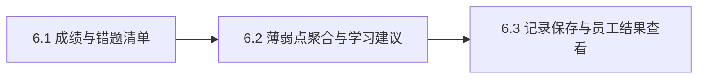

# Epic 6: 成绩分析、学习建议与记录保存（AI 环节 ④）

## 概述

**背景**: 闭环终点——员工考完不只看到分数，而是得到错题、薄弱知识点与针对性学习建议；每次考试记录关联真实员工身份并持久化。这是 AI 环节 ④。
**价值**: 员工获得可行动的反馈；组织沉淀可追踪的能力数据。
**范围**: 总成绩展示（消费 Epic 5 总分）+ 错题清单（R6.1/R6.2）、薄弱点聚合 + AI 学习建议（R6.3/R6.4）、记录持久化 + 员工本人结果查看与可见性边界（R6.5/R6.6）。
**不含**: 团队/管理者能力看板、跨员工能力评估报表、补训内容生成、个性化学习路径（PRD §7/§10 阶段 2+）。

> ⚠️ **设计 delta**: 本 Epic 尚无 `docs/project/api/analysis.md` / `docs/project/data/analysis.md`。AC 引用的端点（`/api/v1/exam/my/results`、`/api/v1/exam/results/{submission_id}`，已在 conventions.md/identity.md 预告）与新表（如 `exam_analyses` 存薄弱点+建议+确认状态）为 **vj-epic-plan 阶段待落地的新 API contract / schema delta**。下游不得据此声称"实现违反既有文档"，只能据此判断需新增契约说明。

## 用户旅程

### 主旅程: 出成绩分析、确认并对员工展示

| 步骤 | 用户行为 | 系统响应 | 覆盖 Story |
|------|----------|----------|------------|
| 1 | （Epic 5 全题终分确定，grading_status=graded） | 消费 total_score 得总成绩，按错题口径生成错题清单 | Story 6.1 |
| 2 | — | 按错题关联知识点聚合薄弱点（去重降序），调 AI 生成学习建议 | Story 6.2 |
| 3 | 管理员复核薄弱点与建议并编辑/确认 | 待确认 → 确认后持久化，方可对员工展示 | Story 6.3 |
| 4 | 员工查看本人考试结果 | 展示成绩/错题/薄弱点/学习建议（仅已确认、仅本人） | Story 6.3 |

### 分支与异常旅程

| 场景 | 用户行为 | 系统响应 | 覆盖 Story / AC |
|------|----------|----------|-----------------|
| 终分未全确定 | 查看结果 | 不展示错题清单（待 R6.1 总成绩确定） | Story 6.1 / Error AC |
| 无错题 | 出分析 | 无薄弱点（空态），不阻塞成绩展示 | Story 6.2 / Edge AC |
| AI 薄弱点/建议失败 | 出分析 | 管理员手工填写薄弱点与建议，不阻塞成绩/错题展示 | Story 6.2 / Error AC |
| 分析未确认 | 员工查看 | 员工结果页不显示分析 | Story 6.3 / Edge AC |
| 越权查看 | 员工访问他人记录 | 拒绝/不展示（数据边界 R6.6） | Story 6.3 / Error AC |

## Success Criteria

- [ ] 全题终分确定后展示总成绩（消费 `submissions.total_score`，不重复计算）（R6.1）
- [ ] 错题清单口径：客观题判错即错题；主观题得分率 < 60%（硬编码默认阈值）计为错题（R6.2）
- [ ] 薄弱点 = 错题所关联知识点的去重集合，按关联错题数降序（R6.3）
- [ ] AI 生成学习建议；失败时管理员可手工填写，不阻塞成绩/错题展示（R6.4）
- [ ] 分析结果待确认，仅确认后对员工展示；员工只见本人记录，不见他人/未确认结果（R6.6）
- [ ] 每次考试记录持久化（成绩/逐题作答/各题得分/AI 评分与依据及人工终分/薄弱点/建议）并关联员工身份，可重看（R6.5）

## Risks and Mitigations

| 风险 | 影响 | 概率 | 缓解策略 |
|------|------|------|----------|
| 错题口径不一致 | M | M | 客观答错 / 主观得分率<60% 固定口径，AC 用 BVA 校验 59/60/61% |
| 薄弱点未按知识点聚合 | M | L | 聚合来源固定为错题 questions.knowledge_point_names 去重降序 |
| 未确认分析即对员工展示 | H | L | 确认 gate：仅 confirmed 分析对员工可见 |
| 跨员工数据泄漏 | H | L | 员工结果端点强制按本人身份过滤，越权→403/不展示 |

## System-Wide Considerations

- **跨模块影响**: 消费 Epic 5 `submissions.total_score`(graded) 与 `question_scores`（判错题、得分率）、Epic 3 `questions.knowledge_point_names`（薄弱点聚合）；新增分析持久化表。
- **不变量保护**: 总成绩不重复计算（消费 grading 的 total_score）；员工仅可见本人 + 已确认结果（R6.6 数据边界）。
- **状态生命周期**: 分析结果 待确认 → 确认（持久化、对员工可见）；记录持久化后可重看。
- **API 表面一致性**: 新增 `/exam/my/results`（employee）、`/exam/results/{submission_id}`（admin/本人）；需补 analysis 模块 contract（delta）。
- **错误传播**: 终分未全确定 → 不出错题清单；AI 失败 → 人工兜底，不阻塞成绩/错题展示。
- **权限边界**: 管理员可见并确认本场分析；员工仅本人已确认结果，越权拒绝。

## Story 列表

| Story | 标题 | 文件 |
|-------|------|------|
| 6.1 (US013) | 成绩与错题清单 | [stories/us013-score-and-wrong-questions.md](stories/us013-score-and-wrong-questions.md) |
| 6.2 (US014) | 薄弱点聚合与学习建议 | [stories/us014-weakpoint-and-advice.md](stories/us014-weakpoint-and-advice.md) |
| 6.3 (US015) | 记录保存与员工结果查看 | [stories/us015-records-and-employee-view.md](stories/us015-records-and-employee-view.md) |

## 依赖关系

**Epic 依赖**: 依赖 Epic 5（total_score/question_scores）、Epic 3（knowledge_point_names）、Epic 1（身份/可见性）
**技术依赖**: 基座 `LLMPort`（学习建议）；新增 analysis 持久化（delta）

## 参考文档

- PRD: [docs/project/requirements.md](../../../project/requirements.md) §3 Epic 6, §9.2/§9.3, §6 待验证假设
- 上游 Data/总分: [docs/project/data/grading.md](../../../project/data/grading.md)（total_score/graded/ACD1）
- 上游 KP 快照: [docs/project/data/question.md](../../../project/data/question.md)（knowledge_point_names）
- ⚠️ 待设计: analysis 模块 API contract + schema（vj-epic-plan）
