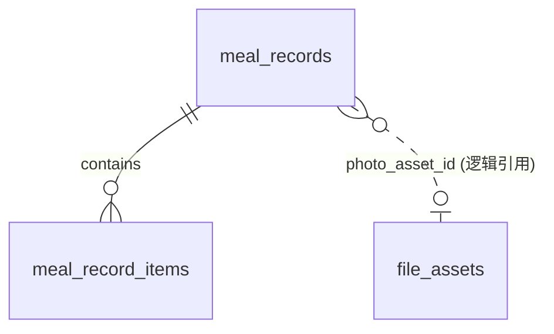

# Meal Log Data Model

随手食记 meal 模块持久化契约（introduced by Epic 1，契约状态：planned——migration 落地后回写实际 revision 号）。
归属与索引模式照抄 [conversation.md](conversation.md)（owner_id nullable、逻辑外键不建 FK、复合索引 owner 打头、CHECK 命名走 naming_convention）。

## ERD

## meal_records（聚合根）

| 列 | 类型 | 约束 |
|----|------|------|
| id | int PK | |
| owner_id | int NULL | 逻辑外键；NULL=孤儿对所有人不可见 |
| photo_asset_id | int NULL | 逻辑引用 file_assets.id；文本补录为 NULL |
| source | varchar | CHECK IN ('photo','text') |
| meal_type | varchar | CHECK IN ('breakfast','lunch','dinner','snack') |
| total_calories / total_protein / total_fat / total_carbs | numeric | 保存时刻快照 |
| recorded_at | timestamptz | 保存时刻 |
| created_at / updated_at | timestamptz | |

索引：`ix_meal_records_owner_recorded (owner_id, recorded_at)` —— Epic 2"今日"聚合与 Epic 4 日期查询的支撑索引。

## meal_record_items（行项目，经聚合根读写）

| 列 | 类型 | 约束 |
|----|------|------|
| id | int PK | |
| record_id | int FK → meal_records.id CASCADE | 聚合内部真外键 |
| name | varchar(100) | 非空 |
| portion | numeric | >0 |
| calories / protein / fat / carbs | numeric | ≥0 |

## 一致性与迁移

- items 无 owner 列，归属经聚合根裁决；识别结果不落中间表（识别零副作用不变量）。
- 单 revision 建两表 + CHECK + 复合索引（on top of `0001`）；downgrade 直接 drop 两表，无数据回填。
