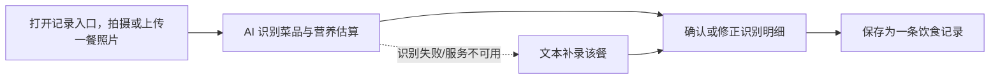
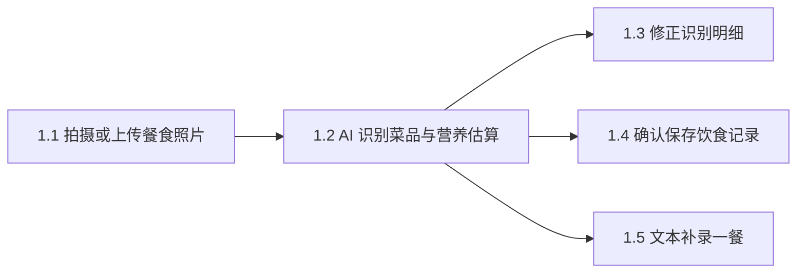

# Epic 1: 拍照记录一餐

> 无人值守生成（vj-epic-story 规则 §22）：Batch Question 的 ⚠️/❓ 项已转为各 Story 的
> "假设待审批" Assumptions（含 Confidence），写盘产物待人后补确认。

## 概述

**背景**: 手动查库记账的成本太高导致无法长期坚持记录饮食；核心痛点是"吃了什么心里没数"（PRD §1.3）。
**价值**: 记录者用拍照代替手动录入，30 秒内完成"拍照 → 识别 → 修正 → 保存"，一餐的热量与三大宏量营养素变成可见数字。
**范围**: 拍摄/上传餐食照片、AI 识别菜品与营养估算、识别明细修正与即时重算、确认保存为饮食记录、识别失败时的自由文本补录兜底（PRD §4 Epic 1 R1–R6）。
**不含**: 今日摄入聚合与总览（Epic 2）、目标设置（Epic 3）、历史与趋势（Epic 4）、餐次自动推断（PRD §11.2 可延后）、食物库搜索/扫码录入、离线能力（PRD §9 非目标）。

## 用户旅程

### 主旅程: 记录者完成一餐记录

| 步骤 | 页面/入口 | 客户方用户行为 | 系统响应 | 覆盖 Story / AC |
|------|-----------|----------------|----------|-----------------|
| 1 | 记录页 `/record` | 拍摄或从相册选择一张餐食照片 | 上传照片并展示上传/识别进度 | Story 1.1 |
| 2 | 记录页（识别中 → 结果态） | 等待识别 | 10 秒内返回菜品列表（名称/份量/热量/蛋白/脂肪/碳水） | Story 1.2 |
| 3 | 记录页（结果确认区） | 修改菜品名称、调整份量或删除误识别项 | 即时按修改重算该餐营养数值 | Story 1.3 |
| 4 | 记录页（结果确认区） | 选择餐次并确认保存 | 生成一条饮食记录（照片+明细+时间+餐次），反馈保存成功 | Story 1.4 |

### 分支与异常旅程

| 场景 | 页面/入口 | 客户方用户行为 | 系统响应 | 覆盖 Story / AC |
|------|-----------|----------------|----------|-----------------|
| 未登录访问记录页 | `/record` | 直接打开链接 | 跳转登录（复用既有登录守卫） | Story 1.1 Error AC |
| 照片无法识别出食物（低置信度/非食物） | 记录页（失败态） | 查看失败原因 | 说明原因并提供文本补录入口 | Story 1.2 Error AC + Story 1.5 |
| AI 服务不可用或超时 | 记录页（失败态） | 等待超时 | 提示服务暂不可用，保留已拍照片，可稍后重试或文本补录 | Story 1.2 Error AC + Story 1.5 |
| 浏览器不支持调用相机 | `/record` | 点击记录入口 | 仅提供相册上传方式 | Story 1.1 前端 AC |
| 双击/重复提交确认保存 | 记录页（结果确认区） | 连续点击保存 | 只产生一条饮食记录 | Story 1.4 Edge AC |
| 删除全部识别明细后尝试保存 | 记录页（结果确认区） | 删光明细后点保存 | 禁止保存并提示至少保留一项或改用文本补录 | Story 1.3 Edge AC |

## 页面体验地图

| 页面/区域 | 屏型 | 页面职责 | 主操作 | 次操作 | 关键状态 | 信息优先级 | 品牌/富度要求 | 体验护栏 / 禁止项 |
|-----------|------|----------|--------|--------|----------|------------|---------------|----------------|
| 记录页·拍摄/上传区 `/record` | operational ⚠️推断 | 让记录者用最低成本发起一餐记录 | 拍摄照片（或选相册） | 查看拍摄提示 | 默认/上传中/上传失败/无相机(仅相册) | 拍照入口 > 上传进度 > 提示文案 | 移动单手可达、大点击区；参考 `docs/reference/research/designs/prd-suishou-shiji/ui-mock-board.html` | 不做裸居中表单；拍照入口不得折叠进二级菜单 |
| 记录页·识别结果确认区 `/record`（识别完成态） | operational ⚠️推断 | 让记录者 30 秒内核对并修正 AI 识别结果 | 确认保存 | 修改名称/调份量/删除项/重拍/文本补录 | 识别中/结果就绪/重算中/识别失败/服务不可用/保存中/保存成功/保存失败 | 该餐总热量 > 菜品明细列表 > 餐次选择 > 保存按钮 | 数据即界面：明细用紧凑列表不做大卡堆；营养数值可视 | 不把每道菜做成独立大卡片；失败态必须保留照片与重试/补录入口，不允许只弹 toast |

## System-Wide Considerations

- **跨模块影响**: 复用既有文件存储能力（照片上传/存储）与外部 LLM 客户端脚手架（AI 识别调用）；Epic 2（今日总览）将消费本 Epic 产生的饮食记录聚合 → 已下放 Story 1.4 Integration AC（记录含可聚合的时间与营养字段）。
- **不变量保护**: 既有 owner-scoped 归属约定（非本人资源 → 404）与统一响应信封、`/api/v1` 前缀不得破坏 → 已下放 Story 1.1 / 1.4 Integration AC。
- **状态生命周期**: 识别失败/超时后照片必须保留可重试（不落孤儿状态）→ Story 1.2 Error AC；确认保存需幂等防重复提交 → Story 1.4 Edge AC；未保存照片的清理策略 V1 不做（仅文档记录，见 PRD §10.3 照片保留策略开放问题）。
- **API 表面一致性**: 新增端点遵循 `docs/project/api/conventions.md` 全局约定（鉴权/信封/错误码）→ 仅文档记录，由 plan 阶段 catalog sync 承载。
- **错误传播**: AI 服务失败必须以明确业务错误码传递到前端并驱动降级 UI（重试/文本补录），不允许裸 500 → Story 1.2 Error AC + Story 1.5 Happy AC。
- **权限边界**: 单用户产品但仍走登录保护；全部照片与记录 owner-scoped，越权访问 → 404 → Story 1.1 / 1.4 Integration AC。

## Story 列表

| Story | 标题 | 文件 |
|-------|------|------|
| 1.1 | 拍摄或上传餐食照片 | [us001-meal-photo-upload.md](stories/us001-meal-photo-upload.md) |
| 1.2 | AI 识别菜品与营养估算 | [us002-ai-recognition.md](stories/us002-ai-recognition.md) |
| 1.3 | 修正识别明细 | [us003-edit-recognition.md](stories/us003-edit-recognition.md) |
| 1.4 | 确认保存饮食记录 | [us004-save-meal-record.md](stories/us004-save-meal-record.md) |
| 1.5 | 文本补录一餐 | [us005-text-fallback-entry.md](stories/us005-text-fallback-entry.md) |

## 依赖关系

**Epic 依赖**: 无
**技术依赖**: 既有登录鉴权（JWT）、文件存储端口、外部 LLM 客户端脚手架（`backend/infrastructure/external/llm/`）

## 参考文档

- PRD: [docs/project/requirements.md](../../../project/requirements.md) §4 Epic 1、§5、§10、§11
- Architecture: [docs/project/architecture.md](../../../project/architecture.md) §Extension Rules
- API Design: [docs/project/api/conventions.md](../../../project/api/conventions.md)（meal 模块契约由 vj-epic-plan catalog sync 产出）
- 设计系统: [docs/project/DESIGN.md](../../../project/DESIGN.md)
- UI 参考: docs/reference/research/designs/prd-suishou-shiji/ui-mock-board.html
