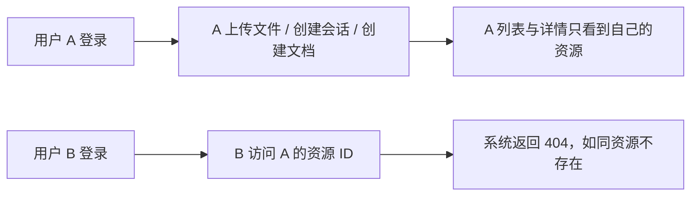

# Epic 1: 资源归属校验（Ownership Enforcement）

## 概述

**背景**: 账号系统（JWT 登录）已上线，但 files / storage / conversations / chat / documents 五组路由只有"登录闸门"——任何登录用户可以读取、下载、删除、修改**所有人**的资源，并可向任意会话发消息消耗付费 LLM。AGENTS.md 与 `docs/project/api/conventions.md` 均已把这标注为已知缺口（"default-deny：在 application service 强制 owner 边界"）。

**价值**: 登录用户只能看到和操作自己的资源；越权访问表现为资源不存在（404），不泄露他人资源的存在性。作为基础库，同时沉淀"ownership 校验在哪一层做、怎么做"的 canonical 模式供下游项目复用。

**范围**: conversations 表补 owner_id（migration）；conversations / chat / files / storage / documents 全部资源端点的 owner 过滤与归属断言；`CONVERSATION_NOT_FOUND` / `DOCUMENT_NOT_FOUND` 的 HTTP 状态修正为 404。

**不含**: agent-configs 端点（无 owner 列，共享配置资源的归属语义未定义，留给 RBAC/租户 epic）；角色/租户模型；superuser 越权通道；前端改动（前端目前只有 auth + home，未消费这些端点）。

## 用户旅程

### 主旅程: 登录用户管理自己的资源

| 步骤 | 页面/入口 | 客户方用户行为 | 系统响应 | 覆盖 Story / AC |
|------|-----------|----------------|----------|-----------------|
| 1 | API `/storage/upload`、`/conversations`、`/documents` | 用户创建资源 | 资源落库并记录 owner_id = 当前用户 | Story 1.2 / 1.3 / 1.4 |
| 2 | API 列表端点 | 用户查看资源列表 | 仅返回 owner_id = 当前用户的资源 | Story 1.2 / 1.3 / 1.4 |
| 3 | API 详情 / 下载 / 删除 / chat | 用户操作自己的资源 | 正常执行 | Story 1.2 / 1.3 / 1.4 |

### 分支与异常旅程

| 场景 | 页面/入口 | 客户方用户行为 | 系统响应 | 覆盖 Story / AC |
|------|-----------|----------------|----------|-----------------|
| 越权访问 | 任意资源详情/操作端点 | 用户 B 拿 A 的资源 ID 访问 | 404（与不存在的 ID 表现一致，不泄露存在性） | 各 Story Error AC |
| 越权 chat | `POST /conversations/{id}/chat` | B 向 A 的会话发消息 | 404，且不触发 LLM 调用、不产生消息/Run 记录 | Story 1.2 |
| 未登录 | 任意端点 | 无 token 访问 | 401（既有行为，不变） | 既有 auth 测试 |
| 遗留无主数据 | 列表/详情 | 用户访问 migration 前创建的 owner_id 为 NULL 的行 | 不可见 / 404（视为无主孤儿数据） | Story 1.1 假设 A2 |

## 页面体验地图

N/A - 无用户界面（纯后端能力 Epic）。

## Story 列表

| Story | 名称 | 依赖 |
|-------|------|------|
| 1.1 | conversations 获得归属（schema + domain + repo + 404 映射修正） | 无 |
| 1.2 | conversations + chat 端点归属闭环 | 1.1 |
| 1.3 | files + storage 端点归属闭环 | 无 |
| 1.4 | documents 端点归属闭环 + catalog 同步 | 无 |

**依赖**: Story 1.2 依赖 Story 1.1；Story 1.3、1.4 无前置依赖，可并行。

## System-Wide Considerations

- **安全**: 越权响应统一 404（防资源枚举）；列表强制 owner 过滤，无"查看全部"逃生舱。
- **兼容性**: `CONVERSATION_NOT_FOUND` / `DOCUMENT_NOT_FOUND` 从 400 改 404 是对外行为变更（修正为正确语义），前端无消费方，已在 decisions.md 记录。
- **数据**: conversations.owner_id 可空、不回填；NULL 行视为孤儿不可见。基础库无生产数据，风险为零。
- **一致性**: 归属断言统一放在 application service（route-facing 方法带 owner_id 参数），路由只传 `current_user.id`，与 `docs/project/api/conventions.md` 的 default-deny 约定一致。
- **性能**: file_assets / documents 已有 `(owner_id, created_at)` 索引；conversations 补同款索引。
