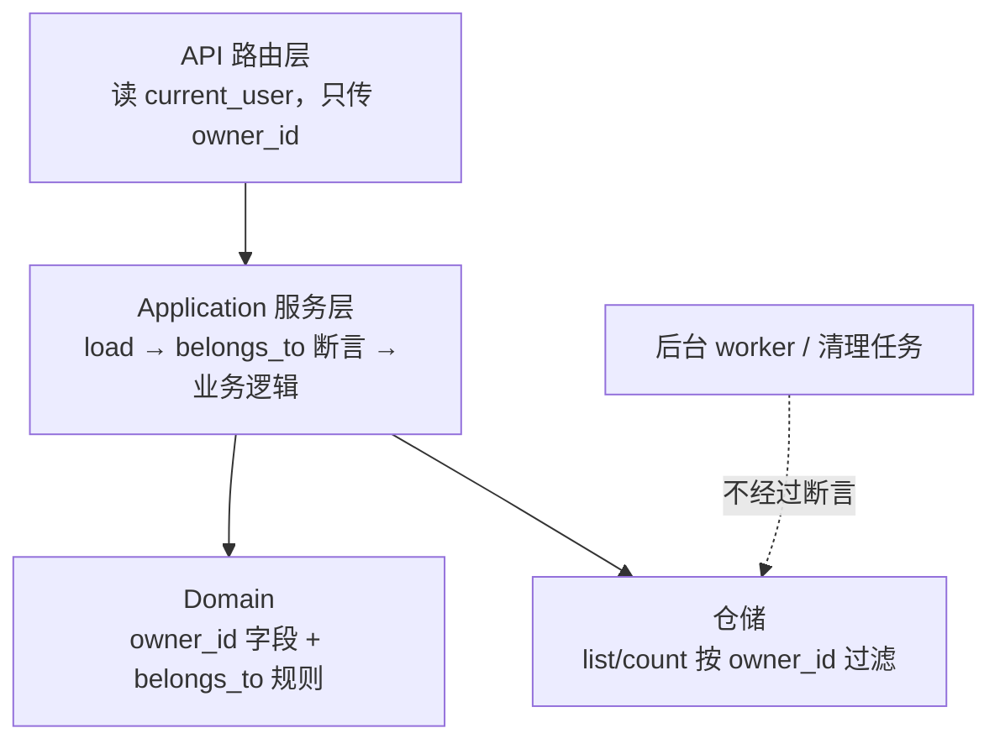
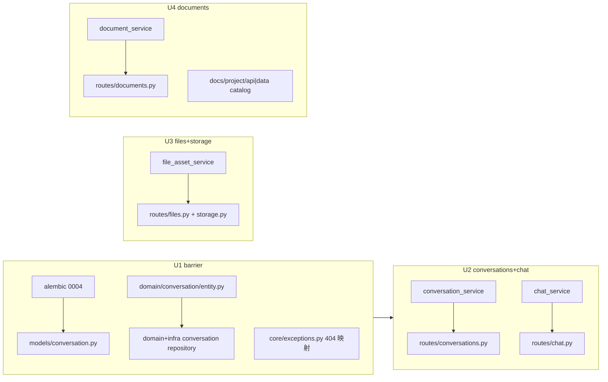
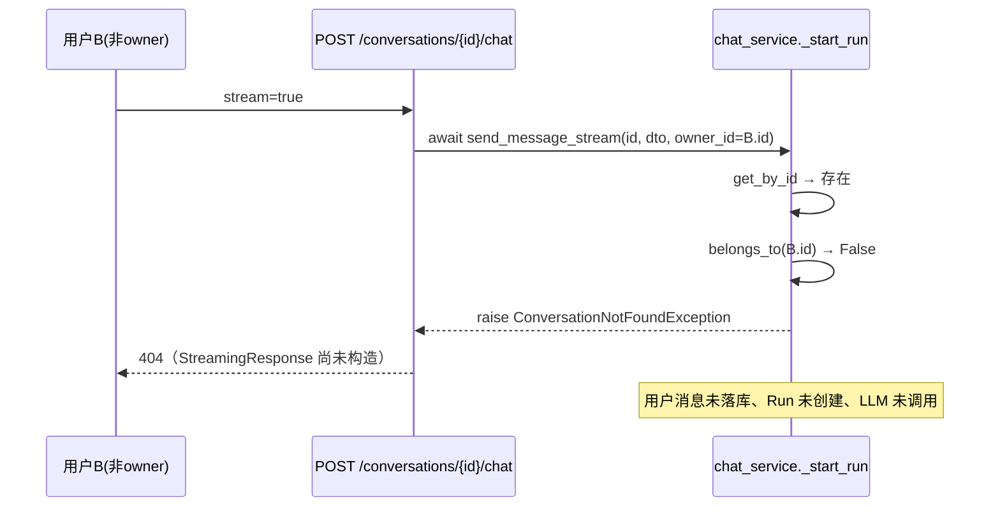

# Epic 1 技术设计：资源归属校验

## 1. Problem Model

用户 A 上传了合同 PDF、和 AI 聊了薪资谈判、存了一份内部文档。用户 B 登录后调 `GET /api/v1/files?signed=true`，拿到 A 的合同带签名下载链接；调 `POST /conversations/7/chat` 用 A 的会话上下文继续追问，还消耗平台的 LLM 费用。这不是假设——五个路由文件里写着 `owner_id = None  # No user filtering` 和四处 `# No permission check`。

本 Epic 解决的就是这一件事：**每个资源端点回答"这是谁的资源、当前用户是不是这个人"**。明确不做：角色/租户模型、superuser 通道、agent-configs（见 decisions.md D3/D5）。

## 2. Glossary by Scenario

- **owner_id**：资源行上的归属用户列。B 误请求 A 的文件详情时，服务层比较 `asset.owner_id == current_user.id` 决定放行还是 404。归属在**实体**（domain），断言在**服务**（application），传递在**路由**（api）——放错层的后果：放路由则直调服务的代码（未来的 gRPC、任务）绕过检查；放 domain 则领域被迫知道"当前用户"这个应用态概念。
- **belongs_to(user_id)**：领域方法，FileAsset / Document 已有，Conversation 本 Epic 补齐。NULL owner 恒 False，天然覆盖孤儿数据。Reviewer 重点：所有断言必须走它，不要在服务里手写 `==`（NULL 语义会写错）。
- **route-facing 方法**：路由 handler 直接调用的服务方法（区别于后台 worker / 清理任务用的内部方法）。只有这一类加必填 `owner_id` 参数。Reviewer 重点：对照 §7 API 表逐个确认没有漏网端点。
- **404 伪装**（D1）：越权与不存在同响应。Reviewer 重点：`CONVERSATION_NOT_FOUND`/`DOCUMENT_NOT_FOUND` 若不进 404 映射（ACD-1），伪装即失效。

## 3. Current Baseline

- 五个路由 router 级 `dependencies=[Depends(get_current_user)]`：登录闸门有效，但 handler 大多不读 user。
- **files/documents**：实体有 owner_id+belongs_to，仓储 list/count 有 owner_id kwarg，创建路径已写 owner（presign_upload / relay_upload_stream / create_document）。缺口＝list 端点硬编码 `owner_id=None` + 详情/变更端点无断言 + `/storage/complete` 任何人可确认他人 pending 资产。
- **conversations**：全栈无 owner（列、实体、仓储、服务、路由），chat 端点因此裸奔。
- `get_current_user → UserDTO(id, is_superuser, ...)`；`NOT_FOUND(20004)→404` 已映射；`CONVERSATION_NOT_FOUND(60001)`/`DOCUMENT_NOT_FOUND(60020)` 未映射→默认 400。
- Migration head = `0003`。

## 4. Target Architecture

责任流向：路由**取身份**，服务**做裁决**，领域**定规则**，仓储**做过滤**。后台任务是显式的旁路（它们没有"当前用户"）。

**conversation 模块**（本 Epic 唯一动 schema 的模块）：为什么补列而不是建关联表——单 owner 语义下一列足矣，关联表是多主/共享场景的形状，现在建就是投机。Message / Run 不加 owner：它们经由 conversation 访问，归属由聚合根裁决，子实体加列是冗余数据等着不一致。Reviewer 重点：`list_messages` / `list_runs` / chat 的断言都必须发生在 conversation 加载处。

**file_asset / document 模块**：不动 schema，只在服务方法加断言 + 路由传参。Reviewer 重点：files.py 五个端点全部要动；storage.py 只动 `/complete`（另两个已写 owner）。

## 5. Dependency Graph

允许依赖：U2 依赖 U1 的实体/仓储/映射产物。禁止依赖：U3、U4 不得 import conversation 模块任何新产物（写集完全隔离，可与 U1/U2 并行）。

## 6. Core Flows

**归属裁决决策表**（所有 route-facing 读/写方法统一）：

| 资源存在 | owner_id | belongs_to(当前用户) | 结果 |
|---------|----------|---------------------|------|
| 否 | - | - | 模块 NotFoundException → 404 |
| 是 | NULL（孤儿） | False | 同上 404（D4） |
| 是 | 他人 | False | 同上 404（D1，不泄露存在性） |
| 是 | 当前用户 | True | 放行 |

**chat 流式时序**（高风险：付费 LLM + SSE 时序）：

断言位置在 `_start_run` 内、existence 校验之后、`message_repository.create` **之前**——顺序错了会留下越权用户的消息残留。既有机制（Phase 1 同步 await，4xx 先于流）已保证 404 不会变成 200 断流，不需要新代码。

**列表过滤**：`owner_id` 由服务层强制注入仓储查询（SQL WHERE），不是取全量后内存过滤。无"查看全部"参数。

## 7. Data Design

Delta 只有一处：`conversations` + `owner_id INTEGER NULL` + 索引 `ix_conversations_owner_created(owner_id, created_at)`（复制 file_assets 的既有形状，含降级 drop）。可空/不回填的论证见 D4。为什么不加 FK 约束到 users：file_assets/documents 的 owner_id 也没加 FK（既有约定，软引用），保持一致；跨模块 FK 会把 bounded context 在数据库层焊死。

## 8. API Design

行为 delta（无新端点、无请求 schema 变化）：

| 端点 | 变更 |
|------|------|
| GET /files、GET /documents、GET /conversations | 强制按当前用户过滤（原：返回全部） |
| GET/PATCH/DELETE /conversations/{id}、/messages、/runs | 非 owner → 404 |
| POST /conversations | owner_id 写入当前用户 |
| POST /conversations/{id}/chat（stream+sync） | 非 owner → 404，不产生任何副作用 |
| GET /files/{id}、preview-url、download-url、DELETE | 非 owner → 404 |
| POST /storage/complete | 非 owner 确认他人 pending 资产 → 404 |
| GET /documents/{id}、/content、reparse、DELETE | 非 owner → 404 |
| （横切）CONVERSATION_NOT_FOUND / DOCUMENT_NOT_FOUND | HTTP 400 → 404（ACD-1） |

错误语义：全部复用各模块既有 NotFound 异常与 message_key，不新增业务码。

## 9. Invariants / Risks

- **不变量 I1**：任何 route-facing 服务方法，`owner_id` 是必填关键字参数（fail-closed，漏传即 TypeError）。
- **不变量 I2**：越权与不存在的响应字节级同构（同 code、同 message_key）。
- **不变量 I3**：越权 chat 零副作用（无 message、无 run、无 LLM 调用）。
- **风险 R1**：服务签名变更是破坏性的——所有调用方必须同步更新；grep 确认调用方只有路由层与测试（gRPC 入口不消费这些服务）。
- **风险 R2**：`test_idempotency_presign.py` 的 FakeFileAssetService 需要跟随新签名，否则全量测试挂。
- **风险 R3**：sqlite 测试库用 `metadata.create_all` 不走 alembic，模型与 migration 需人工对齐（Integration AC 里真跑 upgrade/downgrade 兜底）。

## 10. Reviewer Checklist

- [ ] D1-D5、ACD-1 的假设是否接受（尤其 404-not-403 与 superuser 无通道）
- [ ] §8 端点表与路由代码逐行对照，无漏网端点（特别是 storage/complete）
- [ ] chat 断言早于任何写库副作用（I3）
- [ ] 服务签名 owner_id 必填（I1），无 Optional 逃生舱
- [ ] migration 0004 up/down 干净，索引与 file_assets 形状一致
- [ ] agent-configs 未纳入的风险披露已写进 conventions.md
