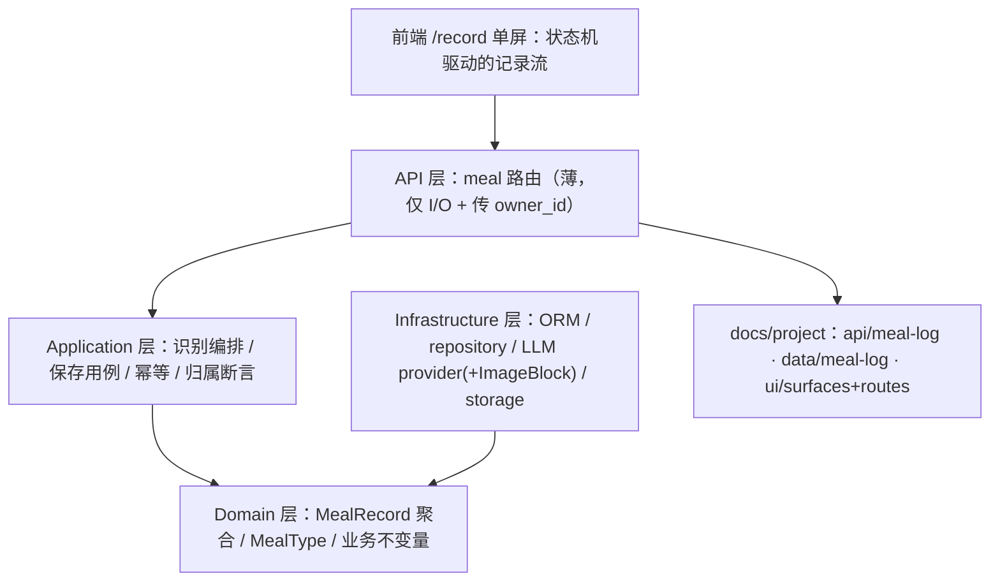
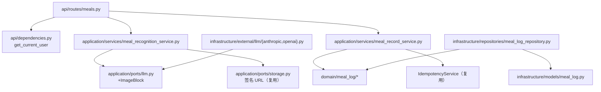
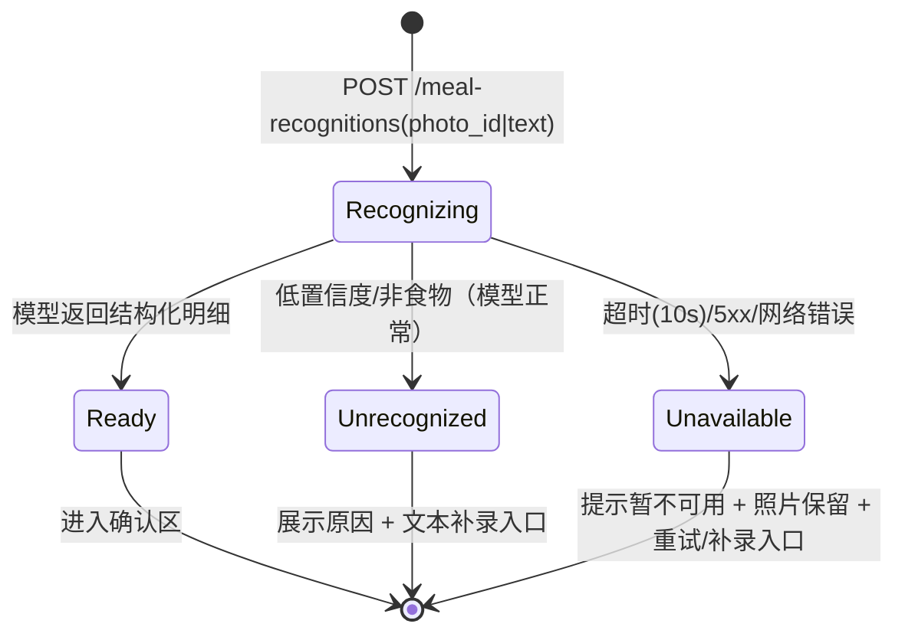

# Epic 1 拍照记录一餐 Technical Design

<!-- 备份说明：这是三区制重写前的最终版本（含 vj-plan-review 全部采纳修订），按会话记录逐字重建，
     仅供新旧写法对照，不是当前 baseline——当前版本是同目录 design.md。 -->

这份文档给 human reviewer 看。读者懂后端 / DDD / FastAPI，但不熟悉本项目。本 Epic 命中 strict（新 schema + migration、扩公共 LLM 端口、新公共 API、外部 AI 服务、整屏新 UI），design.md 全部条件段解锁。

## 1. Problem Model

用户（也就是仓库主人自己）想知道"今天吃了什么、吃了多少"，但手动查食物库记账的成本高到坚持不了两周。本 Epic 把一餐记录压缩为：餐桌上掏出手机 → 拍照 → AI 在 10 秒内给出菜品和营养估算 → 顺手修正明显误差 → 保存。误差 ±20–30% 是可接受的——用户要的是量级感知，不是营养师精度（PRD §6.1）。

明确不做：今日聚合展示（Epic 2）、目标值（Epic 3）、历史趋势（Epic 4）、餐次自动推断、多张照片、离线。识别失败不是可以糊弄的边缘情况——它是移动弱网 + 通用模型的常态路径，文本补录兜底（Story 1.5）和"保留照片可重试"（Story 1.2）是本 Epic 的一等公民。

## 2. Current Baseline

仓库是 FastAPI 基础库，meal 业务域完全不存在（backend `domain/` 现有 common/conversation/document/file_asset/user；frontend `features/` 只有 auth/home）。可直接站上去的地基：

- **照片存储零缺口**：`StoragePort` + `file_assets` 表 + `/api/v1/storage|files` 端点已 owner-scoped，`kind` 列可标记 `meal-photo`（[D2]）。
- **LLM 端口有缺口**：`backend/application/ports/llm.py` 的 `ContentBlock` 只有 Text/ToolUse/ToolResult，**没有图像 block**——照片喂不进模型，需扩端口（[D7]，本 Epic 最大的公共契约变更）。已有 `json_schema` 结构化输出能力，正好用于返回结构化菜品明细。
- **归属与信封约定已强制**：owner default-deny、越权=404、统一响应信封、router 级 JWT 闸门（`docs/project/api/conventions.md`）。
- **幂等**：基座 `IdempotencyService`（Redis/Noop），`presign-upload` 有现成用法（[D9]）。
- 前端：登录守卫（`routes/index.tsx` beforeLoad）、`useSuspenseQuery`+`SuspenseLoader` 数据流（`features/home`）、RHF+Zod 先例（`features/auth`）、`AppShell` 布局。无任何 meal 路由。

## 3a. Glossary by Scenario

### 识别（Recognition）

场景：用户提交照片（或失败后提交文本），系统调用多模态模型返回菜品明细候选。用户在结果确认区看到的一切都来自它。

它解决的问题：识别是**候选生成**，不是记账事实——用户确认前它什么都不是。这个区分决定了系统里最重要的一条不变量：识别调用不产生任何饮食记录。

代码归属：`application/services/meal_recognition_service.py`（编排）+ `LLMPort`（能力）。

如果放错层会怎样：把识别结果直接落库（识别即记录），会出现用户没确认过的"幽灵餐"，Epic 2 的今日总览数字将不可信。

Reviewer 重点看：识别路径有没有任何 `meal_records` 写入；失败路径是否零副作用（Story 1.2 Integration AC）。

### 饮食记录（MealRecord）与明细项（MealItem）

场景：用户点"保存"那一刻，确认后的明细 + 照片引用 + 时间 + 餐次固化为一条 MealRecord（聚合根），MealItem 是它内部的行项目。

它解决的问题：MealRecord 是 Epic 2/4 消费的唯一事实源；明细以保存时刻的快照为准（后续改识别 prompt 不影响历史记录）。

代码归属：`domain/meal_log/entity.py`（聚合根 + `belongs_to` 归属断言）。

如果放错层会怎样：MealItem 若独立成聚合根（自带 owner/生命周期），修正与删除要跨聚合协调事务，为一个纯组合关系引入分布式复杂度。

Reviewer 重点看：items 是否只经聚合根读写；owner 断言是否在 application service 加载后用 `belongs_to(owner_id)` 完成（照抄 conversations 模式）。

### 餐次（MealType）

场景：保存时用户选早/午/晚/加餐；未选则按本地时间段预填默认值（[D5]）。

代码归属：domain 值对象（封闭枚举），DB 列带 CHECK 约束。

如果放错层会怎样：默认值逻辑写进 domain 会把"本地时间段"这种展示态判断带进纯业务层；它属于前端预填（用户可改），domain 只校验取值合法。

Reviewer 重点看：CHECK 约束命名走 `base.py` naming_convention；前端默认值不回写 domain。

## 3b. Target Architecture

### backend/domain/meal_log：记账事实与不变量

用户保存一餐时，"这餐属于谁、明细是否合法、餐次取值是否有效"这些事实判断都发生在这里。责任放在 domain 而不是 service，是因为归属断言（`belongs_to`）和明细非空校验是业务不变量，不依赖任何框架；放 service 会在未来第二个入口（比如 Epic 4 的编辑）出现时被绕过。它从 repository 拿实体、把校验结果交回 application service；HTTP 状态码、幂等、AI 调用这些判断必须留在外面。

Reviewer 重点看：零框架 import（import-linter 兜底）；`belongs_to` 与 conversations 的同名模式一致。

### backend/application/services：两个用例的编排边界

`meal_recognition_service` 编排"拿照片签名 URL/收文本 → 组装多模态请求 → 调 LLMPort（json_schema 输出）→ 超时/失败翻译成业务错误"；`meal_record_service` 编排"幂等检查 → 加载校验 → 落库（UoW）"。两个 service 各定义 service-local UoW `Protocol`（家规：不扩全局 UoW）。识别 service 不碰 `meal_records` 表——见 Glossary「识别」。

Reviewer 重点看：识别失败的错误翻译是否给出稳定业务码（前端降级 UI 靠它分支）；owner_id 是否为必填关键字参数（fail-closed）。

### backend/infrastructure：LLMPort 扩展是本 Epic 的公共面

`ImageBlock`（base64）进入 `ports/llm.py` 的 content 模型，anthropic/openai 两个 provider 同步支持（[D7]）。这是基础库级变更：其他消费者（chat）不受影响（新增 block 类型，非破坏），但 reviewer 应把它当公共 API 审。meal 的 ORM/repository 照抄 conversation 模式（owner_id nullable、逻辑外键不建 FK、复合索引 owner 打头）。

Reviewer 重点看：两个 provider 对 ImageBlock 的编码差异（anthropic `source.data` vs openai `image_url`）；现有 chat 路径回归（`verify.sh` 外的既有 pytest 全量）。

### frontend/src/features/meal-record：一屏状态机

`/record` 是单屏多状态（默认/上传中/识别中/结果/失败/保存中/成功），不是多页流程。组件按区域拆（上传区/状态区/明细确认区），状态机集中在 feature hook 里，营养重算是纯前端比例计算（[D4]）。走 operational 轨设计合同（DESIGN.md：Soft Structuralism、accent≤1、字号≤4 档、三态必备、状态=颜色+图标+文案三件套）。

Reviewer 重点看：失败态是否保留照片与重试/补录双入口（PRD R4 是硬约束）；不得为某个 Story 单做孤立卡片。

## 3c. Dependency Graph

禁止出现的依赖：

- `domain/meal_log` → 任何框架/SDK/application/infrastructure（import-linter 强制）
- `meal_recognition_service` → `meal_records` 表或其 repository（识别零副作用不变量）
- `api/routes/meals.py` → repository / ORM / Session（route 只做 I/O 绑定）

容易误解的边：识别 service 依赖 StoragePort 只为把 photo_id 换成模型可读的图像数据（签名 URL/字节），不做任何文件生命周期管理——那是 file_asset 模块的事。

## 4. Core Flows

### 识别流程（含降级）——本 Epic 最高风险面

这个流程解决什么：把"AI 可能失败"变成用户可恢复的三条明确出路，而不是转圈或裸 500。

| 条件 | HTTP | 业务态（data.status / code） | 前端出路 |
|------|------|------------------------------|----------|
| 明细返回且非空 | 200 | `ready` + items | 确认区 |
| 模型正常但识别不出食物 | 200 | `unrecognized` + reason | 文本补录（一等出路）/ 重拍 |
| 模型超时（>10s）/ 5xx | 503（业务码 `AI_UNAVAILABLE`，新增） | error 信封 | 重试 / 文本补录；照片不动 |
| photo_id 非本人/不存在 | 404 | `NOT_FOUND` | 回上传区 |

不变量：**识别路径零写入**（`meal_records` 无行、无孤儿明细）；照片资产状态不因识别失败改变。

### 保存幂等流

前端每次进入确认区生成一个 `Idempotency-Key`（UUID，重试沿用、重新确认才换新），后端用 `IdempotencyService` 按 (owner, key) 缓存首次结果并原样返回（[D9]，照抄 presign-upload 模式）。失败表：

| 失败点 | 行为 |
|--------|------|
| 幂等命中（双击/网络重试） | 返回首次 201 结果，不新建行 |
| items 为空 | 422，`PARAM_VALIDATION_ERROR` |
| photo_id 非本人 | 404（与不存在同响应） |
| DB 写失败 | UoW 回滚，幂等 key 不落缓存（下次可重试） |

## 5. API Design

新模块 `meal-log`，全部挂 `/api/v1`、router 级 JWT、统一信封（业务数据在 `data` 内）。已同步 `docs/project/api/meal-log.md`（synced, pending review——D 决策改判时 catalog 须随终稿重生，见 decisions.md）。<!-- vj-plan-review: applied [coherence/2] -->

| 方法 | 路径 | 用途 | 关键约束 |
|------|------|------|----------|
| POST | `/api/v1/meal-photos` | 上传餐食照片（薄端点，委托 file_asset，[D2]） | multipart；仅 image/*；≤10MB；非空 → 422；返回 `data.photo_id` |
| POST | `/api/v1/meal-recognitions` | 发起识别（photo_id 与 text 二选一，[D6]） | 同步等待 ≤10s（[D3]）；text ≤200 字；返回 `data.{status,reason?,items[]}`，item={name,portion,calories,protein,fat,carbs} |
| POST | `/api/v1/meal-records` | 保存饮食记录 | `Idempotency-Key` 头（[D9]）；body={photo_id?,source(photo|text),meal_type,items[]}；items 非空；201 返回 `data.record_id` |

为什么不是别的方案：识别不做成 `GET`（有成本的副作用调用）；不做异步 job + 轮询（documents 模式，被 [D3] 拒绝——10s 上限内单次等待，V1 无排队需求）；photo 上传不让前端直连 `/storage/upload`（meal 校验规则无处安放，[D2]）。

错误语义：新增业务码 `AI_UNAVAILABLE`（→503）与 `AI_UNRECOGNIZED` 不是错误（200 + status），错误判别一律走 `error.message_key`/`code`（conventions.md）。

兼容影响：`LLMPort` 新增 `ImageBlock` 为增量变更，既有 chat 消费者不受影响（[D7]）；无既有端点行为变化。

## 6. Data Design

新表两张（Alembic 增量 revision，on top of `0001`），已同步 `docs/project/data/meal-log.md`（synced, pending review）：<!-- vj-plan-review: applied [coherence/2] -->

**meal_records**（聚合根）

| 列 | 类型 | 约束 |
|----|------|------|
| id | int PK | |
| owner_id | int nullable | 逻辑外键不建 FK（照抄 conversation 模式）；NULL=孤儿不可见 |
| photo_asset_id | int nullable | 逻辑引用 file_assets.id；文本补录时为 NULL |
| source | varchar | CHECK IN ('photo','text') |
| meal_type | varchar | CHECK IN ('breakfast','lunch','dinner','snack') |
| total_calories / total_protein / total_fat / total_carbs | numeric | 保存时刻快照 |
| recorded_at | timestamptz | 保存时刻本地时间（[Story 1.4 假设]） |
| created_at / updated_at | timestamptz | |

索引：`ix_meal_records_owner_recorded (owner_id, recorded_at)`——Epic 2 的"今日"聚合与 Epic 4 的日期查询都以它打头；不建其他单列索引（无查询使用）。

**meal_record_items**（行项目，经聚合根读写）

| 列 | 类型 | 约束 |
|----|------|------|
| id | int PK | |
| record_id | int FK → meal_records.id (CASCADE) | 同库真外键（聚合内部） |
| name | varchar(100) | 非空 |
| portion | numeric | >0 |
| calories / protein / fat / carbs | numeric | ≥0 |

为什么不是别的方案：不给 items 建 owner_id（归属经聚合根裁决，家规）；不把 items 存 JSON 列（Epic 4 需要按菜品维度查询的可能性 > JSON 的写入便利）；识别结果不落中间表（识别零副作用不变量，明细只在保存时随聚合写入）。

迁移与回滚：单 revision 建两表 + CHECK + 复合索引；downgrade 直接 drop 两表（无数据回填）。

## 7. UI Surface Delta

新增 Screen 一个（已首建 `docs/project/ui/surfaces.md` + `routes.md`，synced, pending review）：<!-- vj-plan-review: applied [coherence/2] -->

- **Screen ID**: `screen-meal-record` · **Route**: `/record`（beforeLoad 登录守卫，未登录跳 `/login`）
- **Screen type**: operational（DESIGN.md operational 轨：Soft Structuralism、近白底、靛蓝 primary、支持 .dark）
- **Primary Job**: 30 秒内完成"拍照→识别→修正→保存"一餐
- **Role**: 记录者（唯一用户）
- **Covered Units**: U1–U5（单屏承载全部 5 个 Story 的 UI 面）
- **Regions**: ①拍摄/上传区（默认态主视觉，大点击区）②识别状态区（识别中/失败原因/恢复入口）③明细确认区（紧凑列表 + 总热量锚点 + 餐次选择 + 保存）④文本补录区（仅失败态出现）⑤首次发送授权确认（首次识别前的一等确认态，说明照片将发送第三方 AI，PRD §5.3）<!-- vj-plan-review: applied [human-design/2] -->
- **Information Priority**: 默认态：拍照入口 > 说明；结果态：总热量 > 明细列表 > 餐次 > 保存
- **Key States**（13 态）: 默认 / **首次发送授权确认**（仅首次，确认后不再出现；非 toast，一等态）/ 上传中 / **上传失败**（校验 422：空/超限/非图片——展示原因并保留重选入口）/ 识别中 / 结果就绪 / 重算中 / 无法识别 / 服务不可用 / 保存中 / 保存成功 / 保存失败 / 未登录（守卫跳转）。"无相机(仅相册)"是能力变体不单列，经 Story 1.1 FE AC 覆盖<!-- vj-plan-review: applied [human-design/2][ui-surface/1-3] -->
- **Richness Floor**: 状态机全状态可达且各有颜色+图标+文案三件套；失败态必须保留照片缩略与双恢复入口；不空屏
- **Forbidden Patterns**: 裸居中表单；每道菜一张大卡的卡片堆；纯 toast 传达失败；文本输入框出现在默认态（兜底不是一等入口）
- **API-for-UI**: 上表 3 个端点 + 逐态数据来源——backend-driven：`AI_UNAVAILABLE`→服务不可用态、`status=unrecognized`→补录态、meal-photos 422→上传失败态、meal-records 422/写失败→保存失败态；pure-frontend：重算中（D4 比例函数）、首次授权确认（本地持久化标记）；guard：未登录（beforeLoad）。无 mock adapter（后端先行，见 task-index lanes）<!-- vj-plan-review: applied [ui-surface/4] -->
- **App shell / 导航契约**: 套现有 `AppShell`（`frontend/src/components/layout/`）；本 Epic 不新增导航项（首页入口归 Epic 2）
- **Reference image**: 待参考图前置闸（`designs/golden/` 不存在；候选参考 `docs/reference/research/designs/prd-suishou-shiji/ui-mock-board.html`，[D8]）
- **Screen done**: 浏览器可完整走通 拍照(或选图)→识别→修正→保存 并逐一到达上列全部状态

## 8. Invariants and Risks

### Must Hold

- 识别调用零副作用：任何识别路径（成功/失败/重复）不产生 `meal_records` 行
- 全部 meal 资源 owner-scoped，越权=404 与不存在同响应；service 方法 owner_id 必填关键字参数
- AI 失败必须走稳定业务码降级，照片保留；禁止用 mock/假明细伪装识别成功（fail closed）
- **图像承载的识别请求必须真正传出图像**：provider 对未知/不可序列化 content block 显式 raise，禁止静默 drop/coerce（已实锤 openai provider 的 if/elif 链会静默丢弃未知 block → 空 user 消息 + json_schema 强制输出 = 伪造明细过 happy AC）<!-- vj-plan-review: applied [adversarial/1] -->
- **记录 totals 由服务端从确认明细求和**（聚合≠重估）；API 不接受、也绝不采信客户端上送的 total 字段——防未来编辑入口绕过<!-- vj-plan-review: applied [adversarial/5] -->
- `LLMPort` 扩展不改变既有 Text/ToolUse 行为（chat 回归必须绿）
- 照片发送第三方 AI 前需首次使用明示确认（PRD §5.3；落点=Screen Contract"首次发送授权确认"态 + ACD1）

### Risks

| Risk | Consequence | Reviewer should inspect |
|------|-------------|-------------------------|
| 通用多模态模型营养估算质量不达"量级感知"底线（D1/Q1）——难点是单张 2D 照片的**份量/尺度估算**，非菜品识别 | 产品核心假设不成立；T003 端口扩展+T005 整屏返工 | T003 Phase 0 的真实照片 spike 结果（先验证再动公共端口）<!-- vj-plan-review: applied [adversarial/3] --> |
| 同步识别在移动弱网下频繁超时（D3/Q2）；且识别路径无幂等——断连后重试=重复计费（保存有 D9 幂等，识别没有） | 记录成本回升 + AI 调用费翻倍 | 超时参数与前端等待体验；识别调用计数日志（观察项）<!-- vj-plan-review: applied [adversarial/2] --> |
| ImageBlock 扩展破坏既有 chat provider 行为 | 平台级回归 | 两个 provider 的序列化差异与既有 pytest 全量结果 |
| AI 按次计费无护栏（PRD §10.3，V1 不做） | 成本失控（低概率，单用户） | 仅观察项：识别调用是否有 structlog 计数日志 |

## 9. Reviewer Checklist

1. D1–D9 全部是无人值守假设——先批决策再看实现编排；D1（模型选型）与 D3（同步识别）是产品级取舍。
2. 识别零副作用不变量是否被 Story 1.2 Integration AC + `verify.sh U2` 真实覆盖。
3. `LLMPort` ImageBlock 的公共面：两个 provider 的实现差异、既有消费者回归策略。
4. `meal_records` 索引是否足够支撑 Epic 2 的"今日"聚合（复合索引打头列）。
5. Screen Contract 的失败态设计（保留照片 + 双恢复入口）是否在 frontend composition task 中不可裁剪。
6. 幂等键的生命周期（重试沿用/重新确认换新）前后端口径是否一致。
