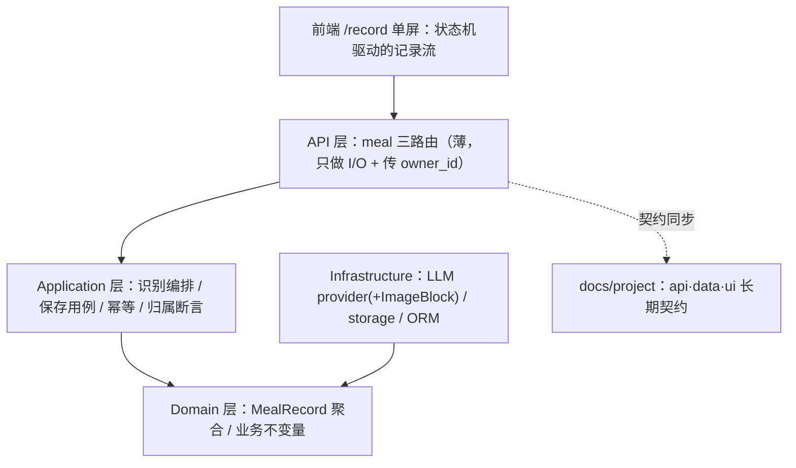
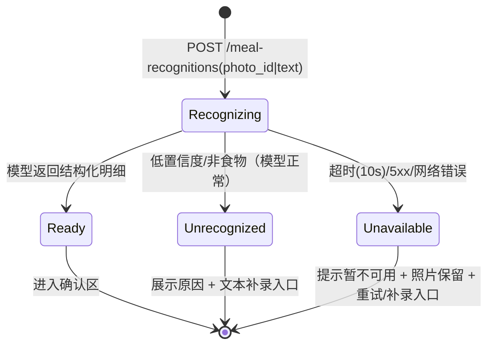
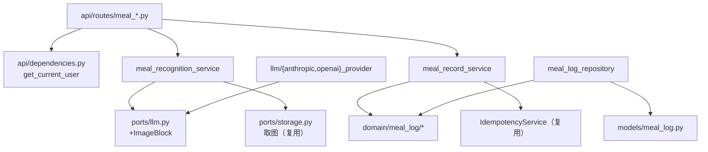

# Epic 1 拍照记录一餐 Technical Design

<!-- 三区制重写版；vj-plan-review 7 视角 findings 已全部采纳（含 adversarial 的 provider 静默丢 block、
     三视角共指的首次授权态、上传失败态、时区口径、totals 求和等），不再逐处标注来源。 -->

## 为什么要做这个（以及这次不做什么）

> 一句话：把"记一餐"从坚持不下去的手动记账，压成 30 秒的"拍照→确认"；识别失败按常态设计，失败后照片不丢、路不断。

记录饮食这件事，靠手动查库、逐项记账，绝大多数人坚持不了两周——这是 PRD 的出发点。这个 Epic 要把"记一餐"压到 30 秒：在餐桌上掏出手机拍一张，等几秒，AI 告诉你这餐大概是什么、多少热量。你顺手改掉明显不对的地方，点保存，完事。

有两个预期要先对齐。

第一，**误差 ±20–30% 是可以接受的**。用户要的是"今天大概吃了多少"这种量级感知，不是营养师级的精确。这是 PRD 明说的假设，也是全项目最需要早验证的假设（见[需要你拍板什么](#需要你拍板什么)）。

第二，**识别失败不是意外，是常态**。移动网络不稳，通用模型也有认不出的时候，失败会经常发生。所以"失败后照片还在、可以重试、可以改用文字补录"不是锦上添花——它和识别成功一样，是这个 Epic 的一等公民。

这次明确不做：今日汇总首页（Epic 2）、目标设置（Epic 3）、历史趋势（Epic 4）、餐次自动猜测、一餐多张照片、离线使用。

## 手里已经有什么、缺什么

> 一句话：存储、登录、防重复提交全是现成的；唯一的真缺口是 AI 端口"看不了图"——这也是本 Epic 唯一要动公共契约的地方。

meal（餐食）这个业务域现在完全不存在：后端没有它的模块，前端没有它的页面。这是这个仓库从零新建的第一个真实业务域。但地基比想象的厚。

**照片存储：零缺口。**仓库已有完整的文件上传链路（file_asset 模块）：上传、"这文件是谁的"校验、带签名的临时访问链接，全是现成的。文件表上还有个 `kind` 字段，正好用来标记"这是餐食照片"。所以我们不自建任何存储，全部委托给它（→ D2）。

**AI 端口：有一个真缺口。**仓库有现成的 LLM 调用端口（跟大模型说话的统一插座），带 anthropic/openai 两个适配器，还支持"要求模型按固定格式返回结果"——让模型返回菜品清单正好用它。但这个插座的消息模型里**只有文字，没有图片**：照片喂不进去。给它加上图片块（`ImageBlock`）、并让两个适配器都认识它，是本 Epic 最大的一处公共契约变更（→ D7）。

其余能直接站上去的：登录，以及"资源只有本人可见"的约定（别人的东西对你等于不存在，一律返回 404）；统一的响应格式；现成的防重复提交组件（上传接口里有现成用法可照抄）。前端有登录守卫、标准数据流和页面外壳，照着写就行。

## 方案：从拍照到保存怎么走

> 一句话：四步链路——拍照上传 → AI 识别 → 确认修正 → 保存；后端拆三个薄接口，前端一屏走到底。

整条链是：**拍照上传 → AI 识别 → 确认或修正 → 保存**。先看全局站位（交互版大图见 [diagrams/](#附录图)）：

四步各自的设计取舍：

**上传：一个"薄"接口。**`POST /meal-photos` 只干两件事：检查这是不是一张合格的图（是图片、不超过 10MB、不是空文件），然后把活全部委托给现成的文件上传服务。它存在的意义，只是给"餐食照片"这个场景一个放校验规则的地方，不重写任何存储逻辑（→ D2）。

**识别：当场等，不是排队取号。**你提交照片，页面转圈最多 10 秒（PRD 的性能上限），结果直接回来。另一条路是排队：先受理、后台慢慢算、页面反复去问"好了吗"——仓库里的文档解析模块就是这么做的。但排队要多养两样东西：存进度的状态、反复询问的逻辑。为一次 10 秒内的等待，不值得（→ D3）。等不到怎么办？照片还在，提示你重试，或者改用文字描述——这已经满足 PRD 的要求。已知代价：识别这条路没防重复，弱网断线重试会多花一次 AI 调用费，先记入[风险表](#risks)观察。

**文字补录：走同一个识别口。**识别失败后，你可以输入"牛肉面一碗"这样的描述，系统同样交给 AI 估算营养。和拍照共用一个端点、一套错误语义、同一个确认流程（→ D6）。注意补录只在失败后出现，不是一等入口——PRD 明确文字只作兜底。

**修正：前端算给你看，保存时后端重新算。**你改份量、删菜品，总热量即时按比例变——这是纯前端计算，不打接口（→ D4）。点保存时，后端只校验数据合法，然后**自己从明细求和**得出记录总值：API 根本不收前端传来的"总热量"字段。对单用户工具，"防伪造"是伪命题；这个设计防的是前端算错了，把错的数字存进库。

**保存：防手抖。**双击、网络重试，都只能产生一条记录。做法：进确认页时，前端生成一个幂等键（防重复提交的一次性票据，存 sessionStorage，刷新不丢），保存时带上；后端见过这张票，就直接返回上次的结果，不再建新记录——照抄上传接口的现成模式（→ D9）。残余的小漏洞：点保存的瞬间杀掉 App 再重来，可能重复一条，且本 Epic 没有删除入口无法自救。显式接受，Epic 4 的编辑功能是补救处。

前端整个流程是**一个页面走到底**：`/record` 一屏承载从拍照到保存的全部 13 个状态（清单在 [Screen Contract](#ui-surface-delta)），不跳页。后端按能力拆（上传/识别/保存三个独立模块），前端按体验合（一屏到底）。

## 关键概念，以及最容易搞错的五件事

> 一句话：识别只出候选不落库、图片必须真送出去、记录和明细是一个整体、餐次默认值归前端、时间一律存 UTC——五条里错任何一条，Epic 2 的数据就不可信。

**一、"识别"是候选，不是记录。**你拍了一碗牛肉面，AI 说"牛肉面，约 550 大卡"。这时候数据库里有什么？**什么都没有。**你把 550 改成 500、点保存，那一刻才第一次落库。AI 返回的清单只是**候选**：确认区里你看到的一切都来自它，但没点保存之前，它什么都不是。由此推出全系统最硬的一条规矩：识别接口**绝不往记录表写任何东西**——识别成功、失败、对同一张照片反复识别，都不写。放错会怎样？如果"识别完就先存一条"，你会看到自己从没确认过的"幽灵餐"，Epic 2 的今日汇总从此不可信。反过来，这条规矩也是失败处理敢于"随便重试"的底气：反正识别零副作用。识别的编排住在 `meal_recognition_service`。review 时盯两处：识别路径里有没有任何 `meal_records` 写入；失败路径是否零残留（Story 1.2 Integration AC 有对应测试）。

**二、图片必须真的送出去了。**这是审查里挖出来的真实陷阱。现有 openai 适配器遇到不认识的消息块会**默默跳过**。如果加了图片块却漏改适配器，图片就被悄悄丢掉——发给模型的请求里只剩提示词，而"按固定格式返回"的机制还会逼着模型**硬编一份看起来正常的菜品清单**。最麻烦的是：常规测试照样全绿，因为返回格式完全合法。所以立两条规矩：适配器遇到不能处理的消息块必须当场报错，禁止默默丢弃；测试里必须有一条"只发图片，然后断言请求体里真有图片数据"的反向用例。

**三、"一餐"和它的菜品明细是一个整体，不是两个东西。**你点保存那一刻，确认后的明细 + 照片引用 + 时间 + 餐次，固化成一条 MealRecord（饮食记录）。它是这组数据的唯一出入口（DDD 里叫聚合根）：MealItem（菜品明细）只是它肚子里的行项目，只能经过它读写，自己不带"属于谁"——归属由整条记录说了算。为什么不让明细独立成活？一旦明细自己带主人、自己有生命周期，将来改一餐、删一餐就要跨两个对象协调事务，为一个纯粹的"整体-部分"关系引入分布式麻烦。明细还是**保存那一刻的快照**：以后换识别模型、改提示词，历史记录纹丝不动。连带一条硬规矩：**记录上的总营养值永远由后端从明细求和**，前端的即时重算只管展示。哪天有人给保存接口加个 `total` 字段想"省一次计算"，Epic 2 的汇总就开始信一个没人校验过的数字了。review 时盯：明细是否只经记录读写；`belongs_to`（这条记录是不是这个人的）断言是否在 service 加载后完成（照抄 conversations 模块的现成写法）。

**四、餐次的默认值是前端的事。**餐次（MealType）是封闭的四选一：早/午/晚/加餐。domain（纯业务层）只负责校验取值合法，数据库加 CHECK 约束兜底（命名走既有 naming_convention）。而"12 点半打开页面，默认选午餐"这种按本地时间猜默认值的逻辑，是**界面层的贴心**：归前端预填，你随时可改。放错会怎样？把它写进纯业务层，业务规则就沾上了"本地时间段"这种界面概念，以后任何不经浏览器的入口（比如 Epic 4 的补录）都会被这个默认值逻辑纠缠。

**五、时间口径：存 UTC，"今天"由客户端算。**记录时间存 UTC（timestamptz），"今天"的边界由客户端按本地时区算。单用户单时区，这个简化是安全的——但要写死在这里，防 Epic 2 实现时想当然。

## 需要你拍板什么

> 一句话：九个决策都按"假设待审批"先行推进；真正带赌注的是 D1（模型估营养靠不靠谱）、D3（当场等）、D7（动公共 AI 端口）。

九个决策全部是无人值守假设，完整论证在 [decisions.md](decisions.md)。真正带赌注的是三个：

- **D1 用通用多模态模型做营养估算。**赌的是"量级感知"够用。难点不是认出这是什么菜，是从一张 2D 照片猜份量。T003 加了前置闸：先拿 5–10 张真实照片试跑，不达标就停下来换选型，不动公共端口。
- **D3 识别当场等（同步）。**赌的是真实弱网下 10 秒内成功率够高。赌输的代价可控：改成文档解析那种排队模式，仓库里有现成先例可抄。
- **D7 给公共 AI 端口加图片能力。**影响面是既有 chat 功能，靠全量回归测试兜底。

另有三个建议回改需求层（Story 验收标准）的事项在等你批：首次授权确认、上传失败态、epic 措辞修正（ACD1–3）。

---

## 合同区（Contracts）

> 刚性合同块。task 文档的 design anchors 只指向本区与 decisions.md 的 D/ACD。

### 术语表

<!-- 索引不是定义：完整解释（场景/为什么/放错会怎样/盯哪）在"讲透它的位置"列指向的叙事段。 -->

| 术语 | 代码归属 | 讲透它的位置 |
|------|----------|--------------|
| 识别 Recognition | `application/services/meal_recognition_service.py` + `LLMPort` | [§五件事·一、二](#关键概念以及最容易搞错的五件事) |
| 饮食记录 MealRecord | `domain/meal_log/entity.py`（聚合根，含 `belongs_to`） | [§五件事·三](#关键概念以及最容易搞错的五件事) |
| 明细项 MealItem | 同上（聚合内行项目） | [§五件事·三](#关键概念以及最容易搞错的五件事) |
| 餐次 MealType | domain 值对象（封闭枚举 + CHECK） | [§五件事·四](#关键概念以及最容易搞错的五件事) |
| 首次发送授权确认 | `/record` 屏状态机（前端本地持久化标记） | [Screen Contract](#ui-surface-delta) |

### API Delta

新模块 `meal-log`，挂 `/api/v1`、router 级 JWT、统一信封。已同步 `docs/project/api/meal-log.md`（synced, pending review；D 改判时随终稿重生）。

| 方法 | 路径 | 用途 | 关键约束 |
|------|------|------|----------|
| POST | `/api/v1/meal-photos` | 上传餐食照片（薄端点，委托 file_asset，[D2]） | multipart；仅 image/*；≤10MB；非空 → 422；返回 `data.photo_id`（=file asset id） |
| POST | `/api/v1/meal-recognitions` | 发起识别（photo_id 与 text 二选一，[D6]） | 同步等待 ≤10s（[D3]）；text ≤200 字；返回 `data.{status,reason?,items[]}`，item={name, portion, calories, protein, fat, carbs} |
| POST | `/api/v1/meal-records` | 保存饮食记录 | `Idempotency-Key` 头（[D9]，(owner,key) 维度，DB 失败不落缓存）；body={photo_id?,source,meal_type,items[]}，items 非空；**不收 total 字段，totals 服务端求和**；201 返回 `data.record_id` |

识别行为决策表（前端降级 UI 的分支依据）：

| 条件 | HTTP | 业务态 | 前端出路 |
|------|------|--------|----------|
| 明细返回且非空 | 200 | `status=ready` + items | 确认区 |
| 模型正常但认不出食物 | 200 | `status=unrecognized` + reason | 文本补录 / 重拍 |
| 模型超时(>10s) / 5xx / 网络失败 | 503 | `AI_UNAVAILABLE`（新增业务码；503 映射复用既有机制） | 重试 / 补录；照片不动 |
| photo_id 非本人/不存在 | 404 | `NOT_FOUND`（与不存在同响应） | 回上传区 |

保存失败表：

| 条件 | 结果 |
|------|------|
| 幂等命中（同 owner 同 key 重放） | 返回首次的 201 结果，不新建行 |
| items 为空 | 422 |
| photo_id 非本人/不存在 | 404（与不存在同响应） |
| DB 写失败 | 事务回滚；幂等 key 不落缓存（可重试） |

兼容影响：`LLMPort` 新增 `ImageBlock` 为增量变更，既有 chat 消费者不受影响（[D7]），既有端点零行为变化。为什么不是别的方案：见 [D2]/[D3]/[D6] 的 Rejected 列。

### Data Delta

两张新表（Alembic 增量 revision，on top of `0001`）。关系：一条 `meal_records`（一餐）拥有多行 `meal_record_items`（菜品），随记录级联删除。已同步 `docs/project/data/meal-log.md`（synced, pending review，含 ERD）。

**meal_records**（聚合根，"一餐"）

| 字段 | 类型 | 约束 | 说明 |
|------|------|------|------|
| id | int | PK | |
| owner_id | int | 允许 NULL | 逻辑外键不建 FK；NULL=孤儿，对所有人不可见 |
| photo_asset_id | int | 允许 NULL | 逻辑引用 file_assets；文本补录时为 NULL |
| source | varchar | CHECK IN ('photo', 'text') | 记录来源 |
| meal_type | varchar | CHECK IN ('breakfast', 'lunch', 'dinner', 'snack') | 餐次 |
| total_calories / protein / fat / carbs | numeric | | **服务端从明细求和的快照**；不收前端上送值 |
| recorded_at | timestamptz | | **存 UTC**；"今日"边界由客户端本地时区计算 |
| created_at / updated_at | timestamptz | | |

**meal_record_items**（行项目，"一道菜"，只经聚合根读写）

| 字段 | 类型 | 约束 | 说明 |
|------|------|------|------|
| id | int | PK | |
| record_id | int | FK → meal_records，CASCADE | 聚合内部真外键，随记录删除 |
| name | varchar(100) | 非空 | 菜品名 |
| portion | numeric | >0 | 份量 |
| calories / protein / fat / carbs | numeric | ≥0 | 单项营养值；不带 owner，归属由记录裁决 |

索引：`ix_meal_records_owner_recorded (owner_id, recorded_at)`——Epic 2"今日"聚合与 Epic 4 日期查询的支撑；不建其他无查询使用的索引。

为什么不是别的方案：items 不建 owner 列（归属经聚合根裁决，照抄 conversation 模式）；不存 JSON 列（Epic 4 可能按菜品维度查询）；识别结果不落中间表（零副作用不变量）。迁移回滚：downgrade 直接 drop 两表，无数据回填。

### UI Surface Delta

新增 Screen 一个，已首建 `docs/project/ui/surfaces.md` + `routes.md`（synced, pending review）：

- **Screen ID**: `screen-meal-record` · **Route**: `/record`（beforeLoad 登录守卫）
- **Screen type**: operational（DESIGN.md 全局 UI 系轨）· **Role**: 记录者
- **Primary Job**: 30 秒内完成"拍照→识别→修正→保存"一餐
- **Covered Units**: U1–U5（单屏承载全部 5 个 Story 的 UI 面）
- **Regions**: ①拍摄/上传区（默认态主视觉，大点击区）②识别状态区 ③明细确认区（紧凑列表+总热量锚+餐次+保存）④文本补录区（仅失败态）⑤首次发送授权确认（一等态）
- **Information Priority**: 默认态：拍照入口 > 说明；结果态：总热量 > 明细 > 餐次 > 保存
- **Key States**（13 态）: 默认 / 首次发送授权确认（仅首次，非 toast）/ 上传中 / 上传失败（422 展示原因+保留重选）/ 识别中 / 结果就绪 / 重算中 / 无法识别 / 服务不可用 / 保存中 / 保存成功 / 保存失败 / 未登录（守卫跳转）。"无相机(仅相册)"是能力变体不单列，经 Story 1.1 FE AC 覆盖
- **Richness Floor**: 13 态全可达、各有颜色+图标+文案三件套；失败态保留照片缩略+重试/补录双入口；不空屏（DESIGN.md §Richness Floor 暂无 operational 全局行，本行即本屏地板）
- **Forbidden Patterns**: 裸居中表单；每道菜大卡堆；纯 toast 传达失败；默认态出现文本输入框
- **API-for-UI**（逐态数据来源）: backend-driven——`AI_UNAVAILABLE`→服务不可用态、`unrecognized`→补录态、meal-photos 422→上传失败态、meal-records 422/写失败→保存失败态；pure-frontend——重算中（[D4]）、首次授权确认（本地持久化标记）；guard——未登录
- **App shell**: 套现有 `AppShell`；本 Epic 不新增导航项（首页入口归 Epic 2）
- **Reference image**: 待参考图前置闸（golden/ 不存在；候选参考 `designs/prd-suishou-shiji/ui-mock-board.html`，[D8]）
- **Screen done**: 浏览器完整走通 拍照(或选图)→识别→修正→保存，13 个 Key States 逐一可达

### Must Hold

- 识别调用零副作用：任何识别路径（成功/失败/重复）不产生 `meal_records` 行
- **图像承载的识别请求必须真正传出图像**：provider 对未知/不可序列化 content block 显式 raise，禁止静默 drop/coerce
- **记录 totals 由服务端从确认明细求和**；API 不接受、不采信客户端上送的 total 字段
- 全部 meal 资源 owner-scoped，越权=404 与不存在同响应；service 方法 owner_id 必填关键字参数
- AI 失败必须走稳定业务码降级、照片保留；禁止用 mock/假明细伪装识别成功（fail closed）
- `LLMPort` 扩展不改变既有 Text/ToolUse 行为（chat 回归必须绿）
- 照片发送第三方 AI 前需首次使用明示确认（PRD §5.3；落点=Screen Contract"首次发送授权确认"态 + ACD1）

### Risks

| Risk | Consequence | Reviewer should inspect |
|------|-------------|-------------------------|
| 通用模型营养估算不达"量级感知"底线（D1/Q1）——难点是单张 2D 照片的份量估算 | 产品核心假设不成立；T003 端口扩展+T005 整屏返工 | T003 Phase 0 真实照片 spike 结果（先验证再动公共端口） |
| 同步识别弱网频繁超时（D3/Q2）；识别路径无幂等，断连重试=重复计费 | 记录成本回升 + AI 调用费翻倍 | 超时参数与等待体验；识别调用计数日志（观察项） |
| ImageBlock 扩展破坏既有 chat provider 行为 | 平台级回归 | 两 provider 序列化差异与既有 pytest 全量结果 |
| AI 按次计费无护栏（PRD §10.3，V1 不做） | 成本失控（低概率，单用户） | 仅观察项：识别调用 structlog 计数 |

### Reviewer Checklist

1. D1–D9 全部是无人值守假设——先批决策再看编排；D7（公共端口）与 D1/D3（产品级取舍）必看。
2. 识别零副作用不变量是否被 Story 1.2 Integration AC + `verify.sh U2` 真实覆盖。
3. ImageBlock 的公共面：两 provider 实现差异、"静默丢块"负向测试、既有消费者回归策略。
4. `meal_records` 复合索引是否足够支撑 Epic 2 的"今日"聚合；UTC/本地时区口径是否会被 Epic 2 误用。
5. Screen Contract 的失败态设计（保留照片+双恢复入口）在 T005 中不可裁剪。
6. 幂等键生命周期（sessionStorage、重试沿用、重新确认换新）前后端口径一致。

---

## 附录：图

展示级交互图（archify 生成，自包含 HTML，支持深浅主题与导出）：

- [diagrams/meal-log-architecture.html](diagrams/meal-log-architecture.html) — 系统架构（组件/边界/调用关系）
- [diagrams/meal-recognition-lifecycle.html](diagrams/meal-recognition-lifecycle.html) — 识别状态机

### 识别流程状态机（Mermaid 源）

### 模块依赖图（允许/禁止的边）

禁止出现的依赖：`domain/meal_log` → 任何框架/SDK（import-linter 强制）；`meal_recognition_service` → `meal_records` 表或其 repository（零副作用不变量）；meal 路由 → repository/ORM/Session（route 只做 I/O 绑定）。容易误解的边：识别 service 依赖 StoragePort 只为取图，不管理文件生命周期——那是 file_asset 模块的事。
