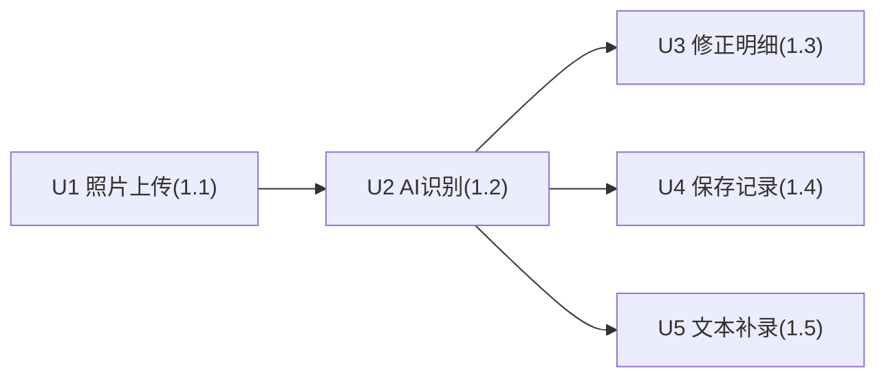

# Epic 1 拍照记录一餐 Task Index

**Human review pack:** `docs/tasks/plans/2026-07-05-epic-1-meal-photo-logging/README.md`  
**Design:** `docs/tasks/plans/2026-07-05-epic-1-meal-photo-logging/design.md`  
**Decisions:** `docs/tasks/plans/2026-07-05-epic-1-meal-photo-logging/decisions.md`  
**Execution policy:** strict（新 schema+migration · 扩公共 LLMPort · 新公共 API · 外部 AI 服务 · 整屏新 UI）

> This index is the execution entrypoint for `vj-work`. Task docs are execution projections, not truth sources. If a task conflicts with Story AC, catalog, `design.md`, or `decisions.md`, STOP and report.
>
> task done != Unit done. Unit done requires all sibling tasks plus Story AC / Unit Verification.
>
> Execution records (status, change narratives, verification results) live in `_ledger.md`
> (append-only, written by `vj-work`). Task docs in this directory may be regenerated wholesale.

## Required Gates

- review: 完整 diff review（strict）；blocking findings 必须修复
- migration/backfill: 新增 revision 的 `alembic upgrade head` + `downgrade -1` 双向验证
- screenshot/browser: `/record` 为 operational 屏 → frontend.md B 轨截图闸（判定权独立于实现者）；参考图前置闸见 T005
- catalog sync: `docs/project/api/meal-log.md` · `data/meal-log.md` · `ui/surfaces.md`+`routes.md`（首建）与终稿一致；**条件目标** `api/conventions.md`（AI_UNAVAILABLE→503 是否进全局业务码映射表，待 reviewer 定）<!-- vj-plan-review: applied [dependency/3] -->
- plan_lint: `python3 .agents/skills/_shared/scripts/plan_lint.py docs/tasks/plans/2026-07-05-epic-1-meal-photo-logging` exit 0<!-- vj-plan-review: applied [coherence/5] -->

## Epic Execution Checklist

> vj-work 将本节原样注入每个 subagent prompt——这是执行者不全文读 guideline / DESIGN.md 的前提；执行中碰到清单外风险面时按 Source 指针展开原文。

1. 识别调用零副作用：任何识别路径（成功/失败/重复识别）不得产生 `meal_records` 行 — Source: `design.md#must-hold`
2. provider 遇未知/不可序列化 content block 必须显式 raise，禁止静默丢弃；必须有 image-only 消息断言 wire payload 真含图像数据的负向测试 — Source: `design.md#must-hold` + `decisions.md#D7`
3. 记录 totals 一律由服务端从 items 求和；API 不收、不采信客户端上送的 total 字段 — Source: `design.md#must-hold`
4. 全部 meal 资源 owner-scoped：越权 = 404 与不存在同响应；service 方法 `owner_id` 必填关键字参数，聚合加载后 `belongs_to` 断言（照抄 conversations 模式） — Source: `docs/project/api/conventions.md`（鉴权与归属） + `backend/application/services/conversation_service.py`
5. AI 失败 fail closed：超时/5xx → 业务码 `AI_UNAVAILABLE`(503)，照片保留可重试；禁止 mock/缓存/假明细伪装识别成功 — Source: `design.md#must-hold` + `design.md#api-delta`（识别行为决策表）
6. `LLMPort` 扩展不得改变既有 Text/ToolUse 行为；既有 `backend/tests/test_llm_*.py` 必须全绿 — Source: `decisions.md#D7`
7. 依赖方向：domain 零框架 import；路由不碰 repository/ORM/Session（import-linter 机器强制，`cd backend && uv run lint-imports`） — Source: `backend/pyproject.toml`（[tool.importlinter]）
8. schema 变更走 Alembic 增量 revision（on top of `0001`），`upgrade head` / `downgrade -1` 双向可跑 — Source: `docs/project/data/meal-log.md` + `AGENTS.md`（Current Baseline）
9. 后端异常用 `BusinessException` + 统一响应信封；禁止 `print`，日志用 `core.logging_config.get_logger(__name__)` — Source: `AGENTS.md`（Coding Style） + `backend/core/exceptions.py`
10. 保存幂等照抄 presign-upload 模式（`idempotency_for` 依赖 + `IdempotencyContext`，不手调底层 decide/persist）；DB 写失败回滚且幂等 key 不落缓存；外部 I/O（LLM/storage 网络调用）不得在 DB 事务内进行（三段式：tx 只读校验 → 无事务外部调用 → tx 落库） — Source: `decisions.md#D9` + `backend/api/routes/storage.py` + `backend/application/services/document_service.py`（docstring 三段式先例）
11. 时间存 UTC（timestamptz），"今日"边界由客户端本地时区计算；餐次默认值逻辑归前端，domain 只校验封闭枚举 — Source: `design.md#data-delta` + `decisions.md#D5`
12. 前端只消费 `docs/project/api/meal-log.md` 的合同字段与错误语义；错误分支断言 `code`/`message_key`，禁止断言文案字符串 — Source: `docs/project/api/meal-log.md`
13. `/record` 屏硬约束：状态表达 = 颜色+图标+文案三件套（:71）；每屏字号 ≤4 档（:75）；间距 4px 刻度 ≤4 种且页框呼吸（:93）；每屏实心 accent ≤1（:106）；明细用紧凑列表不做大卡堆 — Source: `docs/project/DESIGN.md` + `epic.md`（页面体验地图）
14. 复用铁律：存储走 file_asset 委托、AI 走既有 LLM provider 栈、幂等走 IdempotencyService、前端复用 AppShell/SuspenseLoader/apiClient/shadcn；禁止另起炉灶 — Source: `decisions.md#D1 #D2 #D9` + `AGENTS.md`（Prefer Existing Solutions）
15. task done ≠ Unit done：Unit 收口以 `verify.sh U1`…`U5` + Story AC 为准；实现与 story `验证:` 命令冲突时以 story 为准并 STOP 报告 — Source: `task-index.md`（Verification） + `docs/tasks/epics/epic-1-meal-photo-logging/stories/`

## Verification

Unit verification entrypoint (materialized from Story AC `验证:` commands; on conflict the story wins):

```bash
bash docs/tasks/work/epic-1-meal-photo-logging/verify.sh U1   # one unit
bash docs/tasks/work/epic-1-meal-photo-logging/verify.sh all  # whole epic
```

## Unit DAG



## Task DAG / Waves

| Wave | Tasks | Units | Depends on | Write set isolated? | Batch | Done signal |
|------|-------|-------|------------|---------------------|-------|-------------|
| 1 | T001 meal 域地基（barrier） | U1-U5 共享 | 无 | owner task（独占共享文件） | — | migration up/down 通过 + lint-imports + 既有 pytest 全量不回归 |
| 2 | T002 照片上传薄端点 | U1 | T001 | ✅（meal_photos 路由/service/测试独占） | — | `pytest tests/test_meal_photos.py` 全绿 |
| 2 | T003 识别能力（photo+text） | U2+U5(后端) | T001 | ✅（LLMPort+providers+recognition 文件独占） | — | `pytest tests/test_meal_recognition.py` 全绿 + 既有 chat 测试不回归 |
| 2 | T004 保存饮食记录 | U4(后端)+U5(记录同构) | T001 | ✅（meal_records 路由/service/测试独占） | — | `pytest tests/test_meal_records.py` 全绿 |
| 3 | T005 /record 整屏 composition | U1-U5(前端) + U3 全部 | T002+T003+T004（API 合同稳定） | ✅（frontend 独占） | — | Screen done + B 轨截图闸 pass + vitest 全绿 |
| 4 | T006 E2E 收口 | U1-U5 收口 + Epic gate | T005 | 只读验证 + catalog 复核 | — | `verify.sh all` 全绿 + Unit Verification 记录齐 + catalog synced |

> Batch 列全部为 `—`：W2 三个 task 各自含公共契约/幂等/降级面且单个预计 diff 均 >150 行，不满足合批条件（同 lane、单 task diff <150 行、合计 <300 行），vj-work 按写集隔离并行派发即可。

## Execution Lanes / Frontend Composition Waves

| Lane | Wave | Scope | Start condition | Done signal |
|------|------|-------|-----------------|-------------|
| contract | 1 | T001：schema/DTO/路由骨架/共享注册一次占位 | 无 | migration + 注册点全绿 |
| backend-api-capability | 2 | T002/T003/T004 并行 | T001 done | 各自 pytest 全绿 |
| frontend-composition | 3 | T005：screen-meal-record 整屏 | 3 个端点合同稳定（W2 done）+ 参考图前置闸 | Screen done + B 轨闸 |
| e2e-polish | 4 | T006：全流程演示 + 异常态 + 收口 | T005 done | verify.sh all + gates 清零 |

## Barrier / Owner Tasks

| Task | Type | Shared output / files | Unlocks | Done signal |
|------|------|-----------------------|---------|-------------|
| T001 | barrier/owner | domain/meal_log、ORM+migration、DTO、3 个路由骨架文件、`main.py`/`models/__init__.py`/`unit_of_work.py` 注册 | T002/T003/T004 | migration up/down + 全量测试不回归 |
| T006 | 收口 owner | `_ledger.md` Unit 收口记录、catalog 复核 | Epic done | 全部 gates 绿 |

## Unit to Task Mapping

| Unit | Story | Tasks | Unit done signal |
|------|-------|-------|------------------|
| U1 | 1.1 | T001+T002+T005(FE)+T006\* | story-1.1 AC 全过（`verify.sh U1` + FE AC 截图证据） |
| U2 | 1.2 | T001+T003+T005(FE)+T006\* | story-1.2 AC 全过 + 识别零副作用不变量验证 |
| U3 | 1.3 | T005+T006\* | story-1.3 AC 全过（重算 vitest + Browser 交互） |
| U4 | 1.4 | T001+T004+T005(FE)+T006\* | story-1.4 AC 全过 + migration/幂等验证 |
| U5 | 1.5 | T003(后端)+T004(记录同构)+T005(FE)+T006\* | story-1.5 AC 全过 + 记录同构验证 |<!-- vj-plan-review: applied [dependency/1] -->

> `*` = 收口 task：每个 Unit 均以 T006 跑对应的 `verify.sh U1`…`U5` 完成 Unit 级验证收口。

## Shared File Coordination

| File | Tasks | Handling |
|------|-------|----------|
| `backend/main.py` | T001 独占 | 路由注册一次占位（3 个 meal 路由文件），W2 各 task 不再碰 |
| `backend/infrastructure/models/__init__.py` | T001 独占 | ORM 注册一次完成 |
| `backend/infrastructure/unit_of_work.py` | T001 独占 | meal repository 注册一次完成 |
| `backend/application/ports/llm.py` + `infrastructure/external/llm/*` | T003 独占 | ImageBlock 扩展（[D7]），W2 内与 T002/T004 无交集 |
| `frontend/src/routeTree.gen.ts` | T005 独占 | pnpm dev 再生成，不手编 |
| `backend/application/dto.py`（追加 meal DTO 区段，扁平单文件模块不建包） | T001 追加，T002/T003/T004 只读消费 | single-owner, no concurrent write |
| `backend/shared/codes/__init__.py` | T003 独占（追加 AI_UNAVAILABLE） | single-owner |
| `backend/shared/prompts/`（新建） | T003 独占 | single-owner |
| `docs/project/api|data|ui/*` | plan 阶段已同步（synced, pending review）；T006 复核；D 改判时随终稿重生 | 偏离时报告回写 |<!-- vj-plan-review: applied [dependency/2][coherence/2] -->

## Tasks

- [T001 meal 域地基（barrier）](T001-meal-domain-foundation.md)
- [T002 照片上传薄端点](T002-meal-photo-endpoint.md)
- [T003 识别能力 photo+text](T003-meal-recognition-capability.md)
- [T004 保存饮食记录](T004-meal-record-save.md)
- [T005 /record 整屏 composition](T005-record-screen-composition.md)
- [T006 E2E 收口](T006-e2e-closeout.md)
